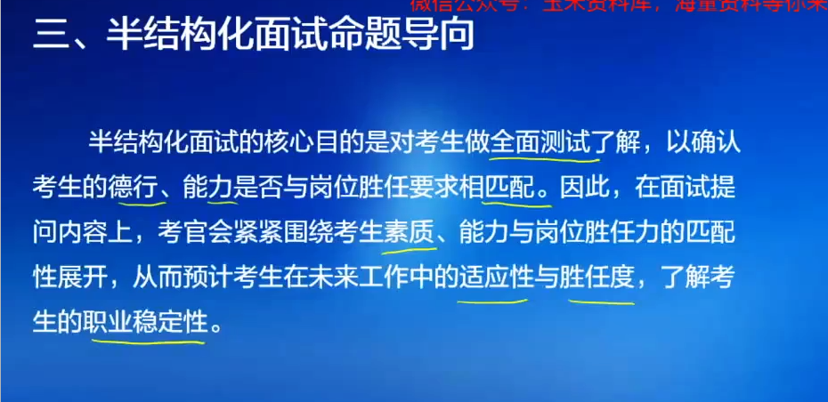
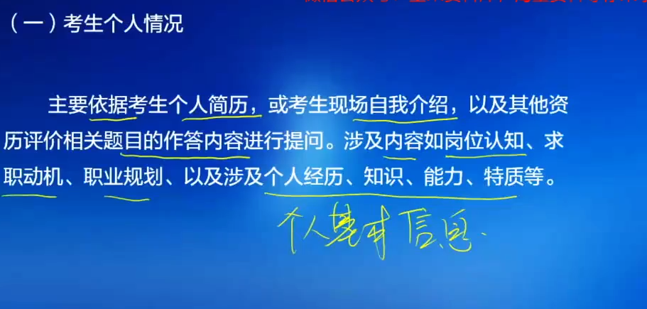
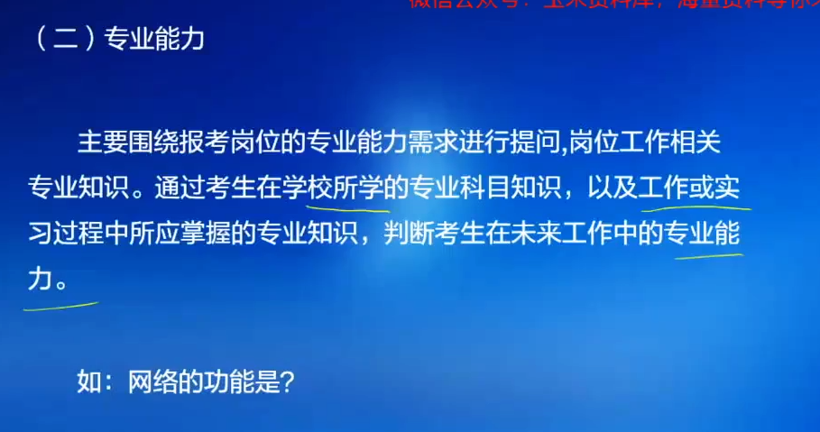
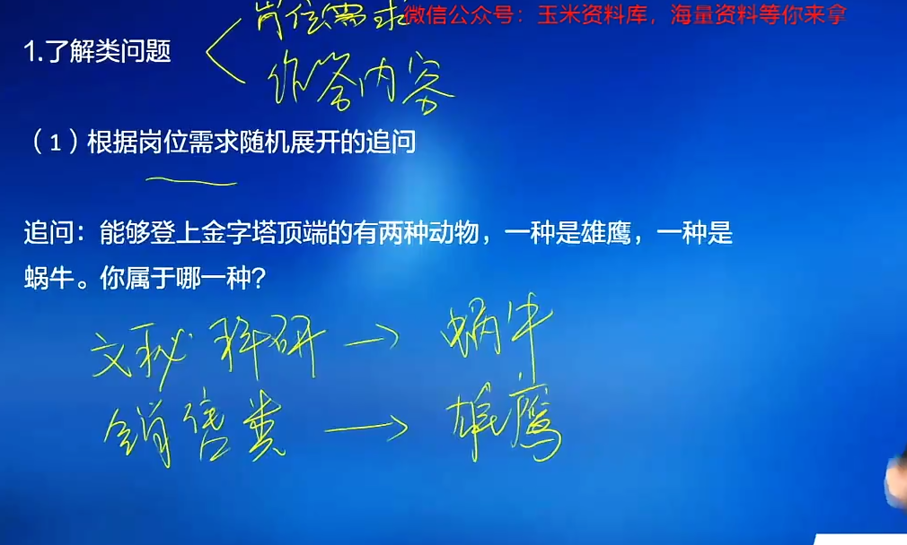
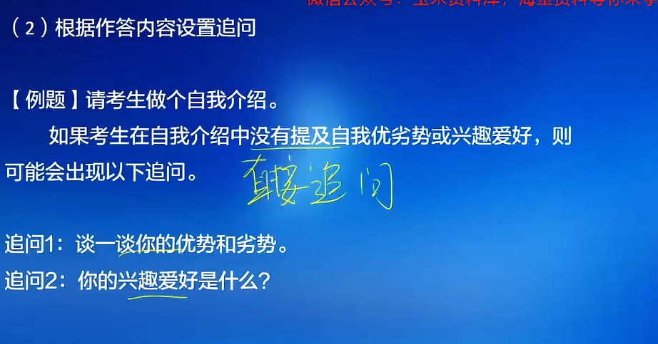
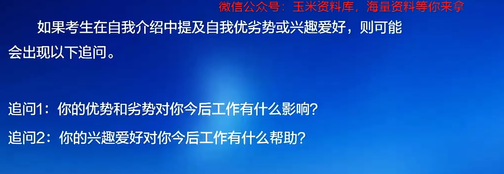

# 半结构化面试

[TOC]

#### 第二章：了解类问题

同学们，我们来学习第三部分例题讲解。对于了解类题目来讲，我们拿两道例题跟大家去分享。在出题上它有什么样的这种出题的特点，我们如何进行思考，怎样进行作答。还是基于两个方面，一个是岗位需求，一个是作答内容。展开追问。
先来看基于岗位需求展开的这个随机提问。这道题目是这样说的，说能够登上金字塔顶端的有两种动物，一种是雄鹰，另一种是蜗牛，你属于哪一种？我在选择的过程当中会发现雄鹰和蜗牛分别是代表了两种不同特质的，对不对？那么我应该选择哪一种呢？还是基于你前面你报考的这个岗，为你的岗位不同的时候，他需要的人才它具备的一些性格特点、能力特点它是不一样的，对不对？
好，那我们先来分析一下这两种动物背后所代表的这个特质分别是什么。我们再结合同学们报考的岗位去进行阐述。看雄鹰为什么能够登上金字塔顶端呢？因为它有翅膀，它能够飞翔，它能够一飞冲天，对不对？它能够去去挑战从低到高的这个金字塔顶端，其实是很长的一个距离，漫长的一个挑战。他能够去应对这些挑战，克服这些困难，然后树立很高的目标。这是雄鹰所代表的特质，对吧？
那我们把它记下来，雄鹰所代表的特质我们这里可以用几个关键词给它写在这里。一个就是让他能够面对更高的挑战，他往往设立更高的目标，他能够利用自身的优势和特长。好，另一种是蜗牛，我们说为什么蜗牛能够飞上这个不是飞上，是登上金字塔的顶端呢？因为蜗牛它爬的很慢，它还能登上金字塔的顶端，那说明它用了非常多的时间，在这个时间里面去一步一个脚印地爬上去，这是坚持对吧？这是坚持踏踏实实的这种坚持精神。好，两种动物分别代表的特质找出来之后，大家就要结合自己报考的岗位去谈了。假如说同学们报考的岗位，我们举两类比较热门的国企招聘的岗位来具体谈一谈。
假如说咱们同学有同学报文秘岗的，那我们文秘岗他可能更需要的是什么？是发挥自己的某一项优势。有翅膀或者是有法律知识，或者是有工程技术，或者有计算机方面的天赋，是发挥某一方面的优势吗？不是文明岗，它更需要的是什么？是综合管理，是协调、是耐细致，对不对？是这一些方面他在做工作的时候才能够去发挥出来，他的特长，他的能力才能发挥出来。而且他的这些工作从文秘岗的角度来讲，比如说我们收发资料，下发通知，协调一些会议的召开，组织一些活动，处理一些文字材料，它会存在很多的重复，那么在这一些重复工作里面，需要更多的是踏踏实实的坚持，而不是不断的突破和做挑战，大家能明白这种感觉嘛？
那么如果你报考的是文秘岗，我们选择的是不是就更应该是啊更应该是它的工作存在很多重复，那么我们的选择是不是就更应该是蜗牛？我们分析的时候顺着分析，我们回答的时候反过来回答，对吧？反过来回答这句话就变成怎样的感觉了呢？**我想对于两种动物来讲，我个人更倾向于是一个蜗牛，首先把结论从后面说出来，接下来去进行阐释。**
**作为一个这个作为一个蜗牛，它背后所代表的特质就是踏踏实实，就是懂得坚持。能够在面临很巨大的困难的时候，一步一个脚印的，有条不紊的，凭着自己的坚韧不拔的毅力，最终完成自己的目标，不急不躁，不好高骛远，我想这样的一些特点跟我本人的性格特质是完全一致的，也跟我未来的工作岗位是相匹配的。我报考的是文秘类的岗位，未来我会涉及到很多文字性的工作，打印复印的一些协调性的工作，活动组织通知传达等等。这一些工作在具体处理下来的时候，它会有重复，也难免会有一些枯燥。在处理很多事务工作的时候，需要我们非常之多的耐心、细致、周到。而这样一些工作的特点，它很符合我平时做事的那种习惯和风格。**
**在我的以往的学生工作生涯里面，我也是做学生会报公室工作的，经常会去协调办公室这个学生会的办公室，组织一些社团活动。在组织一些社团活动的时候，负责一些后勤保障性的一些工作，他很好的锻炼了我的耐心和细致，也挺符合我这种比较温和比较平和的一些个人性格。所以我更倾向于我认为我是蜗牛的这样一种动物**。都能明白吗？反着说回去。而在缩回去的时候，也结合个人的一些经历和性格特点去谈我适合这个岗位，这一句话就把它讲清楚了。
好，我们再举一个岗位，再举一个例子大家去感受一下。假如说我们换一个跟他比较差别比较大的，比如说是销售类，那么这两类销售类岗位，这两类岗位在咱们国企招聘过程当中都是比较热门的，比较招聘比较多的两大类。好，如果作为销售类的岗位的话，大家思考一下他平时的工作可能是什么？设定销售目标，每一次的销售目标，今年的销售目标要比去年要高很多，明年的销售目标比今年还要再高一些。我们要不断的去挑战，对不对？我们要抢占先机，我们要追求速度，我们要尽快的拿到订单，我们要能够在这个市场上获得竞争优势。好了，这样的特点它是不是决定了我们更加符合它要求的是挑战，是不是完成目标，它更加符合什么？
同学们谈到了雄鹰它的特质。如果它更加符合这个雄鹰的特质，我们在讲这一段话的时候还是应该反过来讲。我觉得我更倾向于是雄鹰这种动物。理由就在于我个人是比较喜欢设立阶段目标，通过不断的完成目标来实现自我价值和成就感的。而且我喜欢有做有挑战性的事情。在大学期间本科我学的是中文的这个专业，当时考研究生的时候，我个人逐渐的在大学的一些社团活动和兼职实习里面发现自己的兴趣对营销方面会比较感兴趣，对市场营销、市场策划和销售类会非常有个人的一些爱好。
我就跨专业考研获得了成功。现在在研究生阶段，就读了某某某大学的这个呃市场营销专业。在在这个专业领域里面接触了很多我之前所不了解的一些理论。对我实际的这种兴趣是相当于打开了一个新世界的大门。
而且在本科和研究生阶段，我都会参加一些社团的活动，主要都是在学生会里面做外联部的工作人员。外联部的工作人员他的主要工作内容也是为校内的一些活动举办去拉资金赞助，和很多企业进行洽谈。去寻找我们这个活动资金的这种来源，包括募集资金和我们募集一些相关的物资。在这些方面跟不同的人形形色色企业打交道的过程当中，我会觉得当我能够成功的劝说别人认同我的观点，达成合作，为活动争取到一定的资金和物资的时候，我内心是很愉悦的，所以不断的设立目标去完成目标。中间的这个过程令我感到他还挺适合我这个人，我做的挺开心的。所以我对我外未来报考的这个岗位，我相信也一定是有帮助的。我有信心在我所报考的销售岗位里面去取得很好的成绩。
大家能明白这种感觉了吗？你是什么样的对吧？你觉得你是哪一种动物？接下来我就说我为什么是这一种动物，我为什么是这种动物？说完我为什么是这种动物呢？结合个人的一些经历去谈一谈，对吧？
结合个人经历去谈一谈，相当于我们思考的时候是从你的岗位需求为起点进行思考。我们作答的时候是反来直接回应这道题目它的问法。这是我们答这道题最关键的部分，就是你是哪一类岗位的，你就答你是更属于哪一种动物。除此之外，这里还需要提醒大家一下，答这道题目的过程当中，除了去回答，比如说你是文秘类的岗位和科研类的岗位，你答第一类思路。你是这种销售类的岗位，营销类的岗位，你答第二类思路。
**除了这个之外，在这道题目的最开头，建议大家把这个题干整体分析一下。什么叫整体分析一下呢？就是谈一谈雄鹰代表的特质是什么，谈一谈蜗牛代表的特质是什么？再接下来才谈到自己属于哪一种动物，最后才谈到自己属于这种动物的理由是什么。而这个理由要结合个人的经历，个人的特点以及报考岗位的特点，对吧？最终体现的是你适合你所报考的这个岗位，这里我们就谈清楚了。**
好，那我们进入下一题。**这道题目说的是结合你的作答内容设置的追问，比如说例题问到你身边的人是怎样评价你的。那么我们不同的人可能在作答的时候就会弹出不同的一些评价**，对吧？**有的人说我身边的人评价我很很真诚很实在，有的人说我很乐观，有的人说我很善于去思考一些新的点子，思维很灵活。有的人说我是一个自我情绪控制很强的一个人，我是一个很会抗压的人。**
好了，那在具体的这个追问上，**人家是怎么问的呢？谈到说工作中你不喜欢与什么样的人共事，**他就觉得这个题目是不是略显尴尬？我怎么去谈我不喜欢与什么人共事？如果我谈我不喜欢与什么样的人共事，是不是恰巧反映在那一方面我做的不够好呢？或者是恰巧反映了我不太会跟人取得合作呢？这题怎么答？
好，我们先假设一下前期的那个评价素质，我们随意假设两一两种。因为不同的评价针对后面在答题上它会有不同的指向性。**假如说最常见的说你身边的人是怎么评价你的，我身边的人对我有两个方面的重要评价。一个方面是说我比较真诚实在，另一个说我这个情绪控制很好。**
情绪管理能力强。抗压。假如说别人对我的评价主要体现在这两个方面，那我们在答第一题的时候一定会去谈到什么？**会谈到理由**对不对？
**周边人对我的评价主要集中在两个方面，一个方面是认为我很真诚，很实在。就比如说我身边的朋友，从小学到大学，我一路上有很多朋友都会认识了很多年，我们之间关系都会比较亲密，大家也喜欢把自己的一些事情跟我分享，听听我的意见和建议。大家在处理这些问题的时候，即使我们这些朋友很长时间没有见面了，再见面也不会显得陌生。**
**而且我在之前有短暂的一段工作经历，在那一项工作过程当中，我的领导也对我的评价说，可能刚刚参加工作灵活度经验上欠缺一点。但是我不会偷奸耍滑，很实在，踏踏实实的把这个工作每一项都做到你能够做到的最好，这是我比较认可你的一个点。当他跟我说这句话的时候，我内心还是觉得挺感动的。领导看到了我的努力，看到了我的真诚，所以这是周围的人对我进行评价。第一个方面是一个真诚实在的人。第二个方面有很多人都提到过，包括我的父母家人都提到过，说我是一个控制自己情绪特别好的人，特别适合去去抵抗一些压力。往往大家都说我的难过只能维持三分钟，眼泪可能还没有干，下一秒就可以笑出声。**
**那是因为在我平时的这个生活里面，我想这样的性格养成可能与我的成长环境会有一定的关系。家里面的人大家都会有什么问题一起去商量解决，非常的和气。家中始终还是充满正能量的，父母之间的关系也很好，所以我的从小到大内心的踏实感比较强。那么在遇到一些困难和挫折的时候，就会倾向于有一种习惯性思维，尽快的想到这一件比较糟糕的事情。它好的一面，积极的一面是什么，这样我很快就会走出一些负面的情绪，把精力放在解决问题上，这是我的一个个人的一个特质。就像我之前在高考的过程当中，相信这对每一个走出校门不久的人来说，都还是一个挺深刻的记忆。**
**当时我没有录取到我最心仪的大学，但是我调剂到了一个我很中意的专业上面。在这个专业调剂好了之后，我也很快收拾心情，开学之后就近入学对吧？入学了之后就去用尽全力学好我专业的课。我也取得了不少的成绩，也受到是得到了很大的收获。所以在这种快速调节的基础之上，我认为我一路走来的收获比失去要多得多。**
**这是我个人的对于别人对我评价的两方面介绍**。好，是不是这样就可以把第一个题目给说清楚了。**先说别人对你评价的主要的几个方面，一两个、两三个即可。接下来要充分的解释，要举一些你个人实际的经历例子，别人的说法让对方能够相信你，让考官觉得你这两个特质是真的**，这是第一题，我们把它回答清楚。
而基于这个来讲，**如果我们再回答第二题说工作中你不喜欢于什么样的人共事，在答这里的时候我可以怎么办，大家就可以去围绕你的这个作答内容直接去答，找到最契合的点**。因为乍一问突然一问，我们有可能会反应不过来，喜欢与什么样的人共事，就不喜欢与坏人共事。这个坏人有很多特质，**对不对？最简单的途径是什么？前面你说到了什么，后面你就往反方向去说就好了，而且不容易踩到雷区，不容易回答的不得体。比如我前面说的，我个人很真诚很实在，那我就可以说我不喜欢与不真诚不实在的人共事**，**对吧？那么在生活里面不真诚不实在的人是什么样的人？我们常常称之为泥鳅**。
**泥鳅型的人非常的柔滑。非常油滑，而它的特点就是经常会是这种。非暴力不合作，喜欢推卸责任。好喜欢推卸责任，我不喜欢跟这样的人合作**。就是什么样的人？
**泥鳅型的人很油滑，常常他表现出那种非暴力不合作、推卸责任、推脱工作这样的一些特点。我更更习惯于喜欢和那些直接的真诚的人去一起共事。那么和这些真诚的直接的人一起共事的时候，呈现出来的局面是有活一起干，有错误大家一起承担。我们把更多的精力都放在了处理工作任务上，而不是相互之间斤斤计较上。我觉得这是更高效率的这是对工作的负责任，也是对个人生生命的负责人，对个人时间的负责任。**
这是我直接的回答。大家能发现吗？就是你不喜欢跟什么样的一类人进行公示，就是往你的优势，往别人对你的评价的极反方向，对吧？说的极端一点就好。
**比如说我们再举个例子说，情绪管理能力很强，我就是不会生气生太久三分钟我就好了。我不喜欢跟什么样的人工作呢**？**情绪管理能力比较弱的人，对不对？很情绪化的人，我们可以说这个。很情绪化。**
的人。
那我就要给出理由了，你为什么不喜欢跟情绪化的人工作呢？**我们的这个情绪管理情绪管理这门学科上，曾经有这样的一种说法，说一个人花在处理自己情绪问题上的精力，几乎占这个人全部精力的30%左右。那么这将是非常可怕的一个精力比重，对不对？如果3分之1的时间用于自我情绪的调节，我就浪费了大量的时间，浪费了大量的精力。如果一个团队当中这种情绪化的表现过多，超过甚至超过了3分之1，这个团队他的战斗力也会直接受到影响。所以我们会认为在工作的过程里面，大家应该这应该就是对事不对人，公事公办，以职业精神去面对自己的工作，而不能把很多生活里面的情绪，包括在工作当中引发的负面情绪直接表现出来，甚至影响到自己的工作和自己团队里其他的人。**
**这是我个人认为的一个观点，就是我不会那么喜欢跟一些情绪化特别严重的人去处理工作**。大家能明白这里吗？**就谈情绪化它的严重性，尤其是对工作的危害**。
对工作的危害，我们就把它讲清楚了是吧？讲清楚了。那么在回答这道题目的过程当中，我们可以直接接结合我们上面的作答内容去谈。
结合完作答内容去谈之余，建议大家再补充上一句，不是。综上一句，**在我们的工作里是不是形形色色的人都会遇到，不同性格特点、不同处事方式、不同文化背景的人都有。所以我们应该有包容之心，应该能够去保持团结，应该站在别人的角度考虑问题，通过沟通思考跟大家取得更快速更高效的合作。这样才有利于我们在一个集体里面，在一个企业里面去实现1加1大于二的效果，为我们共同的工作目标去添砖加瓦来助力**。明白这个意思吧？就是我还是愿意去合作的，我还是愿意去包容的，我只是不喜欢，但是不代表我不能够做到。好，这道题咱们就讲清楚了。

#### 第三章意愿类问题。

在这一章当中我们仍然学习三个部分的问题。第一个部分是医院类问题它的定义，了解什么是意愿类问题。第二个部分我们来学习医院类问题它的命题素材，知道它都会从哪些方面作为内容来进行题目命制。第三部分我们具体讲解一下这个题目怎么思考，怎么作答。
好，先来看第一方面，**意愿类问题的定义。请同学们拿出你的讲义和笔，我们一起来看一遍。整体来了解一下，意愿类问题往往考察的是考生对工作的个人意愿、求职动机、对岗位的认识。你入职规划等方面的内容，你入规划等方面内容就是你愿意做什么对吧？你愿意做什么？你为什么要报考，对不对？你觉这个岗位你了解了多少？如果你能够录取成功的话，你后面打算怎么干好这个工作？重点是这几个方面。**
作为我们意愿类问题，它出题的主要的内容的方向。**那么站在考生的角度来说站在考生的角度来说，我们可以向考官去介绍我的意愿，向他表达我强烈的愿意考上的这一个心理。我们想一想，如果一个岗位招一个人三个人进面试的话，这三个人当中如果能力相当，但是最想来的意愿最强烈的那一个人，是不是考官最容易青睐的，因为最想来意愿最强烈的一个人如果被录取，他努力工作，积极表现的可能性就更大一些。他机会得之不易，拿到这个机会之后，更努力的可能性就更大一些，当然考官会更青睐一点，对吧？**
这是第一个方面。从**考生的角度来说，应该想办法去反映出自己加入这个岗位是很强烈也有强烈意愿的，是非常想加入这个岗位当中的**。好，那么从考官的角度来讲，从考官的角度来讲，他就可以帮助考官通过你到底愿意做这类，你到底为什么愿意做这类，你想怎么做？**来通过这种意愿类的问题的这种考察，来进一步的了解考生他实际的报考的动机，而进一步的了解我们考生到底适不适合长久的从事该工作，这里体现的就叫做职业的稳定性。**职业的稳定性。
那么通过对这个整个的定义，大家总体的理解我们就知道了。对于意愿的问题对意愿的问题，从考生的角度来看，**我们在回答每一部分的时候，都应该向考官传递出我适合并且我想考上这样的核心意思**，对不对？好，那么接下来我们来看一看它的命题素材，**就从内容上来讲有哪些个方面？重点是三方面，大家可以拿笔跟我一起理解性的勾画一下。第一个方面是岗位任职，对于岗位认知来讲，它可能出题的方向有以下这样一些方面。**
**第一个方面就是企业的情况，企业的总体情况。比如说这一个企业的总体规模？它企业的总部的设立，分公司它有多少家，涉及的业务领域有多么的广泛，在各个业务领域里面，它在市实际市场当中表现如何，市场占有份额如何？它的产品的品牌体系优势劣势，它产品未来发展，你个人的一些思考，这个企业它的总体的营业额，它企业的这种员工，它要求的能力素质等等，这些方面是我们应该总体有所把握的**。我报考一个企业，我想去这个企业参加工作，那将是很多年去做一件很多年要从一直从事的一项工作。你未来将有很长的时间会在这个企业里面活动。**我下这个决定，我必然需要对这个企业有一个整体的了解，这才能体现出我们的意愿很强，对吧？好，这是第一个方面，就是请同学们去好好了解一下你报考的那个企业总体的这些情况如何。**
第二个，**就是具体的岗位情况，就是他招考哪些类别的岗位，各个类别的岗位对人才有什么能力素质上的要求，这是我们需要知道的。比如说他的岗位职责，他的工作内容，他的学历要求，他的专业背景要求，他的培训方面的要求，他的这种资质，其他资质方面的一些要求，是不是党员，对吧？这些方面这是我们需要去了解的，而且在答题的过程当中，这方面涉及的也是最多的。**
这个岗位情况好，**岗位工作的意义也就是价值。你这个岗位工作它的体现的这种经济的价值，它这种社会的价值，它能够发挥的作用，它在企业里作用，它对这个社会的作用，它的意义所在。这是我们答题过程当中容易融汇到答题里面去的。可能直接出题的这个机会不多，但它会融入进去。就比如说你某一类岗位是提供社会基础性服务的。这个社会基础性服务它在实际参与工作的时候，不仅是养家糊口的途径，它也是实现个人价值实现个人社会价值的渠道**，对吧？
好，**这是工作意义胜任能力，他到底需要我们具备哪些方面的能力？这主要结合我们的一些专业，你以前实习或工作所培养出来的一些综合能力和专业能力他相关**。所以我们**同学们也要去梳理自己的能力跟这个岗位需要的能力，它有哪些能够契合的，这是第一个方面，岗位认知大家总体了解它的命题素材。第二个就是求职动机，在求职动机的这个方面，它重点会围绕以下几个细节点，以下几个考点去命题。**
**第一个就是围绕你的价值观，你的是非黑白观念如何，你对金钱是如何看待的？你对服务是如何看待的？你对企业文化当中的一些善良、奉献、奋斗、团结这样一些精神是如何看待的？不同的价值观念它最终能够形成的是什么？跟企业文化之间的契合。而跟企业文化之间的契合最终是决定了你的职业稳定性。**
如果你觉得在这个企业里面，你跟大家的价值观永远不一样，永远无法融入团队，对吧？永远无法走到这个企业的一些核心。那么坚持长时间的在这个企业工作的可能性就会降低。
好**，再比如专业知识，这很重要。就是我的专业我能在这个企业用上，其实是很很好的一件事情。不浪费自己的专业，而且也容易去做一些擅长的事情。再接下来就是能力，这个能力包括我们在书本上学来的，在大学里面学校里面学来的，也包括我们后续在实习在工作过程当中积累来的。**
好，**再接下来是职业的前景。就是这个职业在未来发展，它是属于一种朝阳型的，还是属于它逐渐的走向没落的那这个职业未来发展前景，也是我们去报考某一个岗位，它非常重要的一个其中的因素。比如说某一类岗位，某一类岗位它在未来需求量特别大**。比如说现在我们去谈我们养老服务业这一类行业，这一类行业还处于一个快速发展的一个阶段，对不对？可预见的是，未来我们的老龄化程度会逐步加深。而在养老服务业这个行业里面，它相关的从业人员，我们对其需求量将会非常之大，需求总量会加大，需求的这个水平工作的水平和能力会逐渐加强，各类工作资质的要求会逐渐建立完善起来。所以在这个方面，他未来的职业前景是极其可观的。如果是有这样的吸引，是不是就代表我更愿意在这个行业里面，因为我是有奔头的。好，**再接下来就是个人的兴趣，个人的兴趣比如说工作的兴趣，比如说生活的兴趣。好，我们可以举个例子来说，拿生活的兴趣来举例。**
生活的兴趣来举例。比如说我非常喜欢读书写摘要和发表文章。平时在生活里面也喜欢向本地的一些报刊杂志去投稿。已经成功发表过15篇各类平台上发表过15篇个人写的一些原创文章。我报考的这个文秘岗位会有非常大的一部分时间在做文字处理性工作者。如果我能够在我以后的工作岗位里面，延续我生活上的一些兴趣，就是我也能够把我的写作的爱好当成我的工作，把我的工当成我的生活生活及工作，我觉得那是非常完美的一种状态，大家能体会吗？就你生活里喜欢干的一类事情，恰好就是你工作的一些核心内容。这就是把生活融入工作，把工作融入生活，他得到了一个很好的契合得到了一个很好的契合。好，比如说这是生活兴趣，我往一些这种生活兴趣上去说，比如说工作兴趣。
我**们谈一个工作兴趣，**我比较喜欢什么样的类型的工作呢？我喜欢研究一些小程序，通过短短几行的一些代码，去使我很多这种基础的表格操作，文件操作，跨文件信息整理的一些工作做得更有效率。我经常会研究这样一些小程序，就是所谓的编程，我很很对这类工作很感兴趣。后面我在研究生阶段就跳转专业考研，开始学习这个计算机编程方面的一些事，一些基本的知识，并且在我的论文，我的实习很多的机会里面，跟我们当下比较主流的一些互联网公司都取得过联系。并且通过实习和这种项目合作的机会，为他们编制了很多目前正在广泛运用的一些这种程序。那会让我觉得很有成就感。我的个人的工作兴趣直接成为了我工作的内容，让我的特长得以发挥，让我的兴趣有充分展示和运用的平台。好，这对于我今后报考的这类计算机这种系统维护以及技术编程类岗位，编程类岗位的这个工作会起到非常大的这种促进作用，我有信心把这项工作做好。大家能明白这种感觉吗？就是描述你的工作兴趣描述你的工作兴趣，然后和你的工作这个岗位的需求是正好是相匹配的这就是我们表达强烈意愿的一种很有效的途径，大家去感受。好，这是第二类。
**第三类职业规划，在职业规划的这个方面，往往我们可能会涉及到哪些呢？好职业规划，比如说有五年规划，有三年规划，有入职之后的规划。好不同的规划**。在这个不同的规划里面，同学们要把自己已经在这个岗位工作之后，你的一些想法把它表达出来。这是第三类它的命题的素材。
**比如说我如何去表达的比较通用的思考方法，就不是我谈一谈我如何适应这个工作，我谈一谈我如何能够去快速的接手我该做的这些本职的工作。我谈一谈以后我该如何努力的提升，在几年之内提升到一个什么样的水平，对不对？我往这些方面去谈即可，这就是我们职业规划。而且在谈职业规划的过程当中，除了按照这种时间的逻辑去谈如何转换角色，慢慢开始适应我的工作，还可以结合什么？还可以结合你的工作内容去谈我这个工作有哪些内容，这些内容需要哪些能力？不同的能力我该如何进行提升？结合工作内容去谈你的职业规划，它显得会更加言之有物一些**。这两种思路皆可好。
我们看一道例题，**根据岗位需求随即展开追问。有这么一道例题，大家来看在你的职业生涯中，个人培训、职业发展、工资薪酬这三个方面你最看重哪一个？请说明理由，你最看重哪一个？这里有一个词是最最最的意思是什么？是比较，对不对？所以我这道题目最终应该回答的是我最看重的一个是什么。这一我最看重的这一个方面比另外两方面重要之处是什么**？我最看重这一个方面它的好处有哪些？我怎么做到？大家能明白这个意思吗？就是它有一个比较的概念，所以答题不能简单答。
说我最看重的就是随便说一个，我最看中的就是个人培训。因为个人培训很重要，能提升自己的能力。个人培训能够让自己在企业当中有更多的发展的机会。通过个人培训企业也能够去增加团队的凝聚力。所以我认为个人培训是最重要的。
**这样去回答这道题目就忽略了个人培训职业发展、工资薪酬三者之间的相互比较，只能凸显出你认为个人培训重要，而不能凸显出你认为个人培训最重要。大家能明白吗？理由要充分，这个比较要凸显出来。别忘了这个重要的一些关键词要审清楚。**
这是讲一讲我们之前有同学们在回答这道题目的时候常犯的一些小小的失误。好了，我们具体来看我到底最看重哪一个，这个比较该怎么进行凸显好了。这里个人培训职业发展和公司薪酬工资薪酬很亮眼。我们找工作的时候肯定对工资薪酬是会有所考虑的。但是是否是我入职之后的，我找工作之后的最重要的一个方面呢？我能否把它看到最重要一个方面？诚然工资薪酬是物质保障，是我们生活的基础。没有了物质保障，没有了基础，饭都吃不饱，别的价值我无法谈，对不对？它确实是重要的，但它是不是最重要的呢？**它既然是基础性的物质保障，那满足的基础性的物质保障，我们追求的一定是更高的发展。所以它基础，但是它不是最重要。**
那么在这三项当中，是不是我们首先排除了一项呢？好，我们去比较个人发展和职业，个人培训和职业发展，我们去思考我们去思考。**个人培训我先来看个人培训，个人培训他跟职业发展之间通过个人培训，通过个人培提高了个人的能力，他才能够实现职业发展，对不对？所以个人发展跟职业个人培训跟职业发展之间，它有一个这么一个什么样的关系？个人培训是职业发展的基础，它是前提，对不对？我得先培训，我得先有能力，我才能谈得上发展，**对吧？
好职业发展。**那么反过来看职业发展跟个人培训之间，我到底培训什么内容？是不是基于我未来想往哪个方向发展，想要做哪方面的工作，它是基于这个去决定的。所以职业发展为个人培训提供了方向，**对吧？
**由此我们可以看到，个人培训和职业发展，他们二者都是重要的。**好，二者都重要。他说有同学就说老师这样的话不就没有分开哪个更重要？那我们还得继续去看，对吧？还得继续看，我们看问题的时候可得看到合理的一面，再看到它什么不同的那一面？不合理的那一面或者不同的一面。
个人培训这件事情，我们再去看啊，刚才咱们能够去发现两者都重要两者都重要。但是你**去想职业发展来说，我们去看它跟我们企业的战略它是直接挂钩的**。如果企业战略发生了改变，那么内部人员的职业发展也会发生改变。比如说原来的核心支柱的这个企业，核心支柱的某一项业务，现在变得不那么重要了，我们要转型了。我们现在提倡企业的转型升级，对吧？好，那么原有业务的那一些人员，他的职业发展就要进行调整，大家能明白吗？这很正常。**所以职业发展它不是一成不变的，它是会有一个动态变化。**
我们**看个人培训，个人培训是我们一阶段的是会持续的。他不是就只有一次，对不对？每一次个人培训都是一次实实在在的自我提升**，对吧？
每一次都算数，每一次它都是提升。**他每一次提升都为自己的工作提供了更多的什么技能，都为自己能够完成更好更多的项目提供了可能性，提供了机会，对不对**？**所以二者之间进行比较，我们会发现个人培训它相较于职业发展来说，它是更加基础的，更加实在的一个方面**。大家能明白吗？就职业发展它还有可能是变化的。现在承诺的职业发展未必是以后的职业发展。但现在已经有的各项的个人培训工作，他一定会踏踏实实的让我个人都要成长，让我有更多的机会去发挥才干，去承担工作项目，让我在这个企业里边去体现自己的价值，对吧？
好了，通过这样的一些对比，基本上我们就可以得出在这道题目当中我最看重的一个方面是什么。所以后续我们该怎么组织回答这道题目呢？**第一点我会先说我最看重的是啥？是个人培训对吧？**
**是个人培训。那么第二点我们要去谈，为什么是个人培训呢？我要去谈三者关系对吧？三者之间的比较，我要把刚才咱们分析下来的这个比较的过程，整个比较的过程把它谈出来。**第三点我还可以去谈个人培训。个人培训。它到底有哪些方面的优势？三者之间个人培训确实有好处。我们单纯看个人培训它的优势，比如说哪些方面的优势，对个人它是能力的提升，对吧？对企业。**它是提高团队的这种战斗力、凝聚力，促进企业人际关系的这种相互融洽，也促进企业整体战斗力的增强。他能够为完成企业的目标去培养需有针对性的培养需要的人才，这对企业的发展是非常有益的对吧？**好，那我们就把个人培训优势讲清楚。第四点我们是不是也得总结收尾一下？就是这三个方面我认为最重要的，**我最看重的还是个人培训。那我怎么把握好这种个人培训的机会？就是以后入职之后是不是。把握好这种培训机会，提升自己，发光发热，在企业当中去发挥作用，创造价值**，

**我最看重的是公司是否提供良好的职业发展空间和学习机会。在人工智能及技术领域，技术迭代非常快，因此能够有机会不断学习、接触新技术和方法，对我来说至关重要。希望公司能够提供技术深度的挖掘和拓展，并支持员工的自我提升，提供如技术培训、交流分享等机会，以帮助我实现个人成长与职业目标。**

对不对？好，那么这道题目咱们就把它梳理清楚了，梳理清楚了。
好，那么我们进入下一题，根据作答内容设置的一个质疑。问这道例题说的是如果你被录取，请谈谈你近三年的职业发展规划如何？我们说了这个近三年职业发展规划或近五年职业发展规划当中，咱们那有两种作答的这种思路。一种是我可以去谈，按时间的顺序去谈，是先调整先熟悉，对不对？先调整自我的角色认知，先去熟悉我这个岗位，接下来做好我的本职工作，熟悉岗位，做好本职工作，不断的学习和提高能力，按照我时间顺序去做事情，也可以按照什么，按照你这个岗位具体的工作内容去谈具体。
假如你这个岗位需要公文写作能力，需要演讲表达能力，这个岗位需要其他的一些综合管理能力。那我为了能够提升自己的这些方面能力，我在未来三年的时间里面，我打算如何开展我的工作呢？第一个就是先把领导交代的每项工作任务完成好。第二个结合我在这个岗位当中完成工作的所需要具备的各项能力，它的重要性进行排序，逐个的去进行提升，并且提出我提升的详细办法。针对我的公文写作能力，我打算怎么也能进行提升，向谁学习，怎么学习，怎么练习，对不对？针对我其他的能力分别怎么样进行提升？这是第二种的作答的思路。
好，就是说让我们**谈谈近三年的这个职业规划。它结合着它有两道问我们具体来看。第一个说的是作为应届毕业生，你缺乏丰富的工作经验和社会经验，你如何胜任工作**？

如果我缺乏丰富的工作经验和社会经验的话，我会有什么样的一个结果呢？我在工作上会有什么样的阻力吗？可能我工作的不快，我会绕很多弯路，可能我工作过程当中容易想当然，实际情况不是这样的，我只能基于书本进行考虑，对不对？
好。我们处理很多问题可能就显得幼稚、不成熟。那我们该怎么办呢？我们该怎么解决这个问题呢？该怎么解决问题呢？作为这个应届生来讲，我没有经验，那我是不是就得学习经验呢？所以第一点。
追问一，第一点我是不是展开学习？**我没有经验，我就应该展开学习**。我学习什么？通过怎样的方式进行学习呢？**我得学习这完成好这一项工作它所需要的基础能力，了解它的基本流程，这样我才能够对这项工作不出现一些什么。在我缺经验的同时不出现一些低级错误，基础性错误**，对吧？
**基础能力、工作流程，还包括什么？一些规章制度**。那这些东西我上哪去学习呢？**我查文件看资料对吧？查文件看资料，领跟领导请示，跟老同事学习，是不是这些方面加快学习。好，这是第一个，我是通过不断的学习去提高这些方面。**

好，第二个。
第二个我除了不断的保持学习之外，我这些经验我该怎么样进行积累了。经验确实没有，那我如何进行积累呢？没有的东西我能获取的途径无非是两方面，一方面是向外的，一方面是向内的对吧？一方面是向内的。**向内的来讲，我获取经验，我们去思考，相对的来讲就是我自己如何积累，我要多做工作的总结，对不对？每一次工作好的总结就是一次经验的积累，而这样的总结做的更多，我就会有很大的提升和飞跃。所以多做工作总结总结。**
**通过工作总结去积累经验，包括如何高效率的完成我的工作。跟不同部门的人沟通交流的时候，他们对方侧重的要点有哪些？汇报工作选择什么样的时机是最合适**。是的，我们处理一些文案工作。这些文案工作最快速记录方法和格式调整方法是从哪些途径可以获取的？这些格式分别是什么？这我们都可以通过我做的每一项细小的工作过程里面去进行总结，把这个经验用一个本子给列出来，这样我后续再去处理同类工作的时候，就会更容易变得高效，对不对？
好，这是我们从内部来讲那么讲从外部来说，我在处理很多工作的时候不是容易犯错误，对不对？如果我不想那么多错误出现，不想在我没经验、没社会经验，没工作经验的同时闹出很多的笑话。我就可以在做一些比较重要的工作的时候，多去咨询别人的意见，吧？所以我们可以适当的去调整工作方式。
**调整工作方式，比如说处理重要工作的时候，多听取意见。听取多听取一些意见和建议，而且也都可以去跟领导汇报，对吧？多查阅之前处理的一些惯例，反复再三的检查，把工作做得精致，这样我就不容易出现那么大的一些错误了**。是这样吧？还不断的调整，这样来弥补我工作经验不足这样的一个特点。除此之外，**我经验不足，我必然需要很多的时候跟别人交流打交道，去思考、去请教**。所以我也应该去学什么？**跟同事们。跟同事。**
**们处理。**
**好关系对吧？处理好关系多去主动帮助他人，帮助他人做一些基础性的事物**。基础性的事物一方面可以跟大家处理好关系，这样方便在实际工作的过程当中获取大家的帮助。另一个方面也可以在跟更多的人去提供帮助进行交流的过程里，多看、多学、多听、多记，侧面的去了解一些经验，对不对？
**侧面的去了解一些经验，相信长时间的努力，我可以慢慢去弥补我在工作上工作经验不足和社会经验不足的这个缺点，去胜任我自己的这项工作。**
好。
这里我们就可以把这道题说清楚了，我们就可以把这道题主要的一些方面说清楚。大家还有更多的一些想法的话，可以在具体细节展开的过程里面进行融会。追问2，他谈的如果**你的实际工作跟你的预期差别很大，你会怎么做呢？是当我的实际工作跟我预期的差别特别大的时候，我要想把我的工作做好，我该注意些什么？我原来想的我的工作是这样，我实际看到我的工作是那样，那我心里就会有点什么落差，对不对？落差差别很大，那必然会有落差**。如果我带着落差有落差这种很心里很很不开心这样的情绪去参与工作，它必然会影响我的工作，对不对？所以针对这个追问2，我写在这里来说，第一个我是不是得调整情绪？
**调整情绪就是我得调节自己的心情，不能因为这个工作的落差，让我产生太多的这种内心波动，影响了我的工作。要去学会尽快的适应我实际的工作情况，工作的内容、合作的伙伴、行政办公的环境。以便于我实际开展工作的时候，能够更快的跟周围融融入进去，这是第一点。第二点大家再去看，如果实际工作跟我的预期差别特别大，那必然有很多方面我是不了解的。所以我是不是应该迅速的了解和学习，**了解实际工作，那么了解什么呢？还是这一项工作它可涉可能涉及到它需要的什么能力，它的流程、它的要求等等方面，对不对？流程它的要求等各个方面等各个方面。那么在这些方面我了解之后，我开展工作就不会出现更太大的一些偏差了，对吧？
好，**我熟悉了这项工作，我大概知道这个工作是怎么要求的了。再接下来我就需要做出什么，踏踏实实的把实际工作办好，是不是做好本职？做好本职**。在我做好这些本职工作的这种同时，就是我心态上已经调整。我赶紧了解这实际工作到底是什么样的。了解之后让我干什么工作，我就尽快的把它干好，对吧？踏踏实实的做好本职，然后**要有精益求精的这种做事的态度，让不拖同事的后腿，不让领导操心。能够把我该干的工作从我这个地截止，做的没有那么多漏洞**，对吧？
**要对工作质量负责，以结果为导向**，好，把我的本职工作干好。本职工作干好之余，我们会发现在整个这件事情当中，我有一个什么样的问题呢？就是我自己设想的一些工作状态，实际和实际的工作情况有可能是不一致的。所以我有的时候会犯一个想当然的一个毛病。我可能对现实有很没有太多的认识，对于实际的工作经验和生活经验积累的不是特别的丰富。所以我应该有的做法是什么应该有的做法是什么？**当我不够了解的时候，我是不是就是服从安排去发扬。**
**最近有一个词叫做钉钉子精神，对吧？去发扬钉钉子精神，安排在哪一个岗位，我就在哪一个岗位上去，踏踏实实的把工作干好啊，像螺丝钉一样放到哪里，都可以为整个企业它的发展去提供自己的一份力量**。好，我们把它写下来，就是**钉钉子精神，有服从意识**。
好，这就是总结升华一下，总结升华一下。好，那么到这里，这道题基本上我们就把它比较重要的几个方面，把它拆解开来了，拆解开来就可以回答这道题目了好了。