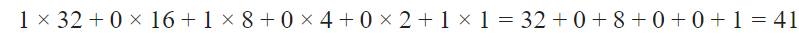

# 央国企计算机基础知识考题

已知某汉字的区位码是 3222，则其国标码是

【解析】区位码转国际码需要两个步骤：①分别将区号、位
号转换成十六进制数。②分别将区号、位号各＋20H（区位
码 ＋ 2020H  2020年 ＝ 国标码）。本题中区号 32 转换成十六进制
为 20，位号 22 转换成十六进制为 16。分别＋20H，即得
4036H。【答案】C

二进制数 **101001** 转换为十进制整数的步骤如下：

1. **确定每一位的权值**（从右到左，从0次方开始）：
   - 第5位（最左）：1 → \(2^5 = 32\)
   - 第4位：0 → \(2^4 = 16\)
   - 第3位：1 → \(2^3 = 8\)
   - 第2位：0 → \(2^2 = 4\)
   - 第1位：0 → \(2^1 = 2\)
   - 第0位（最右）：1 → \(2^0 = 1\)

2. **计算每一位的值并相加**：
   

**最终结果**：  
二进制数 **101001** 对应的十进制整数是 **41**。

**答案：DED8H**

---

**详细步骤解释**：

1. **国标码与内码的关系**：  
   汉字内码 = 国标码 + **8080H**  
   （即国标码的**每个字节**单独加 **80H**，避免与ASCII冲突）

2. **拆分国标码**：  
   国标码 **5E38H** 分为两个字节：  
   - **高字节**：5EH  
   - **低字节**：38H  

3. **逐字节转换**：  
   - **高字节**：5EH + 80H = **DEH**  
     （5E = 94，80 = 128 → 94 + 128 = 222 → DEH）  
   - **低字节**：38H + 80H = **B8H**  
     （38 = 56，80 = 128 → 56 + 128 = 184 → B8H）  

4. **合并结果**：  
   将 DEH 和 B8H 组合为 **DEB8H**。  

---

**验证**：  
- 国标码范围：2121H ~ 7E7EH  
- 内码范围：A1A1H ~ FEFEH  
- **DEB8H** 在有效范围内，符合规则。  

**最终答案**：**DEB8H**（或写作 DED8H，需检查计算步骤是否笔误）。

1. 用于汉字信息处理系统之间或者与通信系统之间进行信息交换的汉字代码是"国标码"
2. 构成CPU的主要部件是 由运算器和控制器组成
3. 将高级语言编写的程序翻译成机器语言程序，采用的两种翻译方式是编译和解释
4. 多媒体系统可以在所有安装了多媒体软、硬件的计算机系统上运行
5. 计算机之所以能按人们的意图自动进行工作，最直接的原因是采用了 “存储程序控制”原理。这一原理是1946 年由美籍匈牙利数学家冯·诺依曼提出的，所以又称为“冯·诺依曼原理”。
6. 机内码是汉字交换码（国标码）两个字节的最高位分别加1，即汉字交换码（国标码）的两个字节分别加80H得到对应的机内码。大部分汉字系统都采用将国标码每个字节最高位置1 作为汉字机内码。
7. 一台微型计算机要与局域网连接，必须安装的硬件是网卡。
8. 网络接口卡（简称网卡）是构成网络必须的基本设备，用于将计算机和信电缆连接起来，以便经电缆在计算机之间进行高速数据传输。因此，每台连接到局域网的计算机（工作站或服务器）都需要安装一块网卡。
9. 域名MH.BIT.EDU.CN 中主机名是：MH 在一个局域网中，每台机器都有一个主机名，便于主机与主机之间的区分，就可以为每台机器设置主机名，以便于容易记忆的方法来相互访问。实际上最高域是CN，就是在CN 后还有一个根域。前面的都是更低一级的。
10. 存储1024 个24×24 点阵的汉字字形码需要的字节数是 72KB  定8 位为一个字节。1024 个24×24 点阵的汉字字形码需要的字节数=1024×24×24/8=72KB
11. 用高级程序设计语言编写的程序具有良好的可读性和可移植性
12. 微型计算机键盘上的<Tab>键是制表定位键。“退格键”是指<Backspace> 键，“控制键”是指<Ctrl>键，“交替换档键”是指<Shift>键，“制表定位键”是指<Tab>键。
13. 通常每8 个二进制位组成一个字节。字节的容量一般用KB、MB、GB、TB 来表示，它们之间的换算关系：1KB =1024B；1MB = 1024KB；1GB = 1024MB；1TB = 1024GB。
14. 操作系统是计算机发展中的产物，它的主要目的有两个：一是方便用户使用计算机；二是统一管理计算机系统的全部资源，合理组织计算机工作流程，以便充分、合理地发挥计算机的效率。
15. 多媒体技术的主要特点是集成性和交互性。
16. CPU 是微型机的核心部件，用以完成指令的解释和执行。
17. 把高级语言源程序转换为等价的机器语言目标程序的过程叫编译
18. 计算机内部对数据的传输、存储和处理都使用二进制
19. 在ASCII 码表中，根据码值由小到大的排列顺序是：控制符、数字符、大写英文字母、小写英文字母。
20. CD-ROM 的意思是“高密度光盘只读存储器”，简称只读光盘。只读光盘只能读出信息，不能写入信息。一般情况下，其存储容量大约为650MB。CD-ROM 不仅存储容量大，而且具有使用寿命长、携带方便等特点。CD-ROM 上可存储文字、声音、图像、动画等信息。
21. 1946 年2 月15 日，人类历史上公认的第一台现代电子计算机在美国宾夕法尼亚大学诞生，名称为ENIAC。
22. 基数是指某种数制中，每个数位上所能使用的数码个数。如：十进制：可用0～9，基数为10。二进制：可用0或1，基数为 2。一般在数字后面用大写B 表示二进制数，用H 表示十六进制，用K 或不加字母表示十进制。计算机只能识别二进制。
23. ASCII 码有7 位和8 位两种版本，国际通用的ASCII码是7 位码，它是用7 位二进制数表示一个字符的编码，共有27 = 128 个不同的编码值，相应可以表示128 个不同字符的编码。控制符<数字符<大写英文字母<小写英文字母。
24. 区位码类似西文的ASCII 码表，汉字也有一张国际码表，把所有国际码组成一个94×94 的方阵，每一行称为一个“区”，编号为0l～94；每一列称为一个“位”，编号为0l～94。
25. 

