# 操作系统

[TOC]

##### 经典同步问题：

1. 哲学家就餐问题

   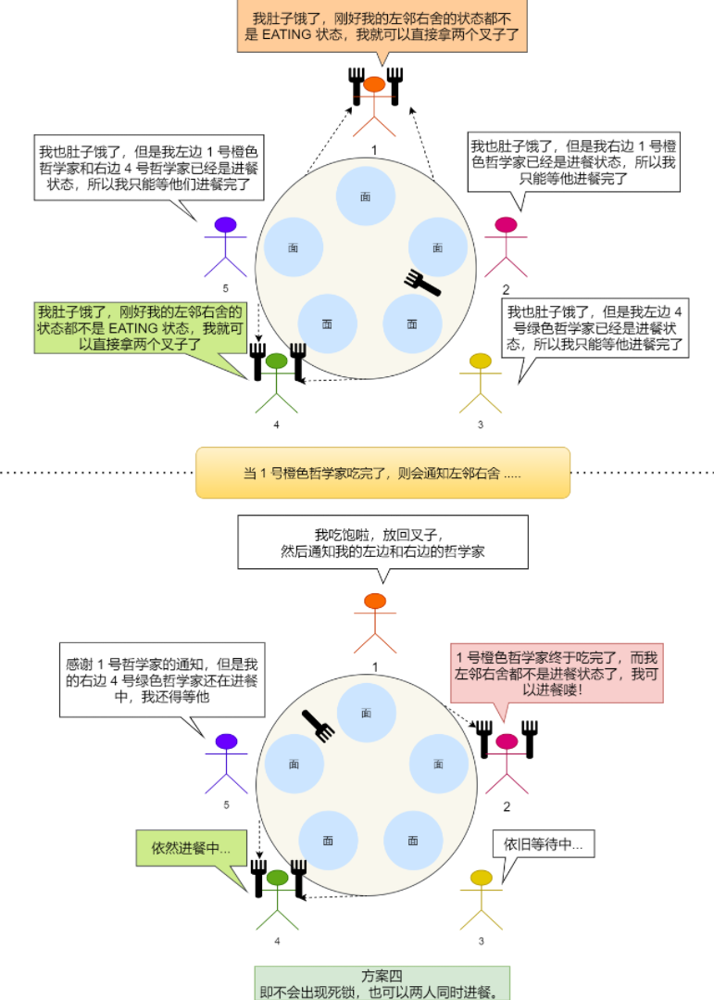

2. 读者写者问题

   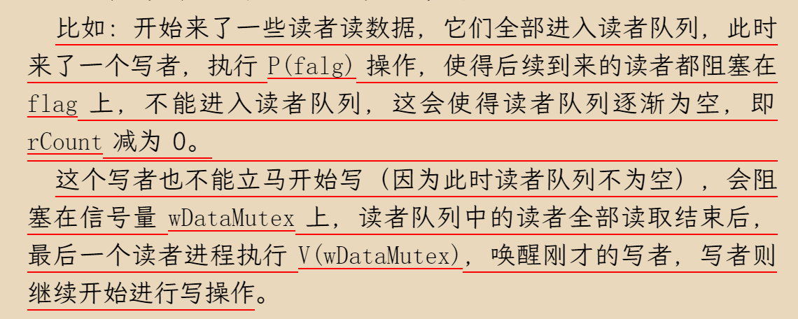

3. 死锁 是指两个或多个进程在运行过程中，因争夺资源而陷入相互等待的状态，导致它们无法继续执行，系统无法正常推进。、

   示例：

   进程A持有资源1，请求资源2；
   进程B持有资源2，请求资源1；
   两者互不相让，形成僵局。

   ---------------------------------
   死锁的四个必要条件：
   互斥（Mutual Exclusion）

   资源一次只能被一个进程独占使用（如打印机）。

   

   占有且等待（Hold and Wait）

   进程已持有至少一个资源，同时等待其他进程释放额外资源。

   

   不可抢占（No Preemption）

   资源不能被强制从持有它的进程中剥夺，只能自愿释放。

   

   循环等待（Circular Wait）

   存在进程资源的环形等待链（如A→B→C→A）。

4. ##### 悲观锁与乐观锁的区别，就像“防贼”和“事后检查”两种生活态度：

   悲观锁（Pessimistic Lock）——出门必锁门
   核心思想：“总有人会改我的数据，先锁住再说！”
   工作方式：操作数据前先加锁（如行锁、表锁），确保独占访问。
   适用场景：
   写操作频繁，冲突概率高（如银行转账、库存扣减）。
   长事务或复杂业务逻辑（需长时间持有数据）。
   优点：保证强一致性，避免脏写。
   缺点：加锁时间长，降低并发性能（其他线程需等待）。

   乐观锁（Optimistic Lock）——回家再检查
   核心思想：“大家一般不会冲突，万一冲突了再处理！”
   工作方式：不加锁，提交时检查数据是否被修改（如版本号、时间戳）。
   适用场景：
   读多写少，冲突概率低（如文章点赞、配置更新）。

   ##### 高并发读场景（避免锁竞争拖慢系统）。

   1：电商秒杀
   悲观锁：用户点击秒杀时，直接锁库存 → 可能拖垮数据库。
   乐观锁：先放用户进入，提交订单时检查库存版本号 → 更适合高并发。
   场景2：文档协作编辑
   悲观锁：编辑前锁定文档 → 其他人无法同时修改，体验差。
   乐观锁：所有人自由编辑，保存时检查版本冲突 → 类似Google Docs。

   ##### 如何选择？

   选悲观锁：
   数据强一致性要求高（如金融系统）。
   写冲突频繁，重试成本高。
   选乐观锁：
   读多写少，冲突概率低。
   系统吞吐量要求高（如互联网应用）。

5. ##### 线程上下文切换是指：

   ##### 线程的上下文切换的是什么？当两个线程是属于同一个进程，因为虚拟内存是共享的，所以在切换时，虚拟内存这些资源就保持不动，只需要切换线程的私有数据、寄存器等不共享的数据。

6. ##### 自旋锁

   自旋锁是通过 CPU 提供的 CAS 函数（Compare And Swap），在「用户态」完成加锁和解锁操作，不会主动产生线程上下文切换，所以相比互斥锁来说，会快一些，开销也小一些。

   自旋锁开销少，在多核系统下一般不会主动产生线程切换，适合异步、协程等在用户态切换请求的编程方式，但如果被锁住的代码执行时间过长，自旋的线程会长时间占用 CPU 资源，所以自旋的时间和被锁住的代码执行的时间是成「正比」的关系。

   **自旋锁** 就像你在餐厅门口等位时，**一直盯着服务员问“有空位了吗？”**，而不是取个号去逛街。用大白话解释：

   ------

   ##### **自旋锁是啥？**

   - **核心逻辑**：线程在抢不到锁时，**死循环不停检查锁状态**，直到锁被释放。
   - 特点：
     - **不放弃CPU**：线程一直占着CPU，不睡觉（不进入阻塞状态）。
     - **适合短等待**：如果锁很快被释放，能立即抢到，响应快。

   ##### **自旋锁 vs 互斥锁（普通锁）**

   |   **场景**   |         **自旋锁**          |          **互斥锁**          |
   | :----------: | :-------------------------: | :--------------------------: |
   | **等锁方式** |   死循环问“锁释放了吗？”    | 取个号去睡觉，等锁释放被叫醒 |
   | **CPU占用**  |     高（一直占着CPU问）     |      低（睡觉不占CPU）       |
   | **适用场景** | 锁持有时间极短（如几纳秒）  | 锁持有时间长（如几毫秒以上） |
   | **典型应用** | 内核中断处理、多核CPU短任务 |     用户态程序、文件读写     |

   ------

   #####  举个栗子🌰——抢厕所

   - **自旋锁**：
     你急着上厕所，门锁着。你站在门口 **不停敲门**：“好了没？好了没？” → 里面的人一出来，你立刻冲进去。
     - **优点**：反应快，一开门就能抢到。
     - **缺点**：一直敲门累死自己（浪费体力/CPU）。
   - **互斥锁**：
     你发现厕所门锁着，**回工位刷手机**，等有人喊“厕所空了”再过去。
     - **优点**：省体力（不占CPU）。
     - **缺点**：可能错过第一时间（唤醒延迟）。

   ------

   ##### **自旋锁的适用场景**

   - **锁持有时间极短**：比如修改一个变量值、更新计数器。
   - **多核CPU环境**：一个核死循环等锁，其他核照常干活，不影响整体效率。
   - **不能睡眠的场景**：如操作系统内核的中断处理程序（中断时不能切换线程）。

   ------

   ##### **自旋锁的坑**

   - **单核CPU慎用**：如果锁一直被占用，自旋锁会 **100%占着CPU**，导致其他线程无法运行，永远拿不到锁（死锁）。
   - **长时间等待血亏**：自旋锁等1秒 → CPU空转1秒，不如让出CPU给其他任务。

7. ##### 加锁的目的就是保证共享资源在任意时间里，只有一个线程访问，这样就可以避免多线程导致共享数据错乱的问题。

   **锁** 就像现实生活中的 **“门锁”**，只不过它保护的不是房间，而是计算机中的 **共享资源（比如变量、文件、数据库记录）**，防止多个线程或进程同时修改导致数据混乱。

   - **本质**：一种同步工具，确保 **同一时间只有一个线程能访问共享资源**。
   - 类比：
     - 公共厕所只有一个坑位，进去的人锁门（加锁），出来解锁（释放锁），其他人才能用。
     - 多人编辑同一份文档，谁先打开就锁定文件，其他人只能等。

   ##### **避免结果不可预测**

   - 场景

     ：多人抢票系统，余票为1时，两个用户同时点击购买。

     - **不加锁**：可能两人都买到票，导致超卖。
     - **加锁**：第一个人锁定票数，第二个人需等待，确保余票正确扣减。

   ##### **锁的工作流程**

   1. 加锁：线程访问共享资源前，先申请锁。
      - 如果锁空闲 → 获得锁，进入临界区（需要保护的代码段）。
      - 如果锁被占用 → 等待（阻塞或自旋）。
   2. **操作资源**：在锁的保护下安全修改数据。
   3. **释放锁**：操作完成后释放锁，其他线程可竞争获取。

   ------

   ##### **锁的代价**

   - **性能开销**：加锁/解锁需要时间，高并发时可能成为瓶颈。
   - **死锁风险**：多个锁互相等待（如A等B，B等A）。
   - **设计复杂度**：锁粒度太粗（性能差）、太细（易出错）。

   ------

   ##### **常见锁的类型**

   |  **锁类型**  |     **特点**      |     **适用场景**     |
   | :----------: | :---------------: | :------------------: |
   |  **互斥锁**  | 阻塞等待，让出CPU |   大部分用户态程序   |
   |  **自旋锁**  | 忙等待，不释放CPU | 内核短操作、多核环境 |
   |  **读写锁**  |  读共享，写独占   |  读多写少（如缓存）  |
   | **条件变量** | 等待特定条件成立  |  生产者-消费者模型   |

   ------

   ##### **总结**

   - **锁是并发编程的“交通警察”**：确保共享资源有序访问。
   - 核心口诀：
     - 共享数据要保护，先加锁来后操作；

8. 开发过程中，最常见的就是互斥锁的了，互斥锁加锁失败时，会用「线程切换」来应对，当加锁失败的线程再次加锁成功后的这一过程，会有两次线程上下文切换的成本，性能损耗比较大。

   如果我们明确知道被锁住的代码的执行时间很短，那我们应该选择开销比较小的自旋锁，因为自旋锁加锁失败时，并不会主动产生线程切换，而是一直忙等待，直到获取到锁，那么如果被锁住的代码执行时间很短，那这个忙等待的时间相对应也很短。

   如果能区分读操作和写操作的场景，那读写锁就更合适了，它允许多个读线程可以同时持有读锁，提高了读的并发性。根据偏袒读方还是写方，可以分为读优先锁和写优先锁，读优先锁并发性很强，但是写线程会被饿死，而写优先锁会优先服务写线程，读线程也可能会被饿死，那为了避免饥饿的问题，于是就有了公平读写锁，它是用队列把请求锁的线程排队，并保证先入先出的原则来对线程加锁，这样便保证了某种线程不会被饿死，通用性也更好点。

   互斥锁和自旋锁都是最基本的锁，读写锁可以根据场景来选择这两种锁其中的一个进行实现。

   另外，互斥锁、自旋锁、读写锁都属于悲观锁，悲观锁认为并发访问共享资源时，冲突概率可能非常高，所以在访问共享资源前，都需要先加锁。

   相反的，如果并发访问共享资源时，冲突概率非常低的话，就可以使用乐观锁，它的工作方式是，在访问共享资源时，不用先加锁，修改完共享资源后，再验证这段时间内有没有发生冲突，如果没有其他线程在修改资源，那么操作完成，如果发现有其他线程已经修改过这个资源，就放弃本次操作。

   但是，一旦冲突概率上升，就不适合使用乐观锁了，因为它解决冲突的重试成本非常高。

   不管使用的哪种锁，我们的加锁的代码范围应该尽可能的小，也就是加锁的粒度要小，这样执行速度会比较快。再来，使用上了合适的锁，就会快上加快了。

   ------

   ## [五]、调度算法

   ### 进程调度/页面置换/磁盘调度算法

   ------

   ## 1、进程调度

   **进程调度算法也称 CPU 调度算法，毕竟进程是由 CPU 调度的。**
   
   **当 CPU 空闲时，操作系统就选择内存中的某个「就绪状态」的进程，并给其分配 CPU。**
   
   什么时候会发生 CPU 调度呢？通常有以下情况：
   
   1. 当进程从运行状态转到等待状态；
   
   2. 当进程从运行状态转到就绪状态；
   
   3. 当进程从等待状态转到就绪状态；
   
   4. 当进程从运行状态转到终止状态；
   
      其中发生在 1 和 4 两种情况下的调度称为「非抢占式调度」，2 和 3 两种情况下发生的调度称为「抢占式调度」。
   
      非抢占式的意思就是，当进程正在运行时，它就会一直运行，直到该进程完成或发生某个事件而被阻塞时，才会把 CPU 让给其他进程。
   
      而抢占式调度，顾名思义就是进程正在运行的时，可以被打断，使其把 CPU 让给其他进程。那抢占的原则一般有三种，分别是时间片原则、优先权原则、短作业优先原则。
   
      你可能会好奇为什么第 3 种情况也会发生 CPU 调度呢？假设有一个进程是处于等待状态的，但是它的优先级比较高，如果该进程等待的事件发生了，它就会转到就绪状态，一旦它转到就绪状态，如果我们的调度算法是以优先级来进行调度的，那么它就会立马抢占正在运行的进程，所以这个时候就会发生 CPU 调度。
   
      那第 2 种状态通常是时间片到的情况，因为时间片到了就会发生中断，于是就会抢占正在运行的进程，从而占用 CPU。
   
   **调度算法影响的是等待时间（进程在就绪队列中等待调度的时间总和），而不能影响进程真在使用 CPU 的时间和 I/O 时间。**
   
   **调度算法影响的是进程的等待时间，而无法改变进程实际需要的 CPU 时间和 I/O 时间。** 这句话可以拆解为以下核心点：
   
   ---
   
   ### **1. 什么是“等待时间”？**
   - **定义**：进程在 **就绪队列** 中等待被 CPU 调度的时间总和。  
   - **受调度算法影响**：不同算法决定了进程何时能获得 CPU 使用权。  
     - **例**：短作业优先（SJF）会让短进程少等待，长进程多等待；而先来先服务（FCFS）则按到达顺序排队，不管任务长短。
   
   ---
   
   ### **2. 什么是“进程真在使用 CPU 的时间”和“I/O 时间”？**
   - **CPU 时间**：进程 **实际执行代码** 所需的时间（如计算 1+1、排序数组）。  
     - **由程序逻辑决定**：无论调度算法如何，计算 1 亿次加法总需要固定的 CPU 时间。  
   - **I/O 时间**：进程 **等待外部设备** 的时间（如读取硬盘、网络请求）。  
     - **由硬件速度决定**：无论调度算法如何，从硬盘读 1GB 数据总需要固定的 I/O 时间。
   
   ---
   
   ### **3. 为什么调度算法无法影响 CPU 和 I/O 时间？**
   - **CPU 时间**：  
     - 程序需要执行多少条指令是固定的，调度算法只能决定 **何时分配 CPU**，但无法减少 **总指令数**。  
     - **例**：一个进程需要 10 秒 CPU 时间，无论是连续执行（FCFS）还是分片执行（RR），总时间都是 10 秒。
   
   - **I/O 时间**：  
     - I/O 操作的速度由硬件（如磁盘转速、网络带宽）决定，调度算法只能管理 **I/O 请求的顺序**，但无法加速设备响应。  
     - **例**：从 SSD 读取文件需要 0.1 秒，无论调度算法如何优化，这个时间无法缩短。
   
   ---
   
   ### **4. 调度算法的作用范围**
   | **调度算法能影响的**             | **调度算法不能影响的**         |
   | -------------------------------- | ------------------------------ |
   | 进程在就绪队列中的等待时间       | 进程实际需要的 CPU 时间        |
   | 进程获得 CPU 的顺序和频率        | 进程执行代码的速度（CPU 算力） |
   | 进程切换的开销（上下文切换次数） | I/O 设备的物理速度             |
   | 系统整体的吞吐量和响应时间       | 单个进程的 CPU 或 I/O 需求     |
   
   ---
   
   ### **5. 举个实际例子**
   假设有两个进程：  
   - **进程A**：需要 5 秒 CPU 时间（纯计算任务）。  
   - **进程B**：需要 2 秒 CPU 时间 + 3 秒 I/O 时间。  
   
   **不同调度算法的表现**：  
   - **FCFS（先来先服务）**：  
     - 若 A 先执行 → A 用 5 秒 CPU，B 等待 5 秒后执行 → B 总等待时间 = 5 秒。  
     - **总 CPU 时间**：A(5) + B(2) = 7 秒（不变）。  
     - **总 I/O 时间**：B(3) 秒（不变）。  
   
   - **SJF（短作业优先）**：  
     - 若 B 先执行 → B 用 2 秒 CPU，A 等待 2 秒后执行 → B 总等待时间 = 0 秒，A 总等待时间 = 2 秒。  
     - **总 CPU 时间**：A(5) + B(2) = 7 秒（不变）。  
     - **总 I/O 时间**：B(3) 秒（不变）。  
   
   → **调度算法改变了等待时间，但 CPU 和 I/O 时间始终不变**。
   
   ---
   
   ### **6. 总结**
   - **调度算法是“时间管理大师”**：决定进程何时运行、运行多久，优化等待时间和系统效率。  
   - **程序需求是“硬指标”**：CPU 和 I/O 时间由代码和硬件决定，调度算法无法压缩。  
   - **关键结论**：  
     - 你可以通过调度让任务更快开始，但无法让它更快完成（除非升级硬件或优化代码）。  
     - 想缩短任务总耗时？优化程序逻辑或换更快的硬件，而不是调整调度算法！  
   
   下次遇到性能瓶颈时，先分清是“等太久”还是“干太慢”——调度算法只管前者，不管后者。 ⏳🚀
   
   
   
   **进程调度算法** 就像银行柜员决定 **“下一个叫哪个号”** 的规则，目标是让客户（进程）高效办理业务（执行任务），同时兼顾公平性和响应速度。以下是常见调度算法的大白话解释：
   
   ---
   
   ### **1. 先来先服务（FCFS）——老实人排队**
   - **规则**：谁先来，谁先办，办完一个再下一个。  
   - **优点**：简单公平，不插队。  
   - **缺点**：  
     - **长任务卡死短任务**：比如第一个人办1小时业务，后面的人等崩溃。  
     - **平均等待时间长**：短任务被长任务拖累。  
   - **场景**：早期简单系统，现已少用。
   - FCFS 对长作业有利，适用于 CPU 繁忙型作业的系统，而不适用于 I/O 繁忙型作业的系统。
   
   ---
   
   ### **2. 短作业优先（SJF）——VIP快速通道**
   - **规则**：柜员优先处理 **“办理时间最短”** 的业务。  
   - **优点**：平均等待时间最短，短任务爽翻天。  
   - **缺点**：  
     - **长任务饿死**：如果一直来短任务，长任务永远轮不到。  
     - **预知时间难**：现实中很难提前知道业务要办多久。  
   - **场景**：批处理系统（如后台计算任务）。
   - 比如，一个长作业在就绪队列等待运行，而这个就绪队列有非常多的短作业，那么就会使得长作业不断的往后推，周转时间变长，致使长作业长期不会被运行。
   
   
   
   ### 小林：那么，高响应比优先
   
   （\*Highest Response Ratio Next, HRRN\*）调度算法**主要是权衡了短作业和长作业。
   
   
   
   #### **算法核心思想**
   
   - **响应比（Response Ratio）**：动态计算每个作业的优先级，优先调度 **响应比最高** 的作业。
   
     
   
     - **等待时间**：作业在就绪队列中等待的时间。
     - **预计运行时间**：作业需要的 CPU 时间（需提前预知）。
   
   - 如果两个进程的「等待时间」相同时，「要求的服务时间」越短，「响应比」就越高，这样短作业的进程容易被选中运行；
   - 如果两个进程「要求的服务时间」相同时，「等待时间」越长，「响应比」就越高，这就兼顾到了长作业进程，因为进程的响应比可以随时间等待的增加而提高，当其等待时间足够长时，其响应比便可以升到很高，从而获得运行的机会；
   
   ---
   
   ### **3. 时间片轮转（RR）——每人限时办业务**
   - **规则**：每人最多办 **固定时间（时间片）**，超时就重新排队。  
     - 比如时间片=5分钟：A办5分钟 → B办5分钟 → C办5分钟 → 循环。  
     
   - **优点**：公平，响应快，适合交互式系统（如电脑桌面）。  
   
   - **缺点**：  
     - 时间片太短 → 频繁切换，效率低。  
     - 时间片太长 → 退化成FCFS，短任务等太久。  
     
   - **场景**：现代操作系统的默认调度策略。
   
     **每个进程被分配一个时间段，称为时间片（\*Quantum\*），即允许该进程在该时间段中运行。**
   
   - 如果时间片用完，进程还在运行，那么将会把此进程从 CPU 释放出来，并把 CPU 分配另外一个进程；
   - 如果该进程在时间片结束前阻塞或结束，则 CPU 立即进行切换；
   
   另外，时间片的长度就是一个很关键的点：
   
   - 如果时间片设得太短会导致过多的进程上下文切换，降低了 CPU 效率；
   - 如果设得太长又可能引起对短作业进程的响应时间变长。将
   
   通常时间片设为 `20ms~50ms` 通常是一个比较合理的折中值
   
   ---
   
   ### **4. 优先级调度——看人下菜碟**
   - **规则**：给每个任务设优先级，柜员先处理优先级高的。  
     - **静态优先级**：优先级固定（如VIP客户永远优先）。  
     - **动态优先级**：优先级随时间变化（如等太久的任务自动升优先级）。  
   - **优点**：灵活，可处理紧急任务。  
   - **缺点**：  
     - **低优先级饿死**：高优先级任务源源不断，低优先级永远等不到。  
     - **优先级反转**：低优先级任务占着资源，高优先级干等（需额外机制解决）。  
   - **场景**：实时系统（如航天控制、工业自动化）。
   
   
   
   对于多用户计算机系统就有不同的看法了，它们希望调度是有优先级的，即希望调度程序能**从就绪队列中选择最高优先级的进程进行运行，这称为最高优先级（\*Highest Priority First，HPF\*）调度算法**。
   
   进程的优先级可以分为，静态优先级或动态优先级：
   
   - 静态优先级：创建进程时候，就已经确定了优先级了，然后整个运行时间优先级都不会变化；
   - 动态优先级：根据进程的动态变化调整优先级，比如如果进程运行时间增加，则降低其优先级，如果进程等待时间（就绪队列的等待时间）增加，则升高其优先级，也就是**随着时间的推移增加等待进程的优先级**。
   
   该算法也有两种处理优先级高的方法，非抢占式和抢占式：
   
   - 非抢占式：当就绪队列中出现优先级高的进程，运行完当前进程，再选择优先级高的进程。
   - 抢占式：当就绪队列中出现优先级高的进程，当前进程挂起，调度优先级高的进程运行。
   
   但是依然有缺点，可能会导致低优先级的进程永远不会运行。
   
   
   
   ---
   
   ### **5. 多级反馈队列（MLFQ）——智能分诊**
   
   **多级反馈队列（\*Multilevel Feedback Queue\*）调度算法**是「时间片轮转算法」和「最高优先级算法」的综合和发展。
   
   - **规则**：  
     1. 设置多个优先级队列，新任务进最高级队列。  
     2. 每个队列时间片不同（高级队列时间片短，低级队列时间长）。  
     3. 任务用完时间片未完成 → 降级到下一队列。  
     4. 任务主动让出CPU（如等I/O） → 保持或升级队列。  
     5. 定期重置所有任务到最高队列 → 防饿死。  
   - **优点**：平衡响应时间和吞吐量，兼顾长短任务。  
   - **缺点**：参数调优复杂（队列数量、时间片大小等）。  
   - **场景**：通用操作系统（如Linux、Windows）。
   
   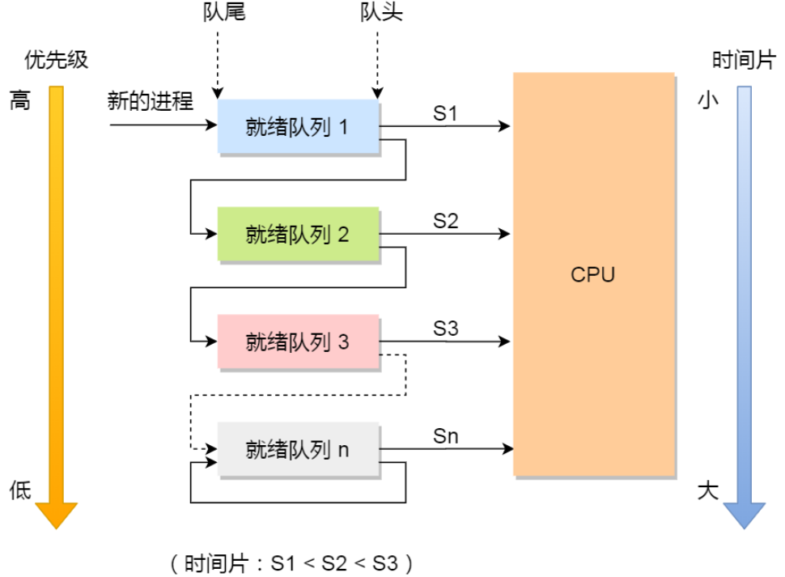
   
   小林：它是如何工作的：
   
   - 设置了多个队列，赋予每个队列不同的优先级，每个**队列优先级从高到低**，同时**优先级越高时间片越短**；
   - **新的进程会被放入到第一级队列的末尾**，按**先来先服务的原则排队等待被调度，如果在第一级队列规定的时间片没运行完成，则将其转入到第二级队列的末尾**，以此类推，直至完成；
   - **当较高优先级的队列为空，才调度较低优先级的队列中的进程运行。如果进程运行时，有新进程进入较高优先级的队列，则停止当前运行的进程并将其移入到原队列末尾，接着让较高优先级的进程运行**；
   
   可以发现，对于短作业可能可以在第一级队列很快被处理完。对于长作业，如果在第一级队列处理不完，可以移入下次队列等待被执行，虽然等待的时间变长了，但是运行时间也会更长了，所以该算法很好的**兼顾了长短作业，同时有较好的响应时间。**
   
   ---
   
   ### **总结：如何选算法？**
   | **场景**           | **推荐算法**         | **原因**                   |
   | ------------------ | -------------------- | -------------------------- |
   | 服务器处理批量任务 | 短作业优先（SJF）    | 快速完成短任务，提升吞吐量 |
   | 个人电脑交互操作   | 时间片轮转（RR）     | 公平响应，避免卡顿         |
   | 实时控制系统       | 优先级调度           | 确保紧急任务优先执行       |
   | 通用多任务环境     | 多级反馈队列（MLFQ） | 自适应长短任务，平衡效率   |
   
   ---
   
   **口诀记忆**：  
   
   - 先来先服务老实人，短作业优先快狠准；  
   - 时间片轮转保公平，优先级调度看身份；  
   - 多级反馈最智能，通用系统它称王！  
   
   理解这些算法，就能明白操作系统如何“公平高效”地管理任务啦！ 🖥️⚖️
   
   
   
   ## 2、内存页面置换算法
   
   **当 CPU 访问的页面不在物理内存时，便会产生一个缺页中断**，请求操作系统将所缺页调入到物理内存。那它与一般中断的主要区别在于：
   
   - 缺页中断在指令执行「期间」产生和处理中断信号，而一般中断在一条指令执行「完成」后检查和处理中断信号。
   
   - 缺页中断返回到该指令的开始重新执行「该指令」，而一般中断返回回到该指令的「下一个指令」执行。
   
   - **缺页中断的处理流程**：
   
     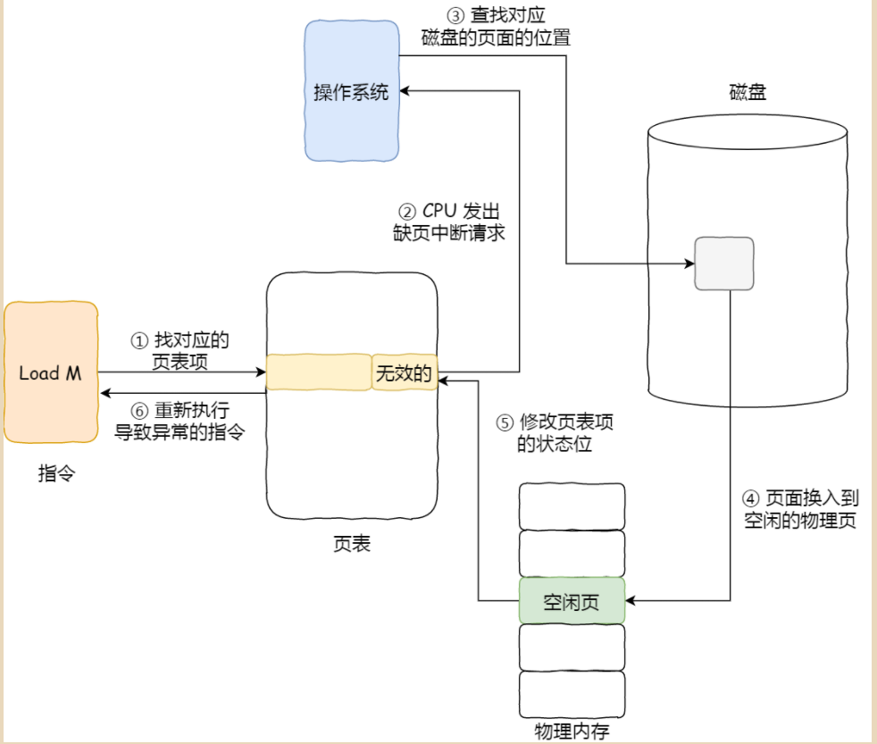
   
   1. 在 CPU 里访问一条 **Load M 指令，然后 CPU 会去找 M 所对应的页表项。**
   
   2. 如果**该页表项的状态位是「有效的」，那 CPU 就可以直接去访问物理内存了，如果状态位是「无效的」，则 CPU 则会发送缺页中断请求。**
   
      
   
      **页表项的字段**：
   
      - *状态位*：用于表示该页是否有效，也就是说是否在物理内存中，供程序访问时参考。
      - *访问字段*：用于记录该页在一段时间被访问的次数，供页面置换算法选择出页面时参考。
      - *修改位*：表示该页在调入内存后是否有被修改过，由于内存中的每一页都在磁盘上保留一份副本，因此，如果没有修改，在置换该页时就不需要将该页写回到磁盘上，以减少系统的开销；如果已经被修改，则将该页重写到磁盘上，以保证磁盘中所保留的始终是最新的副本。
      - *硬盘地址*：用于指出该页在硬盘上的地址，通常是物理块号，供调入该页时使用。
   
   3. **操作系统收到了缺页中断，则会执行缺页中断处理函数**，先会查找该页面在磁盘中的页面的位置。
   
   4. **找到磁盘中对应的页面后，需要把该页面换入到物理内存中，但是在换入前，需要在物理内存中找空闲页，如果找到空闲页，就把页面换入到物理内存中。**
   
   5. 页面**从磁盘换入到物理内存完成后，则把页表项中的状态位修改为「有效的」**。
   
   6. 最后，**CPU 重新执行导致缺页异常的指令。**
   
   上面所说的过程，第 4 步是能在物理内存找到空闲页的情况，那如果找不到呢？
   
   **找不到空闲页的话，就说明此时内存已满了，这时候，就需要「页面置换算法」选择一个物理页，如果该物理页有被修改过（脏页），则把它换出到磁盘，然后把该被置换出去的页表项的状态改成「无效的」，最后把正在访问的页面装入到这个物理页中。**
   
   （在内存页面置换算法中提到的 **「磁盘」和「内存」** 具体含义：
   
   ### **磁盘（Disk）**
   
   - **指代**：操作系统的 **交换空间（Swap Space）**，通常位于硬盘上。
   - 作用：
     - 当物理内存不足时，临时存储被换出的内存页面。
     - 保存未被修改的页面副本（如代码段、只读数据），或脏页（被修改过的数据页）的最终版本。
   - **类比**：像一个「备用仓库」，存放暂时不用的物品（页面），需要时再取回。
   
   ###  **内存（Memory）**
   
   - **指代**：**物理内存（Physical Memory / RAM）**，即计算机的实际内存条。
   
   - 作用
   
     ：
   
     - 存放当前正在运行的进程所需的页面（代码、数据、堆栈等）。
     - CPU 直接访问物理内存中的页面，速度远快于磁盘。
   
   - **类比**：像「书桌」，存放你正在使用的书籍和工具（页面），空间有限。
   
   ### **页面置换算法中的「置换」是什么？**
   
   - 置换目标
   
     ：
   
     - **物理内存中的页面** → 当物理内存已满时，选择一个页面换出到磁盘（Swap Out）。
     - **磁盘中的页面** → 当需要访问不在物理内存中的页面时，将其换入内存（Swap In）。
   
   - 关键点
   
     ：
   
     - 置换的是 **物理内存和磁盘之间的页面**，而非 CPU 缓存或其他内存层级。
     - 若被换出的页面是「脏页」（被修改过），需先写回磁盘；否则直接丢弃（磁盘已有副本）。
   
   ）
   
   ### **为什么需要页面置换？**
   
   - **物理内存有限**：无法同时加载所有进程的页面。
   - **局部性原理**：程序运行时只需部分页面在内存中，其余可暂存磁盘。
   - **效率平衡**：通过置换算法，让最常用的页面留在内存，减少访问磁盘的昂贵开销。
   
   **类比**：
   
   - 物理内存 = 你的书桌（空间有限，放正在用的书）。
   - 磁盘 = 书架（空间大，存放暂时不用的书）。
   - 页面置换 = 把书桌上的某本书放回书架，腾出空间放新书。
   
   理解这一点，就能明白页面置换算法如何优化内存使用，避免系统因内存不足而崩溃！ 🖥️📚
   
   页面置换算法的功能是，**当出现缺页异常，需调入新页面而内存已满时，选择被置换的物理页面**，也就是说选择一个物理页面换出到磁盘，然后把需要访问的页面换入到物理页。
   
   那其算法目标则是，尽可能减少页面的换入换出的次数，常见的页面置换算法有如下几种：
   
   - 最佳页面置换算法（*OPT*）
   - 先进先出置换算法（*FIFO*）
   - 最近最久未使用的置换算法（*LRU*）
   - 时钟页面置换算法（*Lock*）
   - 最不常用置换算法（*LFU*）
   
   **内存页面置换算法** 是操作系统中用于管理虚拟内存的关键机制，当物理内存不足时，决定哪些页面应被换出到磁盘，以腾出空间加载新页面。以下是常见算法的详细说明：
   
   ---
   
   ### **一、最佳置换算法（OPT, Optimal Page Replacement）**
   - **原理**：淘汰 **未来最长时间不再被访问** 的页面（理论最优，但无法实现）。  
   - **优点**：缺页率最低，作为其他算法的性能基准。  
   - **缺点**：需预知未来页面访问序列，实际不可行。  
   - **示例**：  
     访问序列：`2, 3, 2, 1, 5, 2, 4, 5, 3`，物理内存3页。  
     - 当需置换时，选择未来最晚出现的页面（如页面1）。  
   
   基本思路是，**置换在「未来」最长时间不访问的页面**。
   
   其核心思想是 **淘汰未来最长时间不再被访问的页面**，从而最小化缺页次数。虽然实际中无法实现（需预知未来访问序列），但它为其他算法提供了性能上限的参考。以下通过一个具体例子详细说明：
   
   ### **示例场景**
   
   - **物理内存页框数**：3
   
   **物理内存页框数** 是操作系统中内存管理的重要概念，它直接决定了系统能同时容纳多少页面，进而影响程序的运行效率和稳定性。
   
   - **定义**：
     物理内存被划分为多个 **固定大小的块**（如4KB），每个块称为一个 **页框（Page Frame）**。
     - **类比**：像书架上的格子，每个格子大小相同，用来放书（页面）。
   - **页框数**：
     物理内存中页框的总数量。例如：
     - 若物理内存 **4GB**，页框大小 **4KB** → 页框数 = 4GB / 4KB = **1,048,576个**。
   
   - **物理内存页框数 = 内存的“格子数量”**，决定了能同时存放多少数据。
   
   - **页框越多** → 系统越流畅，多任务处理能力越强。
   
   - **页框不足** → 频繁换页拖慢速度，甚至引发崩溃。
   
     
   
   - **页面访问序列**：`1, 2, 3, 4, 1, 2, 5, 1, 2, 3, 4, 5`
   - **目标**：展示 OPT 如何选择置换页面。
   
   ------
   
   ### **分步解析**
   
   | **访问页面** | **物理内存状态** | **是否缺页** | **置换选择（若缺页）** |                         **选择理由**                         |
   | :----------: | :--------------: | :----------: | :--------------------: | :----------------------------------------------------------: |
   |      1       |       [1]        |  是（首次）  |           -            |                     内存为空，直接加载。                     |
   |      2       |      [1, 2]      |      是      |           -            |                     内存未满，继续加载。                     |
   |      3       |    [1, 2, 3]     |      是      |           -            |                     内存未满，继续加载。                     |
   |      4       |    [1, 2, 4]     |      是      |     **淘汰页面3**      | 未来访问序列中，页面3的下次访问在第10步，而页面1和2会更早被访问（第5、6步）。 |
   |      1       |    [1, 2, 4]     |      否      |           -            |                       页面1已在内存。                        |
   |      2       |    [1, 2, 4]     |      否      |           -            |                       页面2已在内存。                        |
   |      5       |    [1, 2, 5]     |      是      |     **淘汰页面4**      | 页面4的下次访问在第11步，页面1和2会更早被访问（第8、9步）。  |
   |      1       |    [1, 2, 5]     |      否      |           -            |                       页面1已在内存。                        |
   |      2       |    [1, 2, 5]     |      否      |           -            |                       页面2已在内存。                        |
   |      3       |    [3, 2, 5]     |      是      |     **淘汰页面1**      |   页面1未来不再被访问，页面2和5的下次访问更晚（第12步）。    |
   |      4       |    [3, 4, 5]     |      是      |     **淘汰页面2**      |        页面2未来不再被访问，页面5的下次访问在第12步。        |
   |      5       |    [3, 4, 5]     |      否      |           -            |                       页面5已在内存。                        |
   
   ------
   
   ### **关键点总结**
   
   1. **置换策略**：
      - 每次缺页时，OPT 会淘汰 **未来最晚被访问** 或 **不再被访问** 的页面。
      - 例如，在第4步访问页面4时，内存已满，需在页面1、2、3中选择淘汰：
        - 页面1将在第5步被访问，页面2在第6步，页面3在第10步。
        - 页面3是未来最晚被访问的 → 淘汰页面3。
   2. **缺页次数统计**：
      - 总缺页次数 = **7次**（访问序列中加粗的步骤）。
      - 对比其他算法：
        - FIFO：9次缺页
        - LRU：7次缺页（与OPT相同，但本例中巧合）
        - Clock：8次缺页
   3. **OPT 的局限性**：
      - **需预知未来访问序列**：实际系统中无法实现，仅作为理论基准。
      - **动态性不足**：无法应对实时变化的访问模式（如程序行为突变）。
   
   这很理想，但是实际系统中无法实现，因为程序访问页面时是动态的，我们是无法预知每个页面在「下一次」访问前的等待时间。
   
   所以，最佳页面置换算法作用是为了衡量你的算法的效率，你的算法效率越接近该算法的效率，那么说明你的算法是高效的。
   
   **总结**：
   
   - OPT 是页面置换的“理想模型”，通过预知未来达到最优性能。
   - 实际系统中，LRU 和 Clock 算法通过近似 OPT 的行为，提供接近最优的性能。
   - 理解 OPT 有助于评估其他算法的优劣，例如 LRU 的缺页率越接近 OPT，说明其设计越高效。
   
   ---
   
   ### **二、先进先出算法（FIFO, First-In-First-Out）**
   
   可以**选择在内存驻留时间很长的页面进行中置换**，这个就是「先进先出置换」算法的思想。
   
   - **原理**：淘汰 **最早进入内存** 的页面。  
   - **实现**：维护一个队列，新页面加入队尾，置换时移除队首页面。  
   - **优点**：实现简单。  
   - **缺点**：  
     
     - **Belady 异常**：增加物理页框数时，缺页率可能不降反升。  
     - 忽略页面访问频率，可能淘汰常用页面。  
   - **示例**：  
     访问序列：`1, 2, 3, 4, 1, 2, 5, 1, 2, 3, 4, 5`，物理内存3页。  
     
     - 缺页次数：9次（FIFO） vs 7次（LRU）。  
     
     ### **FIFO 的核心规则**
     
     1. **队列管理**：所有页面按 **进入内存的时间顺序** 排成一个队列。
     2. **置换策略**：当需要置换页面时，选择 **最早进入内存的页面**（即队列头部的页面）。
     3. **新页面处理**：新加载的页面加入队列尾部。
     
     ------
     
     ### **二、示例场景**
     
     - **物理内存页框数**：3
     - **页面访问序列**：`1, 2, 3, 4, 1, 2, 5, 1, 2, 3, 4, 5`
     - **目标**：展示 FIFO 如何选择置换页面，并统计缺页次数。
     
     ------
     
     ### **三、分步解析**
     
     | **访问页面** | **物理内存状态** | **是否缺页** | **置换选择（若缺页）** | **队列状态（进入顺序）** |
     | :----------: | :--------------: | :----------: | :--------------------: | :----------------------: |
     |      1       |       [1]        |  是（首次）  |           -            |           [1]            |
     |      2       |      [1, 2]      |      是      |           -            |          [1, 2]          |
     |      3       |    [1, 2, 3]     |      是      |           -            |        [1, 2, 3]         |
     |      4       |    [2, 3, 4]     |      是      |     **淘汰页面1**      |        [2, 3, 4]         |
     |      1       |    [3, 4, 1]     |      是      |     **淘汰页面2**      |        [3, 4, 1]         |
     |      2       |    [4, 1, 2]     |      是      |     **淘汰页面3**      |        [4, 1, 2]         |
     |      5       |    [1, 2, 5]     |      是      |     **淘汰页面4**      |        [1, 2, 5]         |
     |      1       |    [1, 2, 5]     |      否      |           -            |        [1, 2, 5]         |
     |      2       |    [1, 2, 5]     |      否      |           -            |        [1, 2, 5]         |
     |      3       |    [2, 5, 3]     |      是      |     **淘汰页面1**      |        [2, 5, 3]         |
     |      4       |    [5, 3, 4]     |      是      |     **淘汰页面2**      |        [5, 3, 4]         |
     |      5       |    [5, 3, 4]     |      否      |           -            |        [5, 3, 4]         |
     
     ------
     
     ### **四、关键点总结**
     
     1. **缺页次数**：共 **9次缺页**（标为“是”的步骤）。
     
     2. Belady 异常（Belady Anomaly）
     
        ：
     
        - **现象**：增加物理内存页框数时，缺页率可能不降反升。
        - **示例**：若物理内存页框数从3增加到4，对某些访问序列，FIFO的缺页次数反而增加。
     
     3. 问题根源
     
        ：
     
        - FIFO 仅根据进入时间淘汰页面，**完全忽略页面的访问频率**。
        - 可能淘汰高频访问的页面（如页面1和2被反复淘汰并重新加载）。
   
   ---
   
   ### **三、最近最少使用算法（LRU, Least Recently Used）**
   
   发生缺页时，**选择最长时间没有被访问的页面进行置换**，也就是说，该算法假设已经很久没有使用的页面很有可能在未来较长的一段时间内仍然不会被使用。
   
   这种算法近似最优置换算法，最优置换算法是通过「未来」的使用情况来推测要淘汰的页面，而 LRU 则是通过「历史」的使用情况来推测要淘汰的页面。
   
   - **原理**：淘汰 **最长时间未被访问** 的页面。  
   - **实现**：  
     - **计数器/时间戳**：记录每个页面最后一次访问时间。  
     - **链表**：每次访问页面时将其移到链表头部，淘汰尾部页面。  
   - **优点**：接近OPT性能，缺页率低。  
   - **缺点**：硬件实现复杂（需记录访问时间）。  
   - **示例**：  
     访问序列：`1, 2, 3, 4, 1, 2, 5, 1, 2, 3, 4, 5`，物理内存3页。  
     - 缺页次数：7次。  
   
   **最近最久未使用置换算法（LRU，Least Recently Used）** 是一种基于页面访问历史的置换策略，其核心思想是 **淘汰最长时间未被访问的页面**，以利用程序的局部性原理，减少缺页率。以下是详细说明和示例：
   
   ------
   
   ### **一、LRU 的核心原理**
   
   - **时间局部性**：如果一个页面最近被访问过，它很可能在不久的将来再次被访问。
   - **淘汰策略**：选择 **最久未被访问的页面** 进行置换，保留近期可能被使用的页面。
   
   ------
   
   ### **二、LRU 的实现方式**
   
   #### **1. 链表法**
   
   - **维护链表**：所有页面按访问时间排序，最近访问的页面在链表头部，最久未访问的在尾部。
   
   - 操作
   
     ：
   
     - **访问页面**：若页面在链表中，将其移到头部；若不在，加载到头部并淘汰尾部页面。
     - **置换页面**：直接淘汰链表尾部页面。
   
   #### **2. 计数器/时间戳法**
   
   - **记录时间戳**：每个页面维护一个最后访问时间戳。
   - **置换时**：选择时间戳最早的页面淘汰。
   
   #### **3. 近似实现（Clock 算法）**
   
   - **访问位（R位）**：页面被访问时置1，定期扫描并清零。
   - **置换策略**：类似时钟算法，但结合访问历史近似LRU。
   
   ------
   
   ### **三、LRU 示例分析**
   
   - **物理内存页框数**：3
   - **页面访问序列**：`1, 2, 3, 4, 1, 2, 5, 1, 2, 3, 4, 5`
   - **目标**：统计缺页次数并展示置换过程。
   
   ------
   
   #### **分步解析**
   
   | **访问页面** | **物理内存状态** | **是否缺页** | **置换选择（若缺页）** | **访问顺序（最近→最久）** |
   | :----------: | :--------------: | :----------: | :--------------------: | :-----------------------: |
   |      1       |       [1]        |  是（首次）  |           -            |            [1]            |
   |      2       |      [1, 2]      |      是      |           -            |          [2, 1]           |
   |      3       |    [1, 2, 3]     |      是      |           -            |         [3, 2, 1]         |
   |      4       |    [2, 3, 4]     |      是      |     **淘汰页面1**      |         [4, 3, 2]         |
   |      1       |    [3, 4, 1]     |      是      |     **淘汰页面2**      |         [1, 4, 3]         |
   |      2       |    [4, 1, 2]     |      是      |     **淘汰页面3**      |         [2, 1, 4]         |
   |      5       |    [1, 2, 5]     |      是      |     **淘汰页面4**      |         [5, 2, 1]         |
   |      1       |    [5, 2, 1]     |      否      |           -            |         [1, 5, 2]         |
   |      2       |    [5, 1, 2]     |      否      |           -            |         [2, 1, 5]         |
   |      3       |    [1, 2, 3]     |      是      |     **淘汰页面5**      |         [3, 2, 1]         |
   |      4       |    [2, 3, 4]     |      是      |     **淘汰页面1**      |         [4, 3, 2]         |
   |      5       |    [3, 4, 5]     |      是      |     **淘汰页面2**      |         [5, 4, 3]         |
   
   ------
   
   ### **四、关键点总结**
   
   1. **缺页次数**：共 **9次缺页**（标为“是”的步骤）。
   
   2. 性能对比
   
      ：
   
      - **OPT 算法**：7次缺页（理论最优）。
      - **FIFO 算法**：9次缺页（与LRU相同，但本例中因访问模式特殊）。
   
   3. **局部性失效**：本例中页面访问模式（如循环访问）导致LRU表现不佳，实际场景中LRU通常优于FIFO。
   
   - **LRU 是“以史为鉴”的置换策略**：通过淘汰最久未使用的页面，优化内存利用率。
   - **核心优势**：利用时间局部性，减少高频页面的置换次数。
   - **局限**：实现复杂，对特定访问模式（如循环）效果不佳。
   
   ---
   
   ### **四、时钟算法（Clock / Second Chance）**
   - **原理**：近似LRU，通过 **环形链表** 和 **访问位（R位）** 管理页面。  
   - **步骤**：  
     1. 页面组织成环形链表，初始访问位R=0。  
     2. 访问页面时，R=1。  
     3. 置换时，指针循环扫描：  
        - 若R=1 → 置R=0，跳过；  
        - 若R=0 → 淘汰该页。  
   - **优点**：开销低，接近LRU性能。  
   - **缺点**：可能淘汰最近使用但R位被清零的页面。  
   - **示例**：  
     访问序列：`1, 2, 3, 4, 1, 2, 5`，物理内存3页。  
     - 缺页次数：5次。  
   
   ---
   
   ### **五、最不常用算法（LFU, Least Frequently Used）**
   
   #### 最不常用算法
   
   最不常用（*LFU*）算法，这名字听起来很调皮，但是它的意思不是指这个算法不常用，而是**当发生缺页中断时，选择「访问次数」最少的那个页面，并将其淘汰**。
   
   它的实现方式是，对每个页面设置一个「访问计数器」，每当一个页面被访问时，该页面的访问计数器就累加 1。在发生缺页中断时，淘汰计数器值最小的那个页面。
   
   看起来很简单，每个页面加一个计数器就可以实现了，但是在操作系统中实现的时候，我们需要考虑效率和硬件成本的。
   
   要增加一个计数器来实现，这个硬件成本是比较高的，另外如果要对这个计数器查找哪个页面访问次数最小，查找链表本身，如果链表长度很大，是非常耗时的，效率不高。
   
   但还有个问题，LFU 算法只考虑了频率问题，没考虑时间的问题，比如有些页面在过去时间里访问的频率很高，但是现在已经没有访问了，而当前频繁访问的页面由于没有这些页面访问的次数高，在发生缺页中断时，就会可能会误伤当前刚开始频繁访问，但访问次数还不高的页面。
   
   那这个问题的解决的办法还是有的，可以定期减少访问的次数，比如当发生时间中断时，把过去时间访问的页面的访问次数除以 2，也就说，随着时间的流失，以前的高访问次数的页面会慢慢减少，相当于加大了被置换的概率。
   
   
   
   - **原理**：淘汰 **访问次数最少** 的页面。  
   - **实现**：为每个页面维护访问计数器，置换时选择计数最小的页面。  
   - **优点**：适合访问模式稳定的场景。  
   - **缺点**：  
     - 历史累计访问次数可能掩盖近期变化。  
     - 计数器溢出问题。  
   - **变种**：**老化算法（Aging）**，定期右移计数器并叠加新访问位。  
   
   
   
   **最不常用算法（LFU，Least Frequently Used）** 是一种基于页面访问频率的置换算法，其核心思想是 **淘汰访问次数最少的页面**，适用于访问模式相对稳定的场景。以下是详细解析：
   
   ------
   
   ### **一、LFU 的核心原理**
   
   - **频率统计**：为每个页面维护一个 **访问计数器**，记录其被访问的次数。
   - **置换策略**：当需要置换页面时，选择 **访问次数最少** 的页面淘汰。
   - **平局处理**：若多个页面访问次数相同，可结合LRU策略（淘汰最久未访问的）。
   
   ------
   
   ### **二、LFU 的实现方式**
   
   #### **1. 基础实现（计数器法）**
   
   - **计数器更新**：每次页面被访问时，计数器加1。
   - **置换选择**：遍历所有页面，选择计数器值最小的页面淘汰。
   - **问题**：历史累计访问次数可能掩盖近期变化（如旧页面计数高但不再使用）。
   
   #### **2. 老化算法（Aging）**
   
   - **定期衰减**：每隔一段时间，将所有页面的计数器右移一位（相当于除以2）。
   - **新访问叠加**：每次访问时，计数器最高位设为1。
   - **优点**：减少历史数据影响，更关注近期访问模式。
   
   #### **3. 基于时间窗口的LFU**
   
   - **滑动窗口**：仅统计最近一段时间内的访问次数（如过去5分钟）。
   - **实现**：使用队列或环形缓冲区记录时间窗口内的访问事件。
   - **优点**：动态适应访问模式变化。
   
   ------
   
   ### **三、LFU 示例分析**
   
   - **物理内存页框数**：3
   - **页面访问序列**：`1, 2, 1, 3, 1, 2, 4, 3, 5`
   - **目标**：统计缺页次数并展示置换过程。
   
   ------
   
   #### **分步解析**
   
   | **访问页面** | **物理内存状态** | **访问计数器** | **是否缺页** |          **置换选择（若缺页）**           |
   | :----------: | :--------------: | :------------: | :----------: | :---------------------------------------: |
   |      1       |       [1]        |      1:1       |  是（首次）  |                     -                     |
   |      2       |      [1, 2]      |    1:1, 2:1    |      是      |                     -                     |
   |      1       |      [1, 2]      |    1:2, 2:1    |      否      |                     -                     |
   |      3       |    [1, 2, 3]     | 1:2, 2:1, 3:1  |      是      |                     -                     |
   |      1       |    [1, 2, 3]     | 1:3, 2:1, 3:1  |      否      |                     -                     |
   |      2       |    [1, 2, 3]     | 1:3, 2:2, 3:1  |      否      |                     -                     |
   |      4       |    [1, 2, 4]     | 1:3, 2:2, 4:1  |      是      |          **淘汰页面3**（计数1）           |
   |      3       |    [2, 4, 3]     | 2:2, 4:1, 3:1  |      是      | **淘汰页面4或3**（平局时选最久未访问的4） |
   |      5       |    [2, 3, 5]     | 2:2, 3:1, 5:1  |      是      | **淘汰页面3或5**（平局时选最久未访问的3） |
   
   ------
   
   ### **四、LFU 的优缺点**
   
   |                     **优点**                     |                     **缺点**                     |
   | :----------------------------------------------: | :----------------------------------------------: |
   |  ✅ **适合稳定访问模式**：长期热点数据保留率高。  | ❌ **历史累计问题**：旧页面计数高但可能不再使用。 |
   |      ✅ **减少高频页面置换**：保护常用数据。      |     ❌ **实现复杂**：需维护计数器和处理平局。     |
   | ✅ **无Belady异常**：增加内存页框数总能减少缺页。 |  ❌ **对突发访问不敏感**：新页面可能被快速淘汰。  |
   
   ---
   
   ### **六、算法对比与总结**
   | **算法**  | **实现复杂度** | **缺页率** | **硬件支持**  | **适用场景**            |
   | --------- | -------------- | ---------- | ------------- | ----------------------- |
   | **OPT**   | 理论不可实现   | 最低       | 无            | 性能基准                |
   | **FIFO**  | 简单           | 高         | 无            | 简单系统                |
   | **LRU**   | 高             | 低         | 需要（如TLB） | 通用系统                |
   | **Clock** | 中             | 中低       | 需要R位       | 实际操作系统（如Linux） |
   | **LFU**   | 高             | 中         | 需要计数器    | 特定访问模式            |
   
   ---
   
   ### **七、如何选择页面置换算法？**
   1. **追求性能**：LRU或Clock（平衡开销与效率）。  
   2. **硬件支持有限**：Clock算法（仅需访问位）。  
   3. **简单系统**：FIFO（易实现，但需注意Belady异常）。  
   4. **特定访问模式**：LFU（如缓存热点数据）。  
   
   ---
   
   **口诀**：  
   - OPT理论最优，FIFO简单但有坑；  
   - LRU效果好，实现成本高；  
   - Clock折中选，实际系统最爱用！  
   
   理解这些算法，有助于优化内存管理，提升系统整体性能。 🖥️⚡


## 3、磁盘调度算法

磁盘调度算法的目的很简单，就是为了提高磁盘的访问性能，一般是通过优化磁盘的访问请求顺序来做到的。

寻道的时间是磁盘访问最耗时的部分，如果请求顺序优化的得当，必然可以节省一些不必要的寻道时间，从而提高磁盘的访问性能。

**磁道距离的计算方法** 是磁盘调度算法中的核心概念，其本质是 **磁头需要移动的物理磁道数**。以下是详细说明和示例：

------

### **磁道距离的定义**

- **磁道编号**：磁盘被划分为多个同心圆（磁道），每个磁道有唯一编号（如从0到N-1）。

- **距离计算**：两个磁道之间的物理距离 = 它们编号的 **绝对值差**。

  

**假设有下面一个请求序列，每个数字代表磁道的位置：**

98，183，37，122，14，124，65，67

初始磁头当前的位置是在第 `53` 磁道。

接下来，分别对以上的序列，作为每个调度算法的例子，那常见的磁盘调度算法有：

- 先来先服务算法
- 最短寻道时间优先算法
- 扫描算法算法
- 循环扫描算法
- LOOK 与 C-LOOK 算法


---

## **一、先来先服务算法（FCFS, First-Come-First-Served）**
### **原理**
- **按请求到达顺序**处理磁盘访问请求，不优化磁头移动路径。
- **示例**：  
  当前磁头位置：50  
  请求队列：`[98, 183, 37, 122, 14, 124, 65, 67]`  
  移动顺序：50 → 98 → 183 → 37 → 122 → 14 → 124 → 65 → 67  
  总寻道距离：`(98-50) + (183-98) + (183-37) + ... = 640` 磁道。

### **优缺点**
| **优点**                 | **缺点**                                                 |
| ------------------------ | -------------------------------------------------------- |
| ✅ 实现简单，公平无饥饿。 | ❌ 寻道时间长，磁头频繁来回移动（如示例中的长距离跳跃）。 |
| ✅ 无额外计算开销。       | ❌ 不适合高并发或密集请求场景。                           |

### **适用场景**
- 请求稀疏的简单系统（如老旧嵌入式设备）。

**小林：先来先服务**

先来先服务（*First-Come，First-Served，FCFS*），顾名思义，先到来的请求，先被服务。

那按照这个序列的话：

98，183，37，122，14，124，65，67

那么，磁盘的写入顺序是从左到右，如下图：

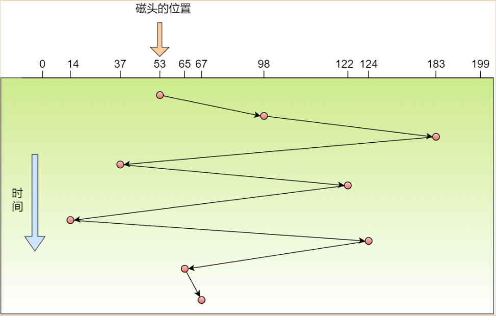

先来先服务算法总共移动了 `640` 个磁道的距离，这么一看这种算法，比较简单粗暴，但是如果大量进程竞争使用磁盘，请求访问的磁道可能会很分散，那先来先服务算法在性能上就会显得很差，因为寻道时间过长。

---

## **二、最短寻道时间优先算法（SSTF, Shortest Seek Time First）**
### **原理**
- 每次选择 **离当前磁头位置最近** 的请求处理。
- **示例**：  
  当前磁头位置：50  
  请求队列：`[98, 183, 37, 122, 14, 124, 65, 67]`  
  移动顺序：50 → 37 → 14 → 65 → 67 → 98 → 122 → 124 → 183  
  总寻道距离：`236` 磁道。

### **优缺点**
| **优点**                   | **缺点**                                       |
| -------------------------- | ---------------------------------------------- |
| ✅ 寻道时间最短，吞吐量高。 | ❌ 可能导致饥饿（如边缘磁道请求长期不被处理）。 |
| ✅ 适合密集请求场景。       | ❌ 实现复杂（需动态计算距离）。                 |

**小林：**

最短寻道时间优先（*Shortest Seek First，SSF*）算法的工作方式是，优先选择从当前磁头位置所需寻道时间最短的请求，还是以这个序列为例子：

98，183，37，122，14，124，65，67

那么，那么根据距离磁头（ 53 位置）最近的请求的算法，具体的请求则会是下列从左到右的顺序：

65，67，37，14，98，122，124，183

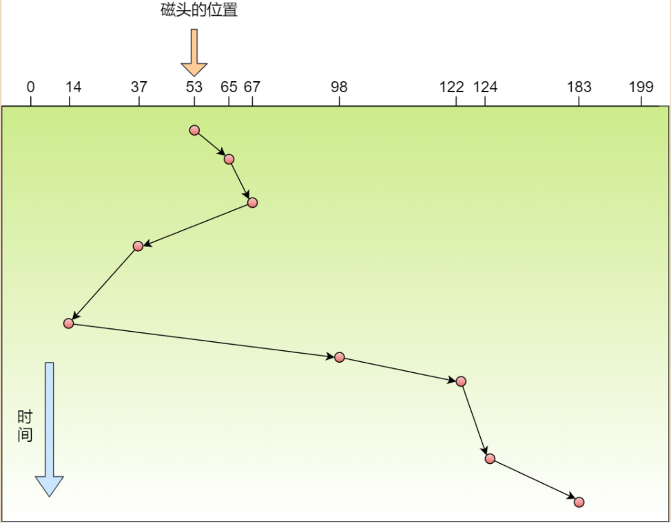

### **适用场景**

- 实时系统或请求集中的场景（如数据库频繁访问同一区域）。磁头移动的总距离是 `236` 磁道，相比先来先服务性能提高了不少。
- 但这个算法可能存在某些请求的**饥饿**，因为本次例子我们是静态的序列，看不出问题，假设是一个动态的请求，如果后续来的请求都是小于 183 磁道的，那么 183 磁道可能永远不会被响应，于是就产生了饥饿现象，这里**产生饥饿的原因是磁头在一小块区域来回移动**。

---

## **三、扫描算法（SCAN，电梯算法）**
### **原理**
- 磁头 **单向移动** 到磁盘一端，再反向扫描处理请求（类似电梯运行）。
- **示例**（磁头初始方向向右）：  
  当前磁头位置：50  
  请求队列：`[98, 183, 37, 122, 14, 124, 65, 67]`  
  移动顺序：50 → 65 → 67 → 98 → 122 → 124 → 183（右端）→ 37 → 14（左端）  
  总寻道距离：`332` 磁道。

### **优缺点**
| **优点**             | **缺点**                                     |
| -------------------- | -------------------------------------------- |
| ✅ 公平性好，无饥饿。 | ❌ 磁头必须移动到磁盘端点，可能延迟边缘请求。 |
| ✅ 寻道时间均衡。     | ❌ 反向扫描时请求可能集中，导致局部高延迟。   |

**小林：**

最短寻道时间优先算法会产生饥饿的原因在于：磁头有可能再一个小区域内来回得移动。

为了防止这个问题，可以规定：**磁头在一个方向上移动，访问所有未完成的请求，直到磁头到达该方向上的最后的磁道，才调换方向，这就是扫描（\*Scan\*）算法**。

这种算法也叫做电梯算法，比如电梯保持按一个方向移动，直到在那个方向上没有请求为止，然后改变方向。

还是以这个序列为例子，磁头的初始位置是 53：

98，183，37，122，14，124，65，67

那么，假设扫描调度算先朝磁道号减少的方向移动，具体请求则会是下列从左到右的顺序：

37，14，`0`，65，67，98，122，124，183

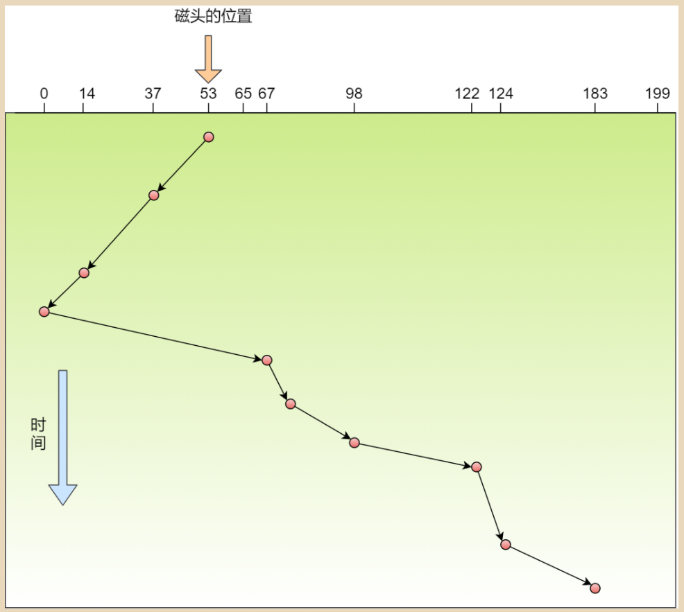

磁头先响应左边的请求，直到到达最左端（ 0 磁道）后，才开始反向移动，响应右边的请求。

扫描调度算法性能较好，不会产生饥饿现象，但是存在这样的问题，中间部分的磁道会比较占便宜，中间部分相比其他部分响应的频率会比较多，也就是说每个磁道的响应频率存在差异。

### **适用场景**

- 通用服务器或需要均衡负载的系统。

---

## **四、循环扫描算法（C-SCAN）**
### **原理**
- 磁头 **单向移动** 到磁盘一端后，**直接返回起点**（不处理返回途中的请求），重新开始扫描。
- **示例**（磁头初始方向向右）：  
  当前磁头位置：50  
  请求队列：`[98, 183, 37, 122, 14, 124, 65, 67]`  
  移动顺序：50 → 65 → 67 → 98 → 122 → 124 → 183（右端）→ 0（快速返回）→ 14 → 37  
  总寻道距离：`383` 磁道。

### **优缺点**
| **优点**                         | **缺点**                           |
| -------------------------------- | ---------------------------------- |
| ✅ 更公平，边缘请求等待时间一致。 | ❌ 返回时不处理请求，资源利用率低。 |
| ✅ 适合均匀分布的请求。           | ❌ 寻道距离可能比 SCAN 更长。       |

### **适用场景**
- 需要均匀服务时间的系统（如视频流服务器）。

**小林：**

扫描算法使得每个磁道响应的频率存在差异，那么要优化这个问题的话，可以总是按相同的方向进行扫描，使得每个磁道的响应频率基本一致。


扫描算法使得每个磁道响应的频率存在差异，那么要优化这个问题的话，可以总是按相同的方向进行扫描，使得每个磁道的响应频率基本一致。

循环扫描（*Circular Scan, CSCAN* ）规定：只有磁头朝某个特定方向移动时，才处理磁道访问请求，而返回时直接快速移动至最靠边缘的磁道，也就是复位磁头，这个过程是很快的，并且**返回中途不处理任何请求**，该算法的特点，就是**磁道只响应一个方向上的请求**。

还是以这个序列为例子，磁头的初始位置是 53：

98，183，37，122，14，124，65，67

那么，假设循环扫描调度算先朝磁道增加的方向移动，具体请求会是下列从左到右的顺序：

65，67，98，122，124，183，`199`，`0`，14，37

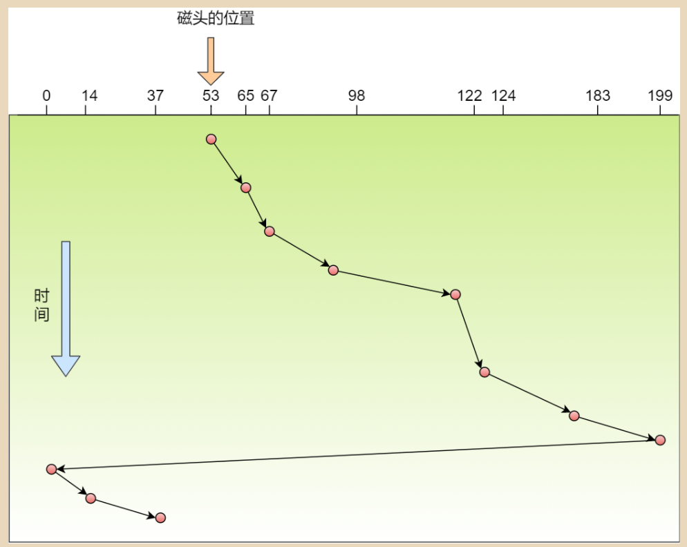

---

磁头先响应了右边的请求，直到碰到了最右端的磁道 199，就立即回到磁盘的开始处（磁道 0），但这个返回的途中是不响应任何请求的，直到到达最开始的磁道后，才继续顺序响应右边的请求。

**循环扫描算法相比于扫描算法，对于各个位置磁道响应频率相对比较平均。**

## **五、LOOK 与 C-LOOK 算法**

### **原理**
- **LOOK**：SCAN 的改进版，磁头移动到 **最远请求位置即反向**，无需到达磁盘端点。  
- **C-LOOK**：C-SCAN 的改进版，磁头移动到 **最远请求位置即返回起点**，不处理返回途中的请求。  

### **示例（LOOK）**
当前磁头位置：50  
请求队列：`[98, 183, 37, 122, 14, 124, 65, 67]`  
移动顺序：50 → 65 → 67 → 98 → 122 → 124 → 183（最远请求）→ 37 → 14  
总寻道距离：`322` 磁道。

### **优缺点**
| **算法**   | **优点**                        | **缺点**                         |
| ---------- | ------------------------------- | -------------------------------- |
| **LOOK**   | ✅ 减少无效移动，效率高于 SCAN。 | ❌ 实现复杂，需动态跟踪最远请求。 |
| **C-LOOK** | ✅ 比 C-SCAN 更高效。            | ❌ 返回时仍不处理请求。           |

### **适用场景**
- 现代磁盘调度主流选择（如 Linux 默认调度策略）。

**小林**：我们前面说到的扫描算法和循环扫描算法，都是磁头移动到磁盘「最始端或最末端」才开始调换方向。

那这其实是可以优化的，优化的思路就是**磁头在移动到「最远的请求」位置，然后立即反向移动。**

那针对 SCAN 算法的优化则叫 LOOK 算法，它的工作方式，磁头在每个方向上仅仅移动到最远的请求位置，然后立即反向移动，而不需要移动到磁盘的最始端或最末端，**反向移动的途中会响应请求**。

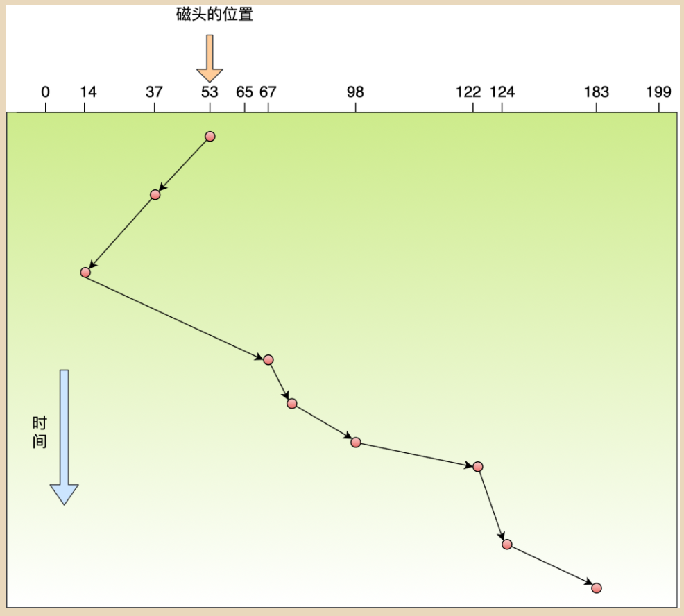

---

而针 C-SCAN 算法的优化则叫 C-LOOK，它的工作方式，磁头在每个方向上仅仅移动到最远的请求位置，然后立即反向移动，而不需要移动到磁盘的最始端或最末端，**反向移动的途中不会响应请求**。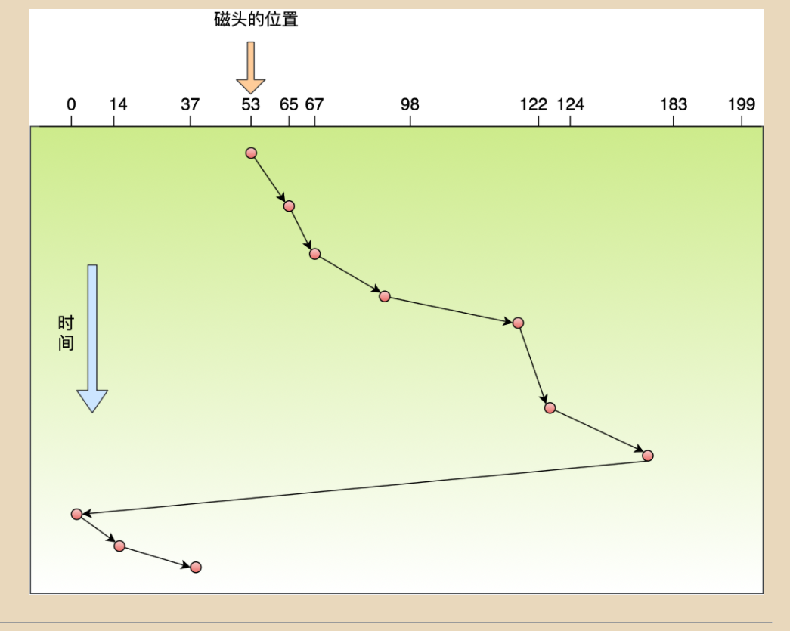


## **六、算法对比总结**

| **算法** | **寻道时间** | **公平性** | **饥饿风险** | **适用场景**         |
| -------- | ------------ | ---------- | ------------ | -------------------- |
| FCFS     | 高           | 高         | 无           | 简单系统             |
| SSTF     | 最低         | 低         | 有           | 实时系统             |
| SCAN     | 中           | 中         | 无           | 通用服务器           |
| C-SCAN   | 中高         | 高         | 无           | 均匀服务请求         |
| LOOK     | 低           | 中         | 无           | 现代高并发系统       |
| C-LOOK   | 低           | 高         | 无           | 需高效均匀服务的系统 |

---

## **七、选择建议**
- **追求高吞吐量**：SSTF（需注意饥饿问题）。  
- **均衡与公平**：LOOK 或 C-LOOK（现代系统首选）。  
- **简单稳定**：SCAN（传统服务器）。  
- **极端均匀性**：C-SCAN（如CDN节点）。  

**口诀**：  
- 先来先服务简单粗暴，最短寻道高效但偏心；  
- 扫描算法像电梯，循环扫描更均匀；  
- LOOK 灵活省路程，现代系统它称王！  

理解这些算法，可帮助优化磁盘I/O性能，提升系统整体效率。 💾⚡


# [六]、 文件系统

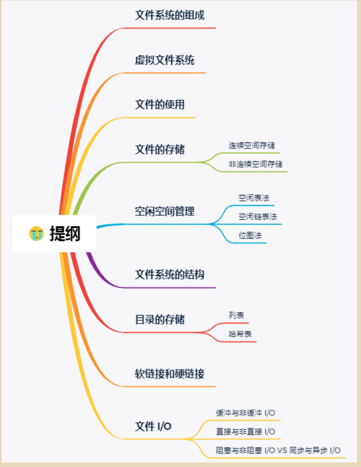

------

1. - **文件系统（File System）** 是操作系统用于管理存储设备（如硬盘、SSD、U盘）上数据的核心机制，它将物理存储空间组织成逻辑上的 **文件和目录**，为用户和应用程序提供高效、安全的数据访问方式。以下是文件系统的详细解析：

     ---

     ### **一、文件系统的核心功能**
     1. **数据组织**  
        - 将存储设备划分为 **文件**（数据集合）和 **目录**（文件的分组结构）。  
        - 支持树状目录结构（如Windows的C:\Users，Linux的/home）。

     2. **存储管理**  
        - 分配和回收存储空间（如按块或簇管理）。  
        - 处理文件碎片（优化读写效率）。

     3. **元数据管理**  
        - 记录文件属性：名称、大小、创建时间、权限等。  
        - 通过 **inode**（类Unix系统）或 **文件控制块（FCB）** 存储元数据。

     4. **访问控制**  
        - 管理用户权限（如读、写、执行）。  
        - 支持访问控制列表（ACL）或简单权限模型（如Linux的rwx）。

     5. **数据保护与恢复**  
        - 日志功能（Journaling）：记录操作日志，防止断电或崩溃导致数据损坏。  
        - 支持备份、快照（Snapshots）和冗余存储。

     ---

     ### **二、常见文件系统类型**
     | **文件系统** | **特点**                                                     | **适用场景**    |
     | ------------ | ------------------------------------------------------------ | --------------- |
     | **FAT32**    | 兼容性强（跨平台），不支持单文件>4GB，无权限管理。           | U盘、旧设备     |
     | **NTFS**     | 支持大文件（TB级）、权限控制、日志功能，Windows默认文件系统。 | Windows硬盘     |
     | **exFAT**    | 针对闪存优化，支持大文件，兼容性好。                         | 大容量U盘、SD卡 |
     | **ext4**     | Linux主流文件系统，日志功能完善，支持最大1EB文件。           | Linux系统盘     |
     | **APFS**     | Apple专为SSD优化，支持加密、快照、空间共享。                 | macOS、iOS设备  |
     | **ZFS**      | 高级功能：数据去重、快照、纠删码，适合企业级存储。           | 服务器、NAS     |
     | **HDFS**     | 分布式文件系统，支持海量数据分块存储（如Hadoop生态）。       | 大数据分析      |

     ---

     ### **三、文件系统的核心结构**
     1. **超级块（Superblock）**  
        - 存储文件系统的全局信息：块大小、inode数量、空闲块列表等。  
        - 类似书的目录页，记录全书章节和页码。

     2. **inode（索引节点）**  
        - 类Unix系统中，每个文件对应一个inode，存储元数据和数据块指针。  
        - **不包含文件名**，文件名存储在目录项中。

     3. **数据块（Data Block）**  
        - 实际存储文件内容的单元（如4KB大小的块）。  
        - 大文件可能占用多个不连续块（需处理碎片）。

     4. **目录结构**  
        - 目录本质是特殊文件，存储文件名与inode的映射关系。  
        - 支持硬链接（同一inode多个文件名）和软链接（快捷方式）。

     ---

     ### **四、文件系统如何工作？**
     1. **文件创建**  
        - 分配inode，记录元数据；分配数据块，更新空闲块列表。

     2. **文件写入**  
        - 根据块大小拆分数据，写入空闲块，更新inode中的块指针。

     3. **文件读取**  
        - 通过目录找到文件名对应的inode，根据块指针读取数据块。

     4. **文件删除**  
        - 标记inode和数据块为“空闲”，实际数据可能残留（可恢复）。  
        - 安全删除需覆写数据块。

     ---

     ### **五、高级功能**
     1. **日志功能（Journaling）**  
        - 记录操作日志，崩溃后快速恢复一致性（如ext4、NTFS）。  
        - 类比“草稿纸”，先记录再执行，避免数据错乱。

     2. **快照（Snapshot）**  
        - 冻结某一时刻的文件系统状态，用于备份或回滚（如ZFS、APFS）。

     3. **加密与压缩**  
        - 透明加密（如BitLocker）或按文件加密（如APFS加密卷）。  
        - 压缩节省空间（如NTFS压缩、ZFS透明压缩）。

     4. **分布式文件系统**  
        - 跨多台机器存储数据，支持高并发访问（如HDFS、Ceph）。

     ---

     ### **六、文件系统 vs 存储设备**
     | **特性**       | **文件系统**               | **存储设备（硬盘/SSD）**         |
     | -------------- | -------------------------- | -------------------------------- |
     | **角色**       | 逻辑数据管理               | 物理数据存储                     |
     | **功能**       | 组织文件、权限控制、日志   | 提供存储空间、读写物理扇区       |
     | **用户可见性** | 用户直接操作（如创建文件） | 用户不可见（由文件系统抽象管理） |

     ---

     ### **七、如何选择文件系统？**
     1. **操作系统兼容性**  
        - Windows首选NTFS，Linux选ext4/Btrfs，macOS选APFS。

     2. **存储介质类型**  
        - SSD：APFS、exFAT（针对闪存优化）。  
        - HDD：NTFS、ext4（传统机械硬盘）。

     3. **使用场景**  
        - 移动设备：exFAT（兼容性好）。  
        - 服务器：ZFS（数据安全）、XFS（高性能大文件）。  
        - 网络存储：NFS（共享）、HDFS（大数据）。

     ---

     ### **总结**
     - **文件系统是数据的“图书管理员”**：负责分类、存储、保护和快速检索。  
     - **核心价值**：将物理存储转化为易用的逻辑结构，平衡效率与安全。  
     - **选择建议**：根据设备类型、操作系统和需求匹配文件系统。  

     **口诀**：  
     - 文件系统管数据，目录文件树状排；  
     - 日志快照保安全，选对类型速度快！  

     理解文件系统，是优化存储性能和数据管理的关键一步。 💾📂

### 小林：1、文件系统的基本组成：

**文件系统是**操作系统中负责管理持久数据的子系统，说简单点，就是**负责把用户的文件存到磁盘硬件中，因为即使计算机断电了，磁盘里的数据并不会丢失，所以可以持久化的保存文件。**

**文件系统的基本数据单位是文件**，它的**目的是对磁盘上的文件进行组织管理**，那组织的方式不同，就会形成不同的文件系统。

Linux 最经典的一句话是：「**一切皆文件**」，不仅**普通的文件和目录，就连块设备、管道、socket 等，也都是统一交给文件系统管理的。**

Linux 文件系统会为每个文件分配两个数据结构：**索引节点（\*index node\*）和目录项（\*directory entry\*）**，它们主要用来记录文件的元信息和目录层次结构。

- **索引节点，也就是 *inode*，**用来记录文件的元信息，**比如 inode 编号、文件大小、访问权限、创建时间、修改时间**、**数据在磁盘的位置**等等。索引节点是文件的**唯一**标识，(索引节点和文件）它们之间一一对应，也同样都会被存储在硬盘中，所以**索引节点同样占用磁盘空间**。
- **目录项，也就是 *dentry***，**用来记录文件的名字**、**索引节点指针**以及与其他目录项的层级关联关系。多个目录项关联起来，就会形成目录结构，但它与索引节点不同的是，**目录项是由内核维护的一个数据结构，不存放于磁盘，而是缓存在内存**。

由于**索引节点**唯一标识一个**文件**，而**目录项**记录着文件的**名**，所以**目录项和索引节点的关系是多对一**，**也就是说，一个文件可以有多个别字**。比如，硬链接的实现就是多个目录项中的索引节点指向同一个文件。（多个文件名（目录项）对于一个地址（索引节点）

*“这种设计使得一个文件可以通过多个不同的名称（路径）访问，这正是 **硬链接（Hard Link）** 的实现基础。*

**软链接（Symbolic Link）和硬链接（Hard Link）的区别**可以这样理解：

- **软链接**：就像桌面上的快捷方式。它只是一个指向另一个文件路径的“指针”，本身并不包含文件数据。如果原始文件被删除或移动，软链接就会“失效”（称为“断链”）。
- **硬链接**：就像同一个文件有了多个名字，它们都指向磁盘上的同一数据块。只要至少还有一个硬链接存在，数据就不会丢失。删除其中一个名字并不会影响其他硬链接指向的内容。


**注意：**目录也是文件，也是用索引节点唯一标识，和普通文件不同的是，普通文件在磁盘里面保存的是文件数据，而**目录文件在磁盘里面保存子目录或文件**。

> **目录项和目录是一个东西吗？**

虽然名字很相近，但是它们不是一个东西，**目录是个文件，持久化存储在磁盘**，而**目录项是内核一个数据结构，缓存在内存。**

如果**查询目录频繁从磁盘读，效率会很低**，所以**内核会把已经读过的目录用目录项这个数据结构缓存在内存，下次再次读到相同的目录时，只需从内存读就可以，大大提高了文件系统的效率**。

注意，**目录项这个数据结构不只是表示目录，也是可以表示文件的**。

> **那文件数据是如何存储在磁盘的呢？**

磁盘读写的最小单位是**扇区**，扇区的大小只有 `512B` 大小，很明显，如果每次读写都以这么小为单位，那这读写的效率会非常低。

所以，文件系统把多个扇区组成了一个**逻辑块**，每次读写的最小单位就是逻辑块（数据块），Linux 中的逻辑块大小为 `4KB`，也就是一次性读写 8 个扇区，这将大大提高了磁盘的读写的效率。

以上就是**索引节点、目录项以及文件数据的关系**，下面这个图就很好的展示了它们之间的关系：

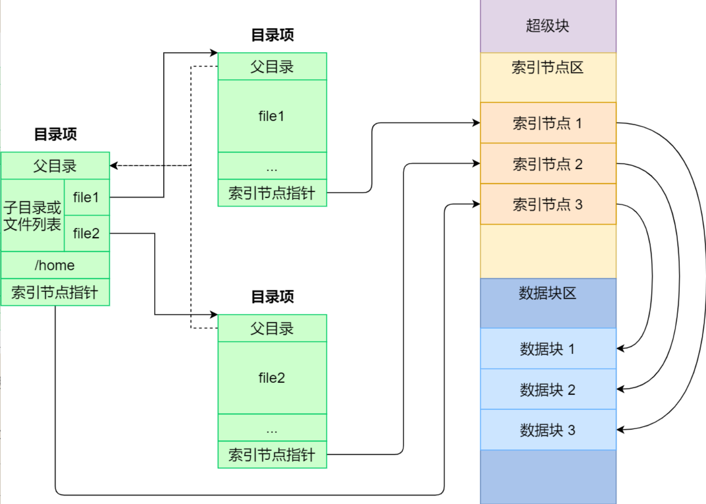

**索引节点是存储在硬盘上的数据，那么为了加速文件的访问，通常会把索引节点加载到内存中。**

另外，**磁盘进行格式化**的时候，会**被分成三个存储区域，分别是超级块、索引节点区和数据块区。**

- *超级块*，用来存储文件系统的详细信息，比如块个数、块大小、空闲块等等。
- *索引节点区*，用来存储索引节点；
- *数据块区*，用来存储文件或目录数据；

我们不可能把超级块和索引节点区全部加载到内存，这样内存肯定撑不住，所以只有当需要使用的时候，才将其加载进内存，它们加载进内存的时机是不同的：

- 超级块：当文件系统挂载时进入内存；
- 索引节点区：当文件被访问时进入内存；

---

DEEPSEEK:

文件系统是操作系统用于管理存储设备上数据的核心机制，其基本组成包括以下几个关键部分：

### **1. 文件与目录**

- **文件**：存储数据的基本单位，每个文件有**名称**和**内容**。例如，文本文件、图片等。
- **目录**：用于组织文件和子目录的容器，形成**树状结构**。目录本身是一种特殊文件，记录其包含的条目（如文件、子目录）。

**示例**：  

- `/home/user/Documents/report.txt` 表示一个文件路径，其中 `Documents` 是目录，`report.txt` 是文件。

---

### **2. 元数据（Metadata）**
- **定义**：描述文件属性的信息，不包含文件内容本身。  
- **常见元数据**：  
  - 文件大小、创建时间、修改时间、访问时间。  
  - 文件权限（读、写、执行）。  
  - 文件所有者（用户和组）。  
  - 文件类型（普通文件、目录、符号链接等）。  

**实现方式**：  
- **inode（索引节点）**：在类Unix系统（如Linux）中，每个文件对应一个inode，存储元数据和数据块指针。  
- **FAT表**：在FAT文件系统中，文件分配表记录文件占用的簇（存储单元）。

---

### **3. 存储空间管理**
- **数据块（Block）**：文件内容被分割为固定大小的块（如4KB），存储在磁盘上。  
- **分配策略**：  
  - **连续分配**：文件占用连续的块（简单但易碎片化）。  
  - **链式分配**：每个块记录下一个块的地址（灵活但访问慢）。  
  - **索引分配**：通过索引块记录所有数据块位置（平衡速度与灵活性）。  
- **空闲空间管理**：  
  - **位图（Bitmap）**：用二进制位标记块是否空闲。  
  - **空闲链表**：将空闲块链接成链表。

---

### **4. 文件系统结构**
- **超级块（Superblock）**：  
  - 记录文件系统的全局信息，如块大小、总块数、inode数量等。  
  - 类似“文件系统的身份证”，损坏可能导致数据无法访问。
- **inode表**：存储所有文件的元数据（仅类Unix系统）。  
- **数据区**：实际存储文件内容的块区域。  
- **目录项（Directory Entry）**：目录中每个条目指向文件或子目录的inode或元数据。

**示例（ext4文件系统布局）**：  
```
[ 超级块 | inode表 | 数据块区 | 日志区 ]
```

---

### **5. 权限与安全**
- **文件权限**：  
  - **用户（Owner）**、**组（Group）**、**其他人（Others）** 的读（r）、写（w）、执行（x）权限。  
  - 通过 `chmod` 命令修改（如 `chmod 755 file.txt`）。  
- **访问控制列表（ACL）**：更细粒度的权限控制（如允许特定用户访问）。

---

### **6. 文件操作接口**
- **系统调用**：  
  - `open()`：打开文件。  
  - `read()`/`write()`：读写文件内容。  
  - `close()`：关闭文件。  
  - `mkdir()`：创建目录。  
- **用户工具**：命令行（如 `ls`, `cp`, `mv`）或图形界面（如文件管理器）。

---

### **7. 一致性与恢复机制**
- **日志（Journaling）**：  
  - 记录文件系统操作（如删除、写入），确保崩溃后能快速恢复。  
  - 用于ext4、NTFS等现代文件系统。  
- **校验和（Checksum）**：检测数据损坏（如ZFS文件系统）。

---

### **8. 特殊文件类型**
- **符号链接（Symbolic Link）**：指向另一个文件的快捷方式。  
- **硬链接（Hard Link）**：同一文件的多个目录入口（共享inode）。  
- **设备文件**：表示硬件设备（如 `/dev/sda`）。

---

### **总结**
文件系统通过**文件与目录**组织数据，**元数据**管理属性，**存储策略**优化空间使用，**权限机制**保障安全，**操作接口**提供访问方式，**日志与恢复**增强可靠性。不同文件系统（如FAT32、NTFS、ext4）在实现细节上各有特点，但核心组成类似。

**比喻**：  
- 文件系统像图书馆：  
  - **目录**是书架分类，**文件**是书籍，**元数据**是书籍索引卡，**权限**是借阅规则，**日志**是借阅记录本。

### 小林：2、虚拟文件系统

文件系统的种类众多，而操作系统希望**对用户提供一个统一的接口**，于是在用户层与文件系统层引入了中间层，这个中间层就称为**虚拟文件系统（\*Virtual File System，VFS\*）。**

VFS **定义了一组所有文件系统都支持的数据结构和标准接口**，这样**程序员不需要了解文件系统的工作原理，只需要了解 VFS 提供的统一接口即可。**

在 Linux 文件系统中，用户空间、系统调用**、虚拟机文件系统、**缓存、文件系统以及存储之间的关系如下图：


**Linux 支持的文件系统也不少，根据存储位置的不同，可以把文件系统分为三类：**

- *磁盘的文件系统*，它是直接把数据存储在磁盘中，比如 Ext 2/3/4、XFS 等都是这类文件系统。
- *内存的文件系统*，这类文件系统的数据不是存储在硬盘的，而是占用内存空间，我们经常用到的 `/proc` 和 `/sys` 文件系统都属于这一类，读写这类文件，实际上是读写内核中相关的数据。
- *网络的文件系统*，用来访问其他计算机主机数据的文件系统，比如 NFS、SMB 等等。

**文件系统首先要先挂载到某个目录才可以正常使用，比如 Linux 系统在启动时，会把文件系统挂载到根目录。**

### 小林 3、文件的使用

我们从用户角度来看文件的话，就是我们要怎么使用文件？首先，我们得通过系统调用来打开一个文件。

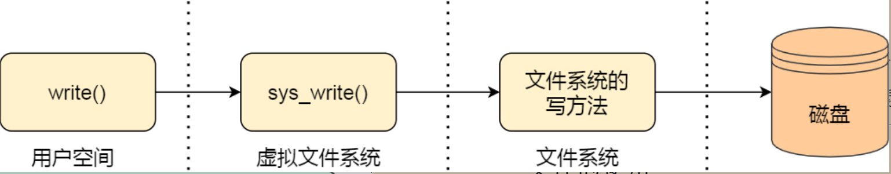

```
fd = open(name, flag); # 打开文件
...
write(fd,...);         # 写数据
...
close(fd);             # 关闭文件
```

上面简单的代码是读取一个文件的过程：

- 首先用 `open` 系统调用打开文件，`open` 的参数中包含文件的路径名和文件名。
- 使用 `write` 写数据，其中 `write` 使用 `open` 所返回的**文件描述符**，并不使用文件名作为参数。
- 使用完文件后，要用 `close` 系统调用关闭文件，避免资源的泄露。

我们打开了一个文件后，操作系统会跟踪进程打开的所有文件，所谓的跟踪呢，就是操作系统为每个进程维护一个打开文件表，文件表里的每一项代表「**文件描述符**」，所以说文件描述符是打开文件的标识。

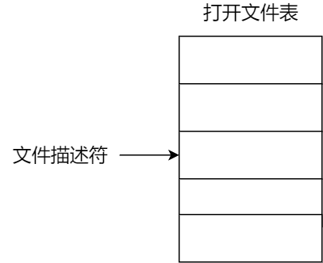

**操作系统在打开文件表中维护着打开文件的状态和信息：**

- **文件指针**：系统跟踪上次读写位置作为当前文件位置指针，这种指针对打开文件的某个进程来说是唯一的；
- 文件打开计数器：文件关闭时，操作系统必须重用其打开文件表条目，否则表内空间不够用。因为多个进程可能打开同一个文件，**所以系统在删除打开文件条目之前，必须等待最后一个进程关闭文件，该计数器跟踪打开和关闭的数量，当该计数为 0 时，系统关闭文件，删除该条目；**
- **文件磁盘位置：**绝大多数文件操作都要求系统修改文件数据，该信息保存在内存中，以免每个操作都从磁盘中读取；
- 访问权限：每个进程打开文件都需要有一个访问模式（创建、只读、读写、添加等），该信息保存在进程的打开文件表中，以便操作系统能允许或拒绝之后的 I/O 请求；

**我们来分别看一下，读文件和写文件的过程：**

用户和操作系统对文件的读写操作是有差异的，用户习惯以字节的方式读写文件，而操作系统则是以数据块来读写文件

- 当用户进程从文件读取 1 个字节大小的数据时，文件系统则需要获取字节所在的数据块，再返回数据块对应的用户进程所需的数据部分。
- 当用户进程把 1 个字节大小的数据写进文件时，文件系统则找到需要写入数据的数据块的位置，然后修改数据块中对应的部分，最后再把数据块写回磁盘。

所以说，**文件系统的基本操作单位是数据块**。

### 4、文件的存储

**文件的数据是要存储在硬盘上面的，数据在磁盘上的存放方式，就像程序在内存中存放的方式那样，有以下两种：**

- **连续空间存放方式**
- **非连续空间存放方式**

其中，非连续空间存放方式又可以分为「链表方式」和「索引方式」。

不同的存储方式，有各自的特点，重点是要分析它们的存储效率和读写性能，接下来分别对每种存储方式说一下。

**连续空间存放方式**顾名思义，**文件存放在磁盘「连续的」物理空间中**。这种模式下，文件的数据都是紧密相连，**读写效率很高**，因为一次磁盘寻道就可以读出整个文件。

使用**连续存放的方式有一个前提，必须先知道一个文件的大小，这样文件系统才会根据文件的大小在磁盘上找到一块连续的空间分配给文件。**

所以，**文件头里需要指定「起始块的位置」和「长度」**，有了这两个信息就可以很好的表示文件存放方式是一块连续的磁盘空间。

注意，此处说的文件头，就类似于 Linux 的 inode。(地址)

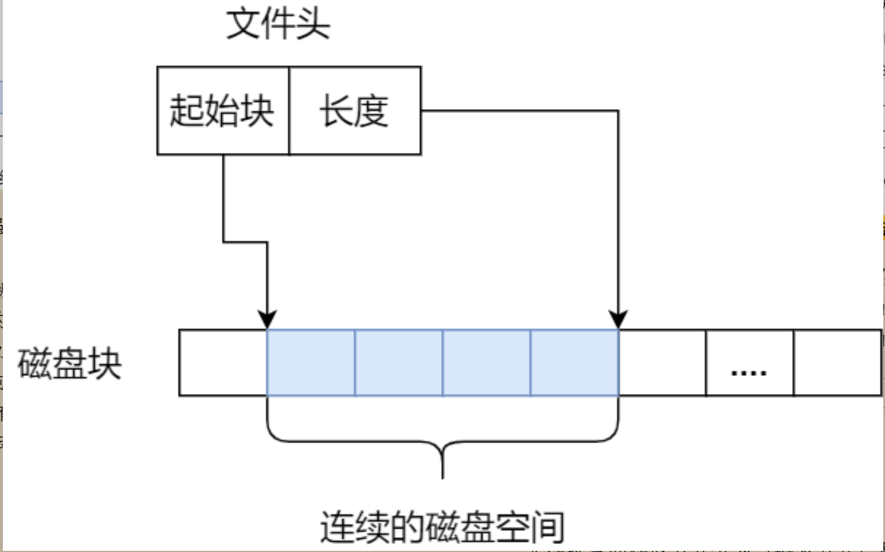

连续空间存放的方式虽然读写效率高，**但是有「磁盘空间碎片」和「文件长度不易扩展」的缺陷。**

如下图，**如果文件 B 被删除，磁盘上就留下一块空缺，这时，如果新来的文件小于其中的一个空缺，我们就可以将其放在相应空缺里。但如果该文件的大小大于所有的空缺，但却小于空缺大小之和，则虽然磁盘上有足够的空缺，但该文件还是不能存放**。当然了，我们可以通过将现有文件进行挪动来腾出空间以容纳新的文件，但是这个在磁盘挪动文件是非常耗时，所以这种方式不太现实。

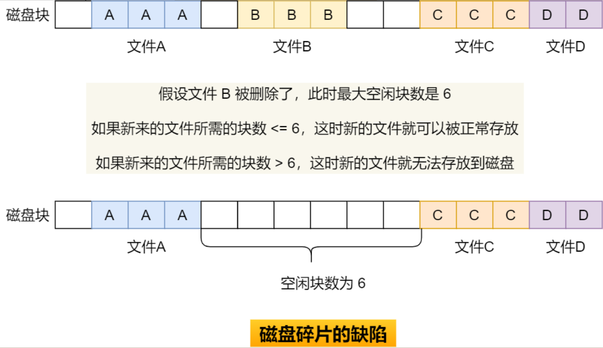

另外一个缺陷是文件长度扩展不方便，例如上图中的文件 A 要想扩大一下，需要更多的磁盘空间，唯一的办法就只能是挪动的方式，前面也说了，这种方式效率是非常低的。

那么有没有更好的方式来解决上面的问题呢？答案当然有，既然连续空间存放的方式不太行，那么我们就改变存放的方式，使用非连续空间存放方式来解决这些缺陷。

非连续空间存放方式分为「链表方式」和「索引方式」。

> 我们先来看看链表的方式。

链表的方式存放是**离散的，不用连续的**，于是就可以**消除磁盘碎片**，可大大提高磁盘空间的利用率，同时**文件的长度可以动态扩展**。根据实现的方式的不同，链表可分为「**隐式链表**」和「**显式链接**」两种形式。

文件要以「**隐式链表**」的方式存放的话，**实现的方式是文件头要包含「第一块」和「最后一块」的位置，并且每个数据块里面留出一个指针空间，用来存放下一个数据块的位置**，这样一个数据块连着一个数据块，从链头开是就可以顺着指针找到所有的数据块，所以存放的方式可以是不连续的。

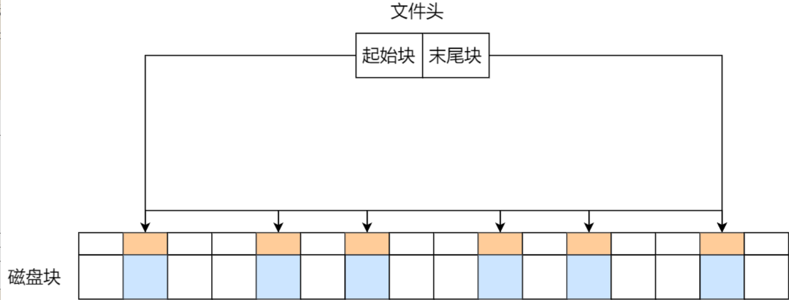

隐式链表的存放方式的**缺点在于无法直接访问数据块，只能通过指针顺序访问文件，以及数据块指针消耗了一定的存储空间**。隐式链接分配的**稳定性较差**，系统在运行过程中由于软件或者硬件错误**导致链表中的指针丢失或损坏，会导致文件数据的丢失。**

如果取出每个磁盘块的指针，把它放在内存的一个表中，就可以解决上述隐式链表的两个不足。那么，这种实现方式是「**显式链接**」，它指**把用于链接文件各数据块的指针，显式地存放在内存的一张链接表中**，该表在整个磁盘仅设置一张，**每个表项中存放链接指针，指向下一个数据块号**。

对于显式链接的工作方式，我们举个例子，文件 A 依次使用了磁盘块 4、7、2、10 和 12 ，文件 B 依次使用了磁盘块 6、3、11 和 14 。利用下图中的表，可以从第 4 块开始，顺着链走到最后，找到文件 A 的全部磁盘块。同样，从第 6 块开始，顺着链走到最后，也能够找出文件 B 的全部磁盘块。最后，这两个链都以一个不属于有效磁盘编号的特殊标记（如 -1 ）结束。内存中的这样一个表格称为**文件分配表（\*File Allocation Table，FAT\*）**。

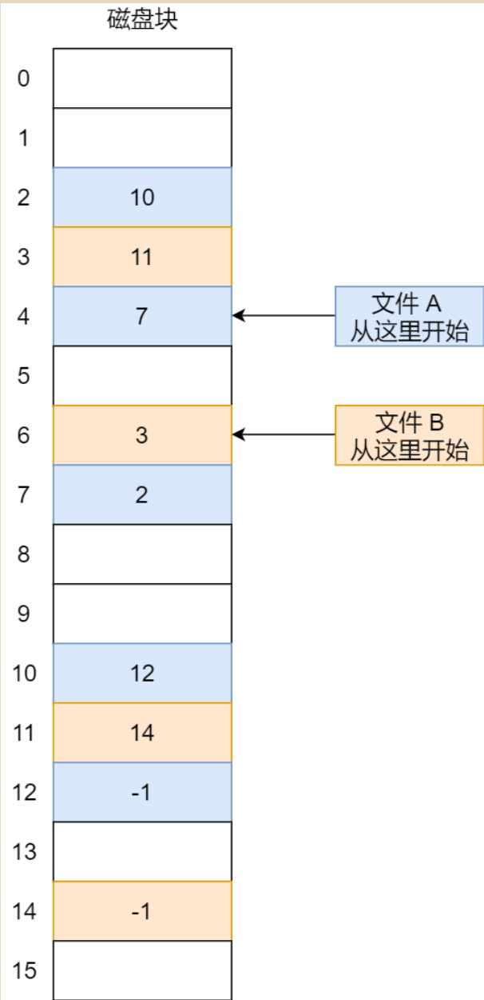

由于查找记录的过程是在内存中进行的，因而不仅显著地**提高了检索速度**，而且**大大减少了访问磁盘的次数**。但也正是整个表都存放在内存中的关系，它的主要的缺点是**不适用于大磁盘**。

比如，对于 200GB 的磁盘和 1KB 大小的块，这张表需要有 2 亿项，每一项对应于这 2 亿个磁盘块中的一个块，每项如果需要 4 个字节，那这张表要占用 800MB 内存，很显然 FAT 方案对于大磁盘而言不太合适。

> 接下来，我们来看看索引的方式。

**链表的方式解决了连续分配的磁盘碎片和文件动态扩展**的问题，但是**不能有效支持直接访问（FAT除外），索引的方式可以解决这个问题。**

索引的实现是为每个文件创建一个「**索引数据块**」，里面存放的是**指向文件数据块的指针列表**，说白了就像书的目录一样，要找哪个章节的内容，看目录查就可以。

另外，**文件头需要包含指向「索引数据块」的指针**，这样就可以通过文件头知道索引数据块的位置，再通过索引数据块里的索引信息找到对应的数据块。

创建文件时，索引块的所有指针都设为空。当首次写入第 i 块时，先从空闲空间中取得一个块，再将其地址写到索引块的第 i 个条目。

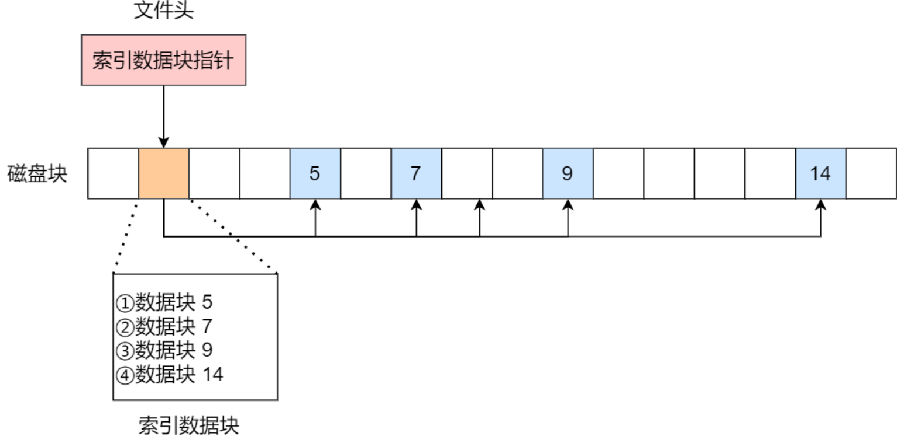

索引的方式优点在于：

- 文件的创建、增大、缩小很方便；
- 不会有碎片的问题；
- 支持顺序读写和随机读写；

由于索引数据也是存放在磁盘块的，如果文件很小，明明只需一块就可以存放的下，但还是需要额外分配一块来存放索引数据，所以缺陷之一就是存储索引带来的开销。


如果文件很大，大到一个索引数据块放不下索引信息，这时又要如何处理大文件的存放呢？我们可以通过组合的方式，来处理大文件的存储。

先来看看链表 + 索引的组合，这种组合称为「**链式索引块**」，它的实现方式是**在索引数据块留出一个存放下一个索引数据块的指针**，于是当一个索引数据块的索引信息用完了，就可以通过指针的方式，找到下一个索引数据块的信息。那这种方式也会出现前面提到的链表方式的问题，万一某个指针损坏了，后面的数据也就会无法读取了。

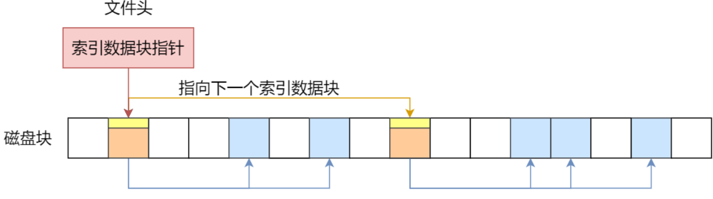

还有另外一种组合方式是索引 + 索引的方式，这种组合称为「**多级索引块**」，实现方式是**通过一个索引块来存放多个索引数据块**，一层套一层索引，像极了俄罗斯套娃是吧。

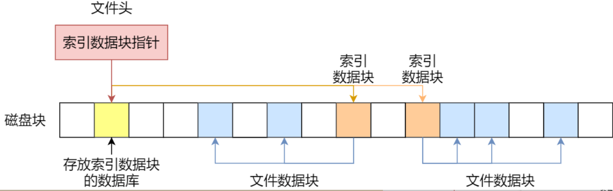

##### 文件存储实现方式，做个比较：

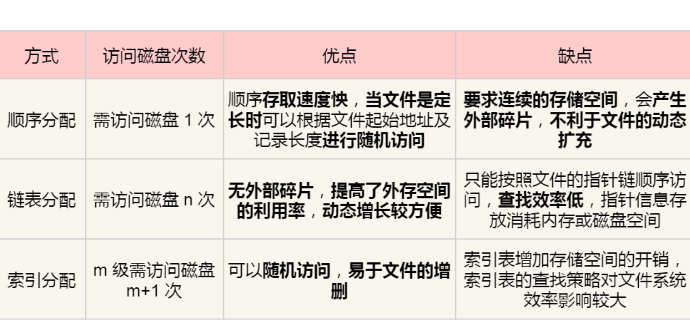

非连续空间存放方式中「链表方式」和「索引方式」的核心区别在于**数据块的组织形式和访问效率**。以下是具体对比：

------

### **1. 链表方式（Linked Allocation）**

- **实现原理**
  每个数据块包含**数据+指向下一块的指针**，通过指针链式连接所有块。
- 特点
  - ✅ 优点：
    1. 无外部碎片（可灵活利用空闲块）
    2. 文件动态扩展容易
  - ❌ 缺点：
    1. **只能顺序访问**（随机访问需遍历链表）
    2. 指针占用存储空间（每个块需额外存储指针）
    3. **可靠性差**（任一指针损坏会导致后续数据丢失）
- **典型应用**
  FAT文件系统的早期版本（如FAT12/16）。

------

### **2. 索引方式（Indexed Allocation）**

- **实现原理**
  单独分配一个**索引块**，集中存储所有数据块的物理地址。
- 特点
  - ✅ 优点：
    1. **支持直接访问**（通过索引表快速定位任意块）
    2. 无指针空间浪费（指针集中在索引块）
    3. 更适合大文件
  - ❌ 缺点：
    1. 索引块本身占用存储空间
    2. 超大文件需多级索引（如Unix inode）
    3. 索引块可能成为性能瓶颈
- **典型应用**
  Unix/Linux的inode机制、NTFS文件系统。

------

### **关键对比表**

|     特性     |         链表方式         |         索引方式         |
| :----------: | :----------------------: | :----------------------: |
| **访问方式** |       只能顺序访问       |       支持随机访问       |
| **空间开销** |   每个块有指针占用空间   |  集中存储指针（索引块）  |
|  **扩展性**  |       动态扩展简单       |     大文件需多级索引     |
|  **可靠性**  | 低（链断裂导致数据丢失） | 高（索引块损坏影响更大） |
| **适用场景** |     小文件、顺序读写     |     大文件、随机读写     |

------

### **举个栗子🌰**

- **链表方式**：像火车车厢，必须从车头开始逐个访问。
- **索引方式**：像书籍目录，通过目录页直接跳转到任意章节。


早期 Unix 文件系统是组合了前面的文件存放方式的优点，如下图：

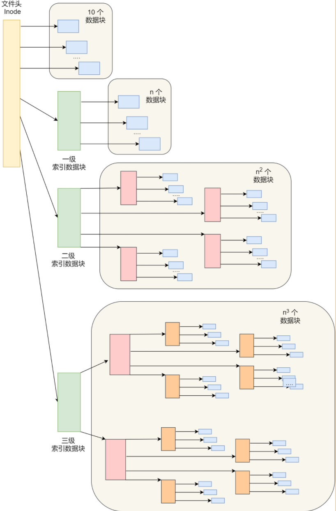

它是根据文件的大小，存放的方式会有所变化：

- 如果存放文件所需的数据块小于 10 块，则采用直接查找的方式；
- 如果存放文件所需的数据块超过 10 块，则采用一级间接索引方式；
- 如果前面两种方式都不够存放大文件，则采用二级间接索引方式；
- 如果二级间接索引也不够存放大文件，这采用三级间接索引方式；

那么，文件头（*Inode*）就需要包含 13 个指针：

- 10 个指向数据块的指针；
- 第 11 个指向索引块的指针；
- 第 12 个指向二级索引块的指针；
- 第 13 个指向三级索引块的指针；

所以，这种方式能很灵活地支持小文件和大文件的存放：

- 对于小文件使用直接查找的方式可减少索引数据块的开销；
- 对于大文件则以多级索引的方式来支持，所以大文件在访问数据块时需要大量查询；

这个方案就用在了 Linux Ext 2/3 文件系统里，虽然解决大文件的存储，但是对于大文件的访问，需要大量的查询，效率比较低。

为了解决这个问题，Ext 4 做了一定的改变

### **空闲空间管理**

前面说到的文件的存储是针对已经被占用的数据块组织和管理，接下来的问题是，如果我要保存一个数据块，我应该放在硬盘上的哪个位置呢？难道需要将所有的块扫描一遍，找个空的地方随便放吗？

那这种方式效率就太低了，所以针对磁盘的空闲空间也是要引入管理的机制，接下来介绍几种常见的方法：

- 空闲表法
- 空闲链表法
- 位图法

#### 空闲表法

（Free Space Table）

#### **原理**

- 使用一张**表格**记录所有空闲区域的起始地址和长度（类似连续内存管理）。
- 表格按空闲块起始地址排序，便于合并相邻空闲块。

#### **实现**

- **分配**：查找满足需求的空闲表项，分割或整块分配。
- **释放**：将释放的块插入表格，并合并相邻空闲块（减少外部碎片）。

#### **优点**

- **快速查找连续大块**（适合顺序分配）。
- 合并机制减少外部碎片。

#### **缺点**

- **表格维护复杂**：频繁分配/释放需频繁合并和排序。
- **空间开销**：表格需存储所有空闲块信息，可能占用较多内存或磁盘空间。
- **随机分配低效**：需遍历表格查找合适块。

#### **应用场景**

- 早期简单文件系统或内存管理（如DOS内存分配）。
- 对连续空间需求高的场景（如磁带存储）。

空闲表法就是为所有空闲空间建立一张表，表内容包括空闲区的第一个块号和该空闲区的块个数，注意，这个方式是连续分配的。如下图：

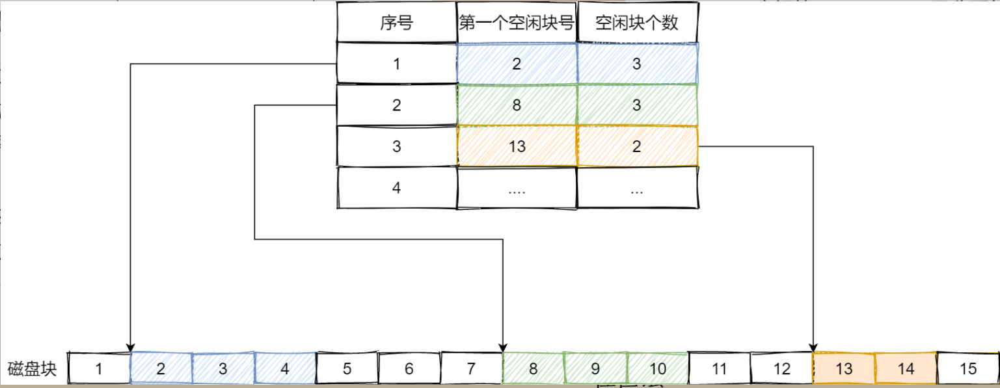

当请求分配磁盘空间时，系统依次扫描空闲表里的内容，直到找到一个合适的空闲区域为止。

当用户撤销一个文件时，系统回收文件空间。这时，也需顺序扫描空闲表，寻找一个空闲表条目并将释放空间的第一个物理块号及它占用的块数填到这个条目中。

这种方法仅当有少量的空闲区时才有较好的效果。因为，如果存储空间中有着大量的小的空闲区，则空闲表变得很大，这样查询效率会很低。另外，这种分配技术适用于建立连续文件。

#### 空闲链表法

我们也可以使用「链表」的方式来管理空闲空间，每一个空闲块里有一个指针指向下一个空闲块，这样也能很方便的找到空闲块并管理起来。如下图：

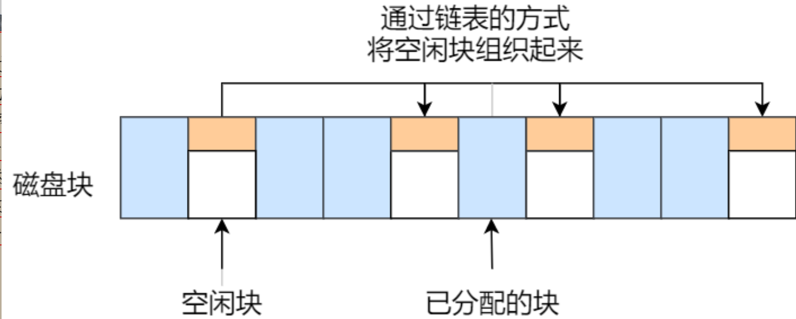

当创建文件需要一块或几块时，就从链头上依次取下一块或几块。反之，当回收空间时，把这些空闲块依次接到链头上。

这种技术只要在主存中保存一个指针，令它指向第一个空闲块。其特点是简单，但不能随机访问，工作效率低，因为每当在链上增加或移动空闲块时需要做很多 I/O 操作，同时数据块的指针消耗了一定的存储空间。

#### **原理**

- 将所有空闲块通过**指针**链接成链表，每个空闲块存储下一个空闲块的地址。
- 链表头指针保存在固定位置（如超级块）。

#### **实现**

- **分配**：从链表头部取块，更新头指针。
- **释放**：将释放的块插入链表头部。

#### **优点**

- **动态管理简单**：无需预分配结构（如位图）。
- **无固定空间开销**：指针嵌入空闲块中。

#### **缺点**

- **随机访问低效**：需遍历链表查找特定块。
- **指针占用空间**：每个空闲块需存储指针（如4字节）。
- **可靠性问题**：链表断裂可能导致空间丢失。

#### **应用场景**

- **FAT文件系统**（通过FAT表隐式链接空闲块）。
- 小规模存储或对连续块需求较低的场景。

**空闲表法和空闲链表法都不适合用于大型文件系统，因为这会使空闲表或空闲链表太大。**

#### 位图法

#### **原理**

- 用**二进制位**（0/1）表示每个磁盘块是否空闲。
- 位图存储在磁盘固定区域（如超级块附近），加载到内存加速访问。

#### **实现**

- **分配**：扫描位图找到连续空闲位，标记为已用。
- **释放**：将对应位重置为0。

#### **优点**

- **快速查找连续空闲块**（位图扫描效率高）。
- **空间开销固定**：位图大小与磁盘总块数成比例（例如1TB磁盘，4KB块 → 位图约32MB）。

#### **缺点**

- **内存占用**：大磁盘的位图需常驻内存，可能影响性能。
- **随机修改开销**：频繁分配/释放导致位图频繁写入磁盘。
- **单点故障**：位图损坏可能导致磁盘空间管理失效。

#### **应用场景**

- **ext2/ext3/ext4**（Linux）、**NTFS**（Windows）等现代文件系统。
- 需要高效随机访问和快速连续分配的场景。

**小林**：**位图是利用二进制的一位来表示磁盘中一个盘块的使用情况，磁盘上所有的盘块都有一个二进制位与之对应。**

**当值为 0 时，表示对应的盘块空闲，值为 1 时，表示对应的盘块已分配**。它形式如下：

```
1111110011111110001110110111111100111 ...
```

在 Linux 文件系统就采用了位图的方式来管理空闲空间，不仅用于数据空闲块的管理，还用于 inode 空闲块的管理，因为 inode 也是存储在磁盘的，自然也要有对其管理。inode (地址)

### 文件系统的结构

用大白话解释就是：

**文件系统就像一个大仓库，仓库里堆满了货架（数据块）。管理员（Linux）需要知道哪些货架是空的，哪些放了东西。他用了两种小本本来记录：**

1. **《inode小本本》**：记录每个货架上的货物信息（比如谁放的、什么时候放的、权限如何）。
2. **《空闲货架小本本》**：记录哪些货架是空的，可以放新货物。

**但问题来了：**
- 每个小本本只能写 **4页纸**（4KB的块）。
- 每页纸能标记 **32,768个货架**（因为1页=4KB=4096字节=32,768位，每位代表1个货架）。
- 每个货架能放 **4KB** 的货物。
- 所以一个小本本最多管 **32,768个货架 × 4KB = 128MB** 的仓库。

**这明显不够用啊！现在随便一个游戏安装包都几十GB了！**

**Linux的解决办法：把大仓库隔成小隔间！**
- 整个仓库被分成 **N个小隔间**（块组），每个小隔间都有：
  - 自己的《inode小本本》
  - 自己的《空闲货架小本本》
  - 自己管理的货架（128MB）
- **每个小隔间独立记账**，互不干扰。
- **存大文件时**：把文件拆开，分到不同小隔间的货架上。

**举个栗子：**
- 仓库总大小 **1TB** → 需要 **8192个小隔间**（1TB ÷ 128MB）。
- 存一个 **10GB的电影**：
  - 拆成 **80份**（10GB ÷ 128MB），
  - 分散存到 **80个小隔间**的货架上。

**为什么每个小隔间还要重复放《总账本》（超级块和块组描述符）？**
- **怕丢！** 如果总账本被老鼠啃了，整个仓库就废了。
- **多抄几份**：每个小隔间都藏一份总账本，啃了1份还有N份备份。
- **后来学聪明了**：新版Linux只在关键小隔间（比如第0、1、3、5、7号隔间）放总账本，省纸又安全。

**总结：**
- **小隔间设计**：解决小本本管不了大仓库的问题。
- **分而治之**：大文件拆散，分到不同小隔间。
- **多备份保平安**：总账本到处藏，丢了也不怕。

下图给出了 Linux Ext2 整个文件系统的结构和块组的内容，文件系统都由大量块组组成，在硬盘上相继排布：

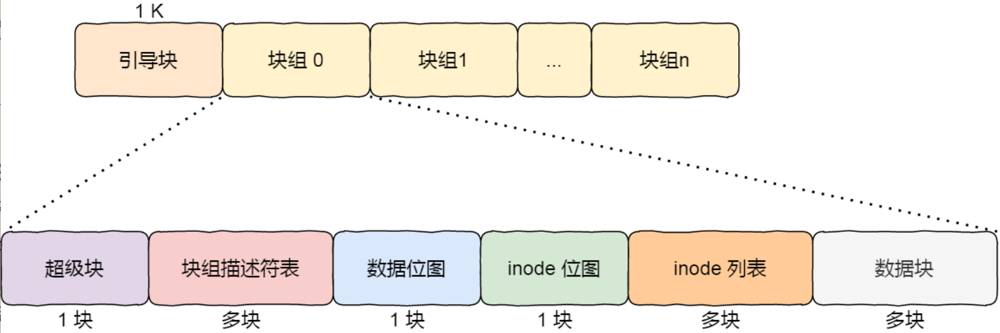

最前面的第一个块是引导块，在系统启动时用于启用引导，接着后面就是一个一个连续的块组了，块组的内容如下：

- *超级块*，包含的是文件系统的重要信息，比如 inode 总个数、块总个数、每个块组的 inode 个数、每个块组的块个数等等。
- *块组描述符*，包含文件系统中各个块组的状态，比如块组中空闲块和 inode 的数目等，每个块组都包含了文件系统中「所有块组的组描述符信息」。
- *数据位图和 inode 位图*， 用于表示对应的数据块或 inode 是空闲的，还是被使用中。
- *inode 列表*，包含了块组中所有的 inode，inode 用于保存文件系统中与各个文件和目录相关的所有元数据。
- *数据块*，包含文件的有用数据。

你可以会发现每个块组里有很多重复的信息，比如**超级块和块组描述符表，这两个都是全局信息，而且非常的重要**，这么做是有两个原因：

- 如果系统崩溃破坏了超级块或块组描述符，有关文件系统结构和内容的所有信息都会丢失。如果有冗余的副本，该信息是可能恢复的。
- 通过使文件和管理数据尽可能接近，减少了磁头寻道和旋转，这可以提高文件系统的性能。

不过，Ext2 的后续版本采用了稀疏技术。该做法是，超级块和块组描述符表不再存储到文件系统的每个块组中，而是只写入到块组 0、块组 1 和其他 ID 可以表示为 3、 5、7 的幂的块组中。

用大白话解释就是：

**Ext2文件系统像一本超厚的电话簿，每个块组就像电话簿的一页。原本每页开头都要重复印一遍目录（超级块和块组描述符），后来发现太浪费纸，就改成只在关键页数印目录。**

具体来说：

1. **旧版Ext2（傻实在版）**  
   - 每个块组开头都有一模一样的"目录页"（超级块+块组描述符）。  
   - 好处：随便翻到哪一页都能看到目录，丢了也能快速恢复。  
   - 坏处：整本书全是重复的目录，浪费大量纸张（磁盘空间）。

2. **新版Ext2（聪明省纸版）**  
   - 目录页只印在关键位置：  
     - 第0页（封面）  
     - 第1页（封二）  
     - 第3页、第9页（3的平方）、第27页（3的立方）...  
     - 第5页、第25页（5的平方）...  
     - 第7页、第49页（7的平方）...  
   - 好处：  
     - **省空间**：整本书变薄了，能装更多有用内容。  
     - **好恢复**：关键位置都有目录，即使某几页被撕掉，也能从其他目录页恢复。  
     - **找得快**：目录页按数学规律分布，找目录时不用翻遍全书。

3. **为什么选3、5、7的幂？**  
   - 就像藏宝图上的标记点：  
     - 3的幂：3, 9, 27, 81...（间隔越来越大）  
     - 5的幂：5, 25, 125...  
     - 7的幂：7, 49, 343...  
   - 这样分布能保证：  
     - 无论书多厚（磁盘多大），每隔一段距离就有目录页。  
     - 数学规律让计算机能快速算出最近的目录页位置。

**举个现实例子：**  
假设你有一个1TB的U盘，用Ext2文件系统：  
- 旧版：每128MB就重复存一遍目录，浪费了约0.1%的空间（相当于1GB）。  
- 新版：目录只存关键位置，可能只浪费0.001%的空间（相当于10MB）。  

这种设计在 **可靠性** 和 **空间效率** 之间找到了完美平衡，就像在图书馆里既不放满灭火器（浪费空间），也不只放一个灭火器（风险高），而是按楼层和区域合理分布。

### 目录的存储


在前面，我们知道了一个普通文件是如何存储的，但还有一个特殊的文件，经常用到的目录，它是如何保存的呢？

基于 Linux 一切皆文件的设计思想，目录其实也是个文件，你甚至可以通过 `vim` 打开它，它也有 inode，inode 里面也是指向一些块。

和普通文件不同的是，**普通文件的块里面保存的是文件数据，而目录文件的块里面保存的是目录里面一项一项的文件信息。**

在目录文件的块中，最简单的保存格式就是**列表**，就是一项一项地将目录下的文件信息（如文件名、文件 inode、文件类型等）列在表里。

列表中每一项就代表该目录下的文件的文件名和对应的 inode，通过这个 inode，就可以找到真正的文件。

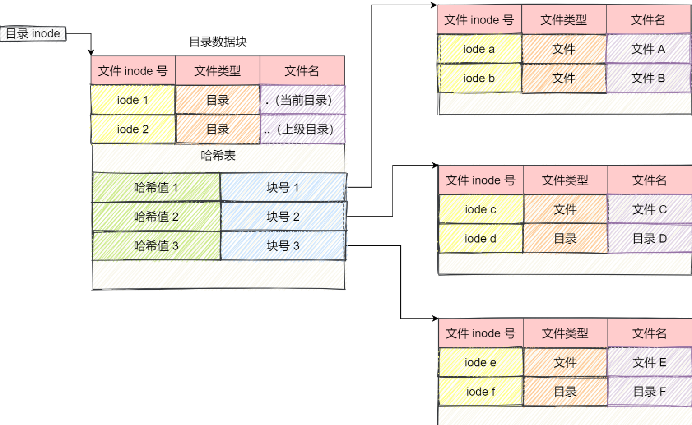

通常，第一项是「`.`」，表示当前目录，第二项是「`..`」，表示上一级目录，接下来就是一项一项的文件名和 inode。

如果一个目录有超级多的文件，我们要想在这个目录下找文件，按照列表一项一项的找，效率就不高了。

于是，保存目录的格式改成**哈希表**，对文件名进行哈希计算，把哈希值保存起来，如果我们要查找一个目录下面的文件名，可以通过名称取哈希。如果哈希能够匹配上，就说明这个文件的信息在相应的块里面。

Linux 系统的 ext 文件系统就是采用了哈希表，来保存目录的内容，这种方法的优点是查找非常迅速，插入和删除也较简单，不过需要一些预备措施来避免哈希冲突。

目录查询是通过在磁盘上反复搜索完成，需要不断地进行 I/O 操作，开销较大。所以，为了减少 I/O 操作，把当前使用的文件目录缓存在内存，以后要使用该文件时只要在内存中操作，从而降低了磁盘操作次数，提高了文件系统的访问速度。


目录在文件系统中的存储可以这样理解：

---

### **1. 目录的本质**
- **目录是一个特殊文件**，其数据块不存储普通内容，而是保存该目录下的**文件和子目录的条目信息**。
- 每个条目包含两个核心信息：**文件名**和对应的**inode编号**。

---

### **2. 目录的存储结构**
#### **(1) 简单线性列表（传统方式）**
- **条目格式**：  
  每个条目由以下部分组成（以ext2为例）：  
  ```c
  struct ext2_dir_entry {
      __u32 inode;          // 文件/子目录的inode编号
      __u16 rec_len;        // 当前条目总长度（含文件名）
      __u8 name_len;        // 文件名实际长度
      __u8 file_type;       // 文件类型（普通文件、目录等）
      char name[255];       // 文件名（可变长，以`\0`结尾）
  };
  ```
- **特点**：  
  - 条目长度可变（根据文件名长度动态调整）。  
  - 通过`rec_len`字段支持快速跳过无效条目（如删除文件后留下的空洞）。  
  - **缺点**：查找文件需遍历所有条目，效率低（适用于小目录）。

#### **(2) 哈希树（HTree，ext4优化）**
- **原理**：  
  将目录条目按文件名哈希值组织成树形结构（B树变种），实现快速查找。  
- **优势**：  
  - 查找时间复杂度从`O(n)`降为`O(log n)`，适合大目录（如数万文件）。  
- **实现**：  
  - 根节点存储哈希值和子节点指针。  
  - 叶子节点存储实际目录条目。

---

### **3. 目录操作示例**
#### **(1) 创建文件`/home/user/file.txt`**
1. 分配一个inode（假设为1053）。  
2. 在`/home/user`目录的数据块中插入条目：  
   ```plaintext
   inode: 1053 | name_len: 8 | file_type: 普通文件 | name: "file.txt"
   ```

#### **(2) 删除文件**
1. 标记inode为未使用。  
2. 在目录条目中设置`inode=0`（或通过`rec_len`跳过该条目）。  
3. 后续新文件可复用该条目空间。

---

### **4. 关键细节**
#### **(1) 文件名长度**
- 文件名最长通常为255字节（受文件系统限制）。  
- 条目总长度按4字节对齐（如`rec_len`为4的倍数）。

#### **(2) 硬链接 vs 软链接**
- **硬链接**：  
  在目录中新增一个条目，指向同一inode（inode引用计数+1）。  
- **软链接**：  
  创建新inode，其数据块存储目标路径字符串。

#### **(3) 目录权限**
- **读权限**：允许列出目录条目（如`ls`）。  
- **写权限**：允许增删改目录条目（如`rm`、`touch`）。  
- **执行权限**：允许进入目录（如`cd`）。

---

### **5. 空间管理**
- **碎片问题**：  
  频繁增删文件可能导致目录数据块中出现空洞（通过`rec_len`字段跳过无效条目）。  
- **动态扩展**：  
  当目录条目超出当前数据块容量时，分配新数据块并更新inode指针。

---

### **6. 示例：ext4目录结构**
```plaintext
目录inode
├─ 数据块1（根哈希节点）
│   ├─ 哈希值0x1A3F → 子节点块地址
│   └─ 哈希值0x7B2C → 子节点块地址
├─ 数据块2（叶子节点）
│   ├─ 条目1：inode=1053, name="file1.txt"
│   └─ 条目2：inode=1054, name="file2.txt"
└─ 数据块3（叶子节点）
    ├─ 条目3：inode=1055, name="file3.txt"
    └─ 条目4：inode=0（已删除）, name="old_file.txt"
```

---

### **7. 总结**
- **目录是文件名到inode的映射表**，核心功能是快速定位文件。  
- 传统线性结构简单但低效，现代文件系统（如ext4）通过哈希树优化大目录性能。  
- 目录条目管理需平衡空间利用与操作效率，是文件系统设计的关键部分。

### 软链接和硬链接

有时候我们希望给某个文件取个别名，那么在 Linux 中可以通过**硬链接（\*Hard Link\*）** 和**软链接（\*Symbolic Link\*）** 的方式来实现，它们都是比较特殊的文件，但是实现方式也是不相同的。

**硬链接是“多个名字指向同一实体”，软链接是“指向路径的快捷方式”**

你的问题非常关键！硬链接虽然也是“多个名字”，但它和快捷方式（软链接）有本质区别。我们可以用现实世界的比喻和计算机底层原理来彻底理解：

---

### **1. 硬链接的本质：同一个文件的「多个别名」**
想象你是一本书的作者，出版社用不同名字在不同国家发行：
- **中文版**书名：《编程的艺术》
- **英文版**书名：《The Art of Programming》
- **日文版**书名：《プログラミングの芸術》

**关键特点**：
- **所有版本都是同一本书**：内容、页数、ISBN号（类比inode）完全相同。
- **删除任意一个版本**：其他版本依然存在，书的内容不会消失。
- **修改内容**：任意版本的内容更新，所有版本同步更新。

**这就是硬链接的逻辑**：多个文件名指向同一个物理数据（inode），没有主次之分。

---

### **2. 软链接的本质：独立的「快捷方式文件」**
假设你电脑桌面上有一个快捷方式：
- **快捷方式名称**：《我最爱的电影》
- **指向路径**：`D:\Movies\经典老片\教父.mp4`

**关键特点**：
- **快捷方式本身是一个独立文件**：它只记录目标路径，不包含实际电影数据。
- **删除原文件**：快捷方式依然存在，但点击时会报错“文件不存在”。
- **修改原文件内容**：快捷方式指向的内容同步更新（因为它只是路径引用）。

---

### **3. 技术底层对比**
| **特性**       | **硬链接**                                | **软链接（快捷方式）**                       |
| -------------- | ----------------------------------------- | -------------------------------------------- |
| **存储内容**   | 直接指向inode（数据块的入口）             | 存储目标文件的路径字符串                     |
| **inode号**    | 与原文件相同                              | 独立in号（自己是独立文件）                   |
| **跨文件系统** | ❌ 不允许（不同磁盘分区inode独立）         | ✅ 允许                                       |
| **链接目录**   | ❌ 不允许（防止循环引用）                  | ✅ 允许                                       |
| **原文件删除** | 不影响其他硬链接访问数据                  | 导致软链接失效（悬空链接）                   |
| **文件大小**   | 与原文件相同（共享数据块）                | 等于路径字符串长度（如`/home/file`占11字节） |
| **引用计数**   | inode维护计数器，记录有多少个硬链接指向它 | 无引用计数                                   |

---

### **4. 为什么硬链接不是快捷方式？**
#### **(1) 数据存储方式不同**
- **硬链接**：多个文件名直接“贴”在同一个数据块上。  
  ```plaintext
  文件名A → inode 1053 → 数据块
  文件名B → inode 1053 → 数据块
  ```
- **软链接**：独立文件的数据块里写了一个路径纸条。  
  ```plaintext
  快捷方式文件 → inode 2011 → 数据块（内容："原文件路径"）
  ```

#### **(2) 删除操作的后果不同**
- **删除硬链接A**：  
  - inode引用计数从2减为1，数据仍在，仍可通过文件名B访问。  
- **删除软链接的目标文件**：  
  - 快捷方式文件仍在，但指向的路径失效，无法访问数据。

#### **(3) 底层实现限制**
- **硬链接不能跨文件系统**：  
  因为不同磁盘分区的inode编号是独立管理的，无法直接指向其他分区的inode。  
- **硬链接不能指向目录**：  
  防止形成目录循环（如`A/B/C`链接回`A`），导致文件系统遍历陷入死循环。

---

### **5. 实际场景举例**
#### **(1) 硬链接：日志文件的多个访问入口**
```bash
# 创建原始日志文件
touch /var/log/app.log
# 创建硬链接（备份入口）
ln /var/log/app.log /backup/app.log.backup
# 删除原始文件
rm /var/log/app.log
# 数据仍在！可通过备份文件访问
cat /backup/app.log.backup
```

#### **(2) 软链接：动态版本切换**
```bash
# 创建软件v1.0目录
mkdir /opt/myapp-v1.0
# 创建软链接指向当前版本
ln -s /opt/myapp-v1.0 /opt/myapp
# 升级到v2.0时，只需修改软链接
rm /opt/myapp
ln -s /opt/myapp-v2.0 /opt/myapp
```

---

### **6. 总结**
- **硬链接**是“多个名字共享同一份数据”，**没有主次之分**，本质是**文件实体的别名**。  
- **软链接**是“记录路径的独立文件”，**依赖目标存在**，本质是**路径的快捷方式**。

理解这一区别，能帮助你更好地设计文件存储策略（如用硬链接防止误删，用软链接灵活切换路径）。


### 文件 I/O

文件的读写方式各有千秋，对于文件的 I/O 分类也非常多，常见的有

- 缓冲与非缓冲 I/O
- 直接与非直接 I/O
- 阻塞与非阻塞 I/O VS 同步与异步 I/O


#### 缓冲与非缓冲 I/O

文件操作的标准库是可以实现数据的缓存，那么**根据「是否利用标准库缓冲」，可以把文件 I/O 分为缓冲 I/O 和非缓冲 I/O**：

- 缓冲 I/O，利用的是标准库的缓存实现文件的加速访问，而标准库再通过系统调用访问文件。
- 非缓冲 I/O，直接通过系统调用访问文件，不经过标准库缓存。

这里所说的「缓冲」特指标准库内部实现的缓冲。

比方说，很多程序遇到换行时才真正输出，而换行前的内容，其实就是被标准库暂时缓存了起来，这样做的目的是，减少系统调用的次数，毕竟系统调用是有 CPU 上下文切换的开销的。

#### 直接与非直接 I/O

我们都知道磁盘 I/O 是非常慢的，所以 Linux 内核为了减少磁盘 I/O 次数，在系统调用后，会把用户数据拷贝到内核中缓存起来，这个内核缓存空间也就是「页缓存」，只有当缓存满足某些条件的时候，才发起磁盘 I/O 的请求。

那么，**根据是「否利用操作系统的缓存」，可以把文件 I/O 分为直接 I/O 与非直接 I/O**：

- 直接 I/O，不会发生内核缓存和用户程序之间数据复制，而是直接经过文件系统访问磁盘。
- 非直接 I/O，读操作时，数据从内核缓存中拷贝给用户程序，写操作时，数据从用户程序拷贝给内核缓存，再由内核决定什么时候写入数据到磁盘。

如果你在使用文件操作类的系统调用函数时，指定了 `O_DIRECT`标志，则表示使用直接 I/O。如果没有设置过，默认使用的是非直接 I/O。

> 如果用了非直接 I/O 进行写数据操作，内核什么情况下才会把缓存数据写入到磁盘？

以下几种场景会触发内核缓存的数据写入磁盘：

- 在调用 `write` 的最后，当发现内核缓存的数据太多的时候，内核会把数据写到磁盘上；
- 用户主动调用 `sync`，内核缓存会刷到磁盘上；
- 当内存十分紧张，无法再分配页面时，也会把内核缓存的数据刷到磁盘上；
- 内核缓存的数据的缓存时间超过某个时间时，也会把数据刷到磁盘上；


#### 阻塞与非阻塞 I/O VS 同步与异步 I/O

为什么把阻塞 / 非阻塞与同步与异步放一起说的呢？因为它们确实非常相似，也非常容易混淆，不过它们之间的关系还是有点微妙的。

先来看看**阻塞 I/O**，当用户程序执行 `read` ，线程会被阻塞，一直等到内核数据准备好，并把数据从内核缓冲区拷贝到应用程序的缓冲区中，当拷贝过程完成，`read` 才会返回。

注意，**阻塞等待的是「内核数据准备好」和「数据从内核态拷贝到用户态」这两个过程**。过程如下图：

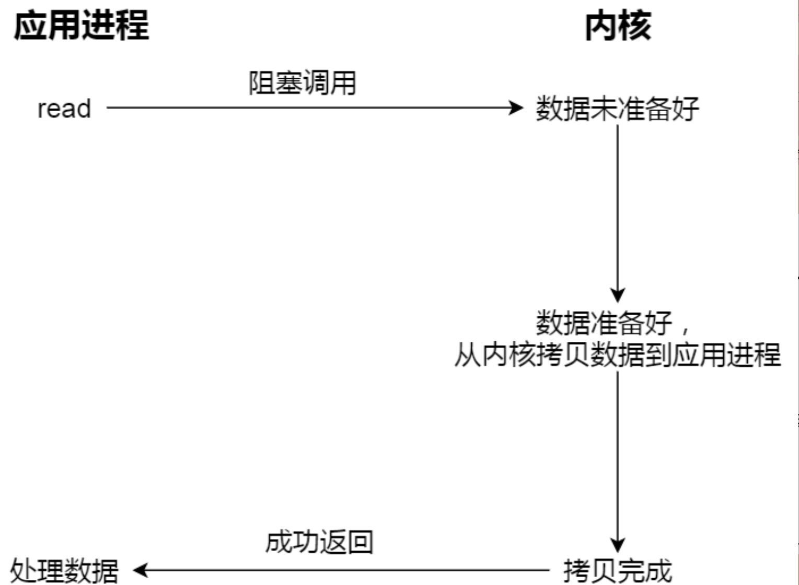

知道了阻塞 I/O ，来看看**非阻塞 I/O**，非阻塞的 read 请求在数据未准备好的情况下立即返回，可以继续往下执行，此时应用程序不断轮询内核，直到数据准备好，内核将数据拷贝到应用程序缓冲区，`read` 调用才可以获取到结果。过程如下图：

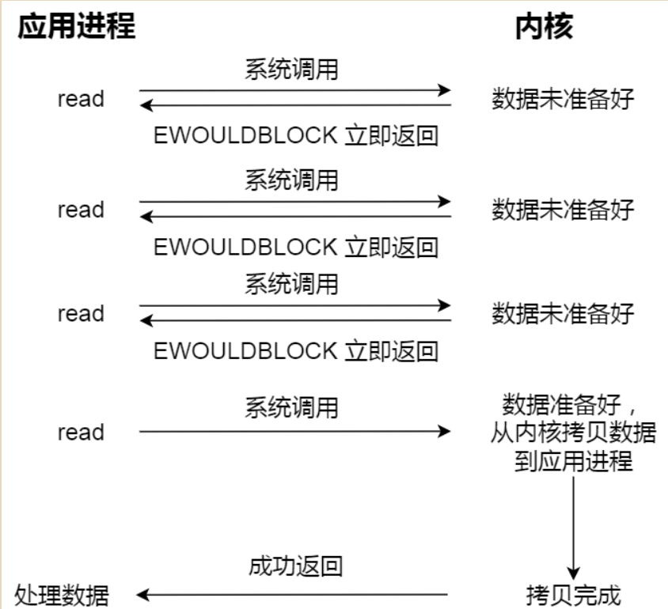

注意，**这里最后一次 read 调用，获取数据的过程，是一个同步的过程，是需要等待的过程。这里的同步指的是内核态的数据拷贝到用户程序的缓存区这个过程。**

应用程序每次轮询内核的 I/O 是否准备好，感觉有点傻乎乎，因为轮询的过程中，应用程序啥也做不了，只是在循环。

为了解决这种傻乎乎轮询方式，于是 **I/O 多路复用**技术就出来了，如 select、poll，它是通过 I/O 事件分发，当内核数据准备好时，再以事件通知应用程序进行操作。

这个做法大大改善了应用进程对 CPU 的利用率，在没有被通知的情况下，应用进程可以使用 CPU 做其他的事情。

下图是使用 select I/O 多路复用过程。注意，`read` 获取数据的过程（数据从内核态拷贝到用户态的过程），也是一个**同步的过程**，需要等待：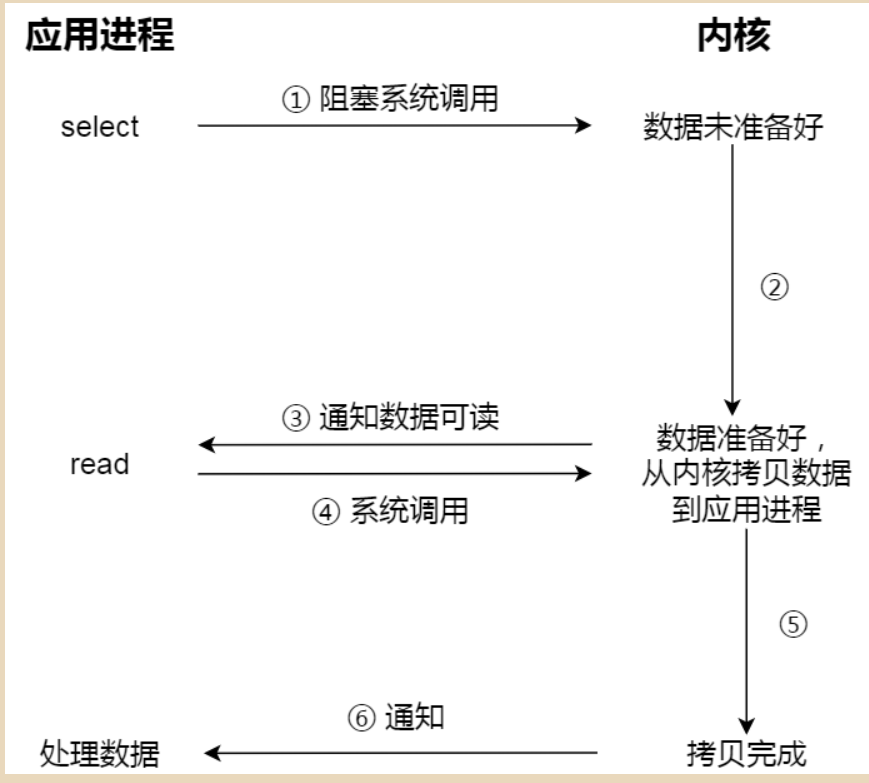

实际上，无论是阻塞 I/O、非阻塞 I/O，还是基于非阻塞 I/O 的多路复用**都是同步调用。因为它们在 read 调用时，内核将数据从内核空间拷贝到应用程序空间，过程都是需要等待的，也就是说这个过程是同步的，如果内核实现的拷贝效率不高，read 调用就会在这个同步过程中等待比较长的时间。**

而真正的**异步 I/O** 是「内核数据准备好」和「数据从内核态拷贝到用户态」这两个过程都不用等待。

当我们发起 `aio_read` 之后，就立即返回，内核自动将数据从内核空间拷贝到应用程序空间，这个拷贝过程同样是异步的，内核自动完成的，和前面的同步操作不一样，应用程序并不需要主动发起拷贝动作。过程如下图：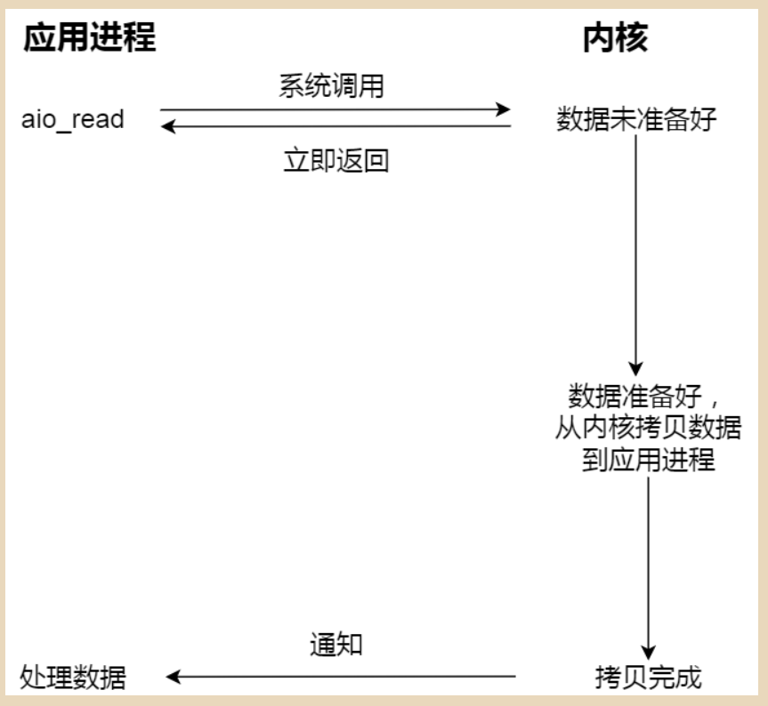

下面这张图，总结了以上几种 I/O 模型：

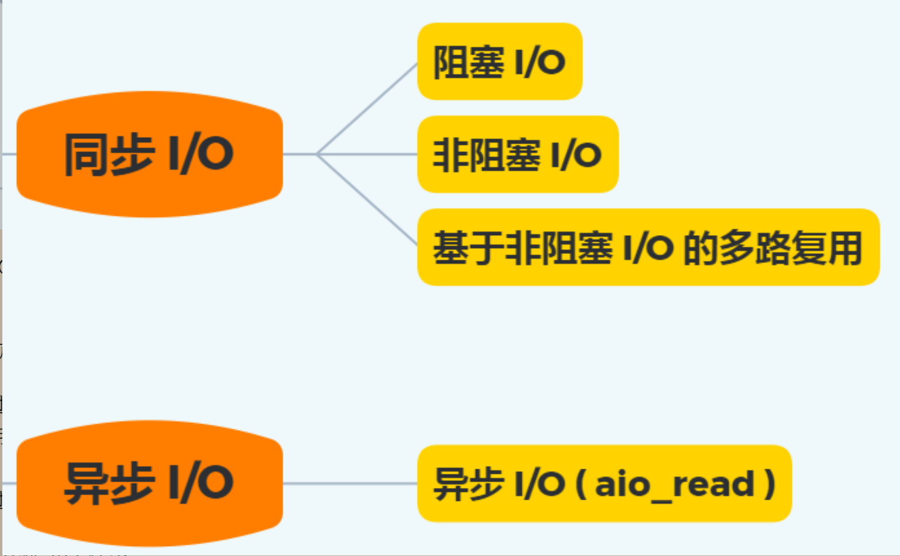

在前面我们知道了，I/O 是分为两个过程的：

1. 数据准备的过程
2. 数据从内核空间拷贝到用户进程缓冲区的过程

阻塞 I/O 会阻塞在「过程 1 」和「过程 2」，而非阻塞 I/O 和基于非阻塞 I/O 的多路复用只会阻塞在「过程 2」，所以这三个都可以认为是同步 I/O。

异步 I/O 则不同，「过程 1 」和「过程 2 」都不会阻塞。

> 用故事去理解这几种 I/O 模型

举个你去饭堂吃饭的例子，你好比用户程序，饭堂好比操作系统。

阻塞 I/O 好比，你去饭堂吃饭，但是饭堂的菜还没做好，然后你就一直在那里等啊等，等了好长一段时间终于等到饭堂阿姨把菜端了出来（数据准备的过程），但是你还得继续等阿姨把菜（内核空间）打到你的饭盒里（用户空间），经历完这两个过程，你才可以离开。

非阻塞 I/O 好比，你去了饭堂，问阿姨菜做好了没有，阿姨告诉你没，你就离开了，过几十分钟，你又来饭堂问阿姨，阿姨说做好了，于是阿姨帮你把菜打到你的饭盒里，这个过程你是得等待的。

基于非阻塞的 I/O 多路复用好比，你去饭堂吃饭，发现有一排窗口，饭堂阿姨告诉你这些窗口都还没做好菜，等做好了再通知你，于是等啊等（`select` 调用中），过了一会阿姨通知你菜做好了，但是不知道哪个窗口的菜做好了，你自己看吧。于是你只能一个一个窗口去确认，后面发现 5 号窗口菜做好了，于是你让 5 号窗口的阿姨帮你打菜到饭盒里，这个打菜的过程你是要等待的，虽然时间不长。打完菜后，你自然就可以离开了。

异步 I/O 好比，你让饭堂阿姨将菜做好并把菜打到饭盒里后，把饭盒送到你面前，整个过程你都不需要任何等待。

# 【七】、设备管理

## 键盘敲入A 字母时，操作系统期间发生了什么？

键盘可以说是我们最常使用的输入硬件设备了，但身为程序员的你，你知道「**键盘敲入A 字母时，操作系统期间发生了什么吗**」？

那要想知道这个发生的过程，我们得先了解了解「操作系统是如何管理多种多样的的输入输出设备」的，等了解完这个后，我们再来看看这个问题，你就会发现问题已经被迎刃而解了。

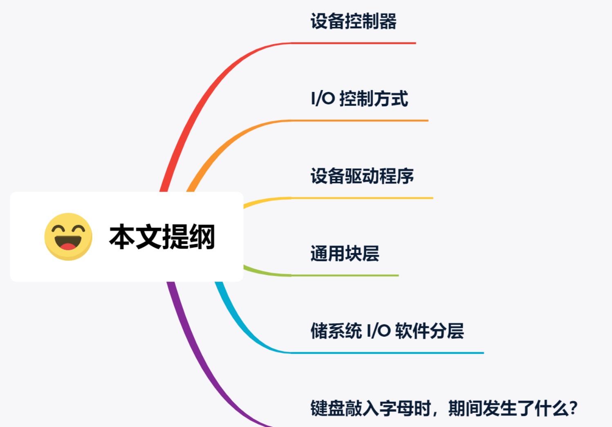

### 设备控制器

我们的电脑设备可以接非常多的输入输出设备，比如键盘、鼠标、显示器、网卡、硬盘、打印机、音响等等，每个设备的用法和功能都不同，那操作系统是如何把这些输入输出设备统一管理的呢?

为了屏蔽设备之间的差异，每个设备都有一个叫**设备控制器（\*Device Control\*）** 的组件，比如硬盘有硬盘控制器、显示器有视频控制器等。

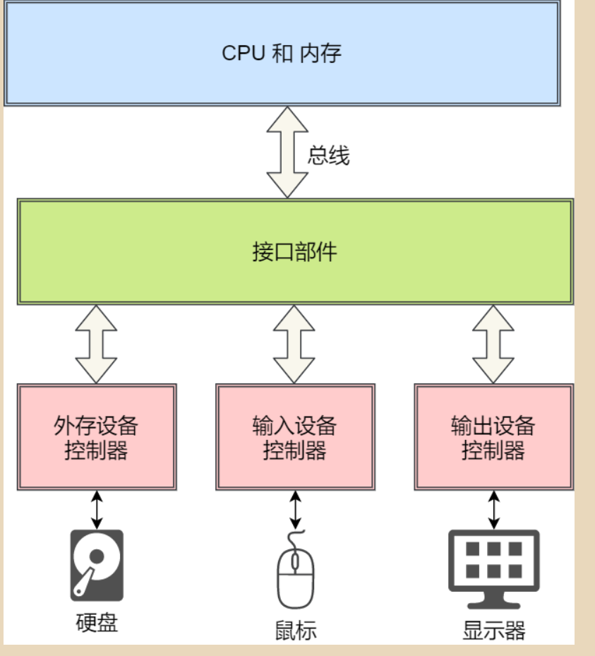

因为这**些控制器都很清楚的知道对应设备的用法和功能，所以 CPU 是通过设备控制器来和设备打交道的。**

**设备控制器里有芯片，它可执行自己的逻辑，也有自己的寄存器，用来与 CPU 进行通信**，比如：

- 通过写入这些寄存器，操作系统可以命令设备发送数据、接收数据、开启或关闭，或者执行某些其他操作。
- 通过读取这些寄存器，操作系统可以了解设备的状态，是否准备好接收一个新的命令等。

实际上，**控制器是有三类寄存器，**它们分别是**状态寄存器（\*Status Register\*）**、 **命令寄存器（\*Command Register\*）**以及**数据寄存器（\*Data Register\*）**，如下图：

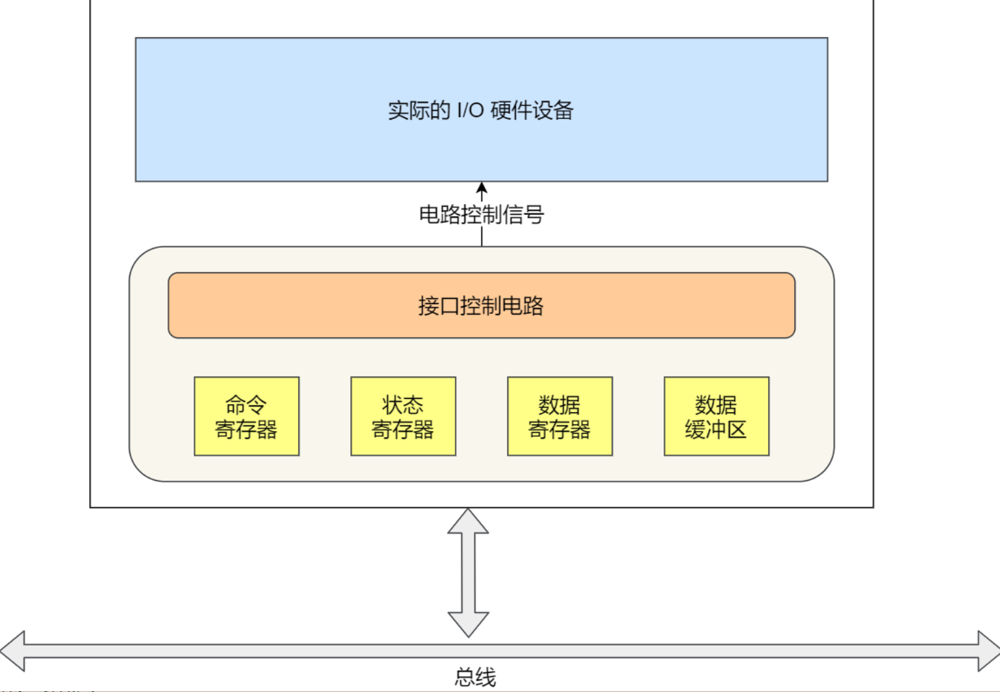

**这三个寄存器的作用：**

- *数据寄存器*，CPU 向 I/O 设备写入需要传输的数据，比如要打印的内容是「Hello」，CPU 就要先发送一个 H 字符给到对应的 I/O 设备。
- *命令寄存器*，CPU 发送一个命令，告诉 I/O 设备，要进行输入/输出操作，于是就会交给 I/O 设备去工作，任务完成后，会把状态寄存器里面的状态标记为完成。
- *状态寄存器*，目的是告诉 CPU ，现在已经在工作或工作已经完成，如果已经在工作状态，CPU 再发送数据或者命令过来，都是没有用的，直到前面的工作已经完成，状态寄存标记成已完成，CPU 才能发送下一个字符和命令。

**CPU 通过读写设备控制器中的寄存器控制设备，这可比 CPU 直接控制输入输出设备，要方便和标准很多。**

另外， **输入输出设备可分为两大类** ：**块设备（\*Block Device\*）**和**字符设备（\*Character Device\*）**。

- ***块设备***，把数据存储在固定大小的块中，每个块有自己的地址，硬盘、USB 是常见的块设备。
- ***字符设备***，以字符为单位发送或接收一个字符流，**字符设备是不可寻址**的，也没有任何寻道操作，鼠标是常见的字符设备。

**“不可寻址”** 是字符设备的核心特性之一，指的是字符设备的数据无法通过**地址（Address）**直接定位或随机访问。我们可以从以下几个角度深入理解这一概念：

---

### **1. 与块设备的对比**
- **块设备（如硬盘、SSD）**：  
  - **可寻址**：数据存储在固定大小的块（如4KB）中，每个块有唯一地址（如LBA逻辑块地址）。  
  - **随机访问**：可以直接跳转到任意地址读写数据（如读取文件中间某一段）。  
  - **示例**：硬盘可以快速定位到第1000个块，读取或修改其中的数据。

- **字符设备（如鼠标、键盘、串口）**：  
  - **不可寻址**：数据以**连续的字符流**形式传输，没有固定地址概念。  
  - **顺序访问**：数据必须按顺序处理，无法直接跳转到某个位置。  
  - **示例**：鼠标移动时生成连续的坐标事件流，无法直接读取“第5秒的坐标”，只能按顺序接收实时数据。

---

### **2. 不可寻址的体现**
#### **(1) 数据流特性**
- 字符设备的数据像水流一样**连续、不可逆**：  
  - 一旦数据被读取，就无法回头再读（除非设备支持缓存，但这不是设备本身的特性）。  
  - **示例**：从串口接收的数据流，若未及时读取，后续数据会覆盖缓冲区。

#### **(2) 无存储介质**
- 字符设备通常**不存储数据**，而是实时生成或消费数据：  
  - **输入设备**（如键盘、鼠标）：生成数据流。  
  - **输出设备**（如打印机、显示器）：消费数据流。  
  - **例外**：某些字符设备可能包含缓冲区（如串口缓存），但缓冲区仅用于临时存储，不提供寻址功能。

#### **(3) 无寻道操作**
- 块设备的磁头需要移动（寻道）到指定位置，而字符设备**无需物理寻址**：  
  - **示例**：硬盘读取文件需要磁头移动到对应磁道，而鼠标数据直接通过中断传输，无物理定位过程。

---

### **3. 技术实现角度**
#### **(1) 驱动接口**
- 字符设备通过 **`read()` 和 `write()`** 系统调用与用户空间交互，操作单位是字符（字节）：  
  ```c
  // 用户从字符设备读取数据（如鼠标）
  read(fd, buffer, buffer_size);
  
  // 用户向字符设备写入数据（如发送串口指令）
  write(fd, command, command_length);
  ```
- **没有 `lseek()` 支持**：字符设备驱动通常不实现定位函数，因为数据流无法随机访问。  
  ```c
  // 尝试定位会返回错误（ESPIPE）
  lseek(fd, offset, SEEK_SET); // 失败！
  ```

#### **(2) 内核数据结构**
- 字符设备在内核中通过 **`struct cdev`** 表示，其核心是提供流式访问的接口：  
  ```c
  struct file_operations {
      ssize_t (*read)(...);    // 读数据流
      ssize_t (*write)(...);   // 写数据流
      // 无 llseek 或定位操作
  };
  ```

---

### **4. 典型字符设备示例**
#### **(1) 鼠标**
- **数据流**：连续的移动事件（`dx, dy`）和点击事件（左键、右键）。  
- **不可寻址**：无法直接读取历史事件，只能实时获取当前状态。

#### **(2) 键盘**
- **数据流**：按顺序传输按键的扫描码（如按下`A`键生成`0x1E`）。  
- **不可寻址**：无法直接读取“第5次按键”的记录。

#### **(3) 串口（UART）**
- **不可寻址** = **无法通过地址随机访问数据**。  
- 字符设备的数据像水流一样**连续、实时、不可逆**，适用于事件驱动或流式传输场景。  
- 这一特性决定了字符设备的应用场景：实时交互（如鼠标键盘）、流式传输（如串口）、无存储需求的设备（如打印机）。


**块设备通常传输的数据量会非常大，于是控制器设立了一个可读写的数据缓冲区。**

CPU 写入数据到控制器的缓冲区时，当缓冲区的数据囤够了一部分，才会发给设备。

CPU 从控制器的缓冲区读取数据时，也需要缓冲区囤够了一部分，才拷贝到内存。

**这样做是为了，减少对设备的频繁操作。**

那 **CPU 是如何与设备的控制寄存器和数据缓冲区进行通信的？存在两个方法**：

- *端口 I/O*，每个控制寄存器被分配一个 I/O 端口，可以通过特殊的汇编指令操作这些寄存器，比如 `in/out` 类似的指令。
- *内存映射 I/O*，将所有控制寄存器映射到内存空间中，这样就可以像读写内存一样读写数据缓冲区。

### I/O 控制方式

每种设备都有一个设备控制器，控制器相当于一个小 CPU，它可以自己处理一些事情，但有个问题是，当 CPU 给设备发送了一个指令，让设备控制器去读设备的数据，它读完的时候，要怎么通知 CPU 呢？

控制器的寄存器一般会有状态标记位，用来标识输入或输出操作是否完成。于是，我们想到第一种**轮询等待**的方法，让 CPU 一直查寄存器的状态，直到状态标记为完成，很明显，这种方式非常的傻瓜，它会占用 CPU 的全部时间。

那我们就想到第二种方法 —— **中断**，通知操作系统数据已经准备好了。我们一般会有一个硬件的**中断控制器**，当设备完成任务后触发中断到中断控制器，中断控制器就通知 CPU，一个中断产生了，CPU 需要停下当前手里的事情来处理中断。

另外，中断有两种，一种**软中断**，例如代码调用 `INT` 指令触发，一种是**硬件中断**，就是硬件通过中断控制器触发的。

但中断的方式对于频繁读写数据的磁盘，并不友好，这样 CPU 容易经常被打断，会占用 CPU 大量的时间。对于这一类设备的问题的解决方法是使用 **DMA（\*Direct Memory Access\*）** 功能，它可以使得设备在 CPU 不参与的情况下，能够自行完成把设备 I/O 数据放入到内存。那要实现 DMA 功能要有 「DMA 控制器」硬件的支持。

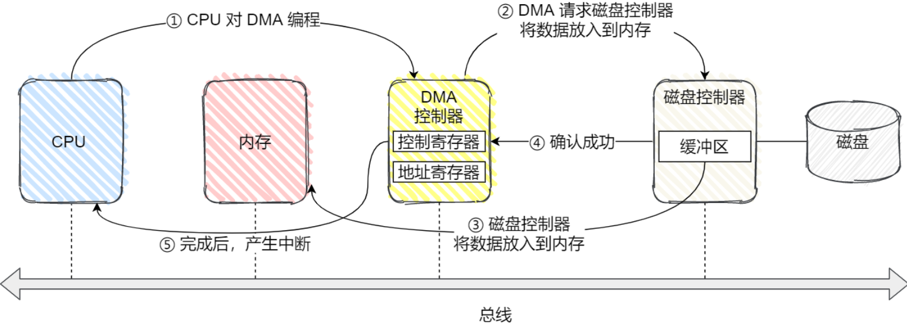

DMA 的工作方式如下：

- CPU 需对 DMA 控制器下发指令，告诉它想读取多少数据，读完的数据放在内存的某个地方就可以了；
- 接下来，DMA 控制器会向磁盘控制器发出指令，通知它从磁盘读数据到其内部的缓冲区中，接着磁盘控制器将缓冲区的数据传输到内存；
- 当磁盘控制器把数据传输到内存的操作完成后，磁盘控制器在总线上发出一个确认成功的信号到 DMA 控制器；
- DMA 控制器收到信号后，DMA 控制器发中断通知 CPU 指令完成，CPU 就可以直接用内存里面现成的数据了；

可以看到， CPU 当要读取磁盘数据的时候，只需给 DMA 控制器发送指令，然后返回去做其他事情，当磁盘数据拷贝到内存后，DMA 控制机器通过中断的方式，告诉 CPU 数据已经准备好了，可以从内存读数据了。仅仅在传送开始和结束时需要 CPU 干预。

### 设备驱动程序

虽然设备控制器屏蔽了设备的众多细节，但每种设备的控制器的寄存器、缓冲区等使用模式都是不同的，所以为了屏蔽「设备控制器」的差异，引入了**设备驱动程序**。

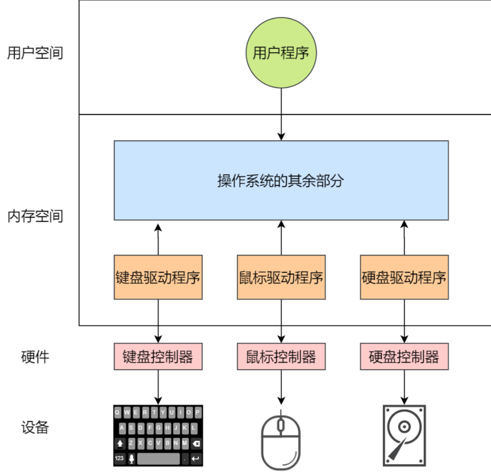

**设备控制器不属于操作系统范畴，它是属于硬件，**而**设备驱动程序属于操作系统的一部分，操作系统的内核代码可以像本地调用代码一样使用设备驱动程序的接口**，而设备驱动程序是面向设备控制器的代码，它发出操控设备控制器的指令后，才可以操作设备控制器。

不同的设备控制器虽然功能不同，但是**设备驱动程序会提供统一的接口给操作系统**，这样不同的设备驱动程序，就可以以相同的方式接入操作系统。如下图：

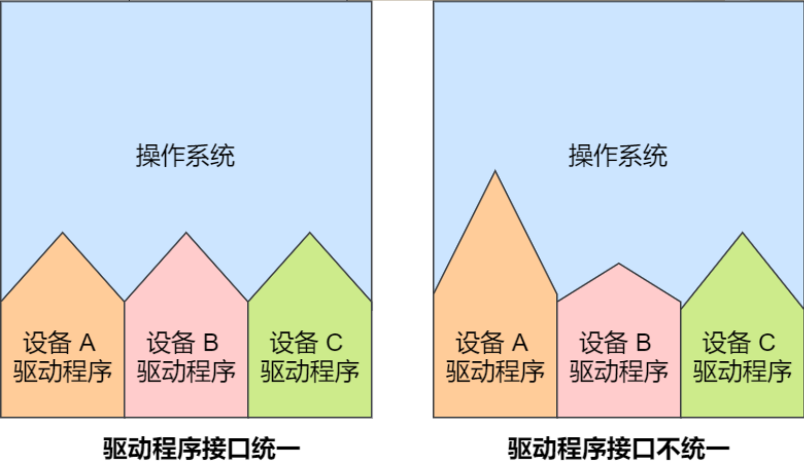


前面提到了不少关于中断的事情，设备完成了事情，则会发送中断来通知操作系统。那操作系统就需要有一个地方来处理这个中断，这个地方也就是在设备驱动程序里，它会及时响应控制器发来的中断请求，并根据这个中断的类型调用响应的**中断处理程序**进行处理。

**通常，设备驱动程序初始化的时候，要先注册一个该设备的中断处理函数。**

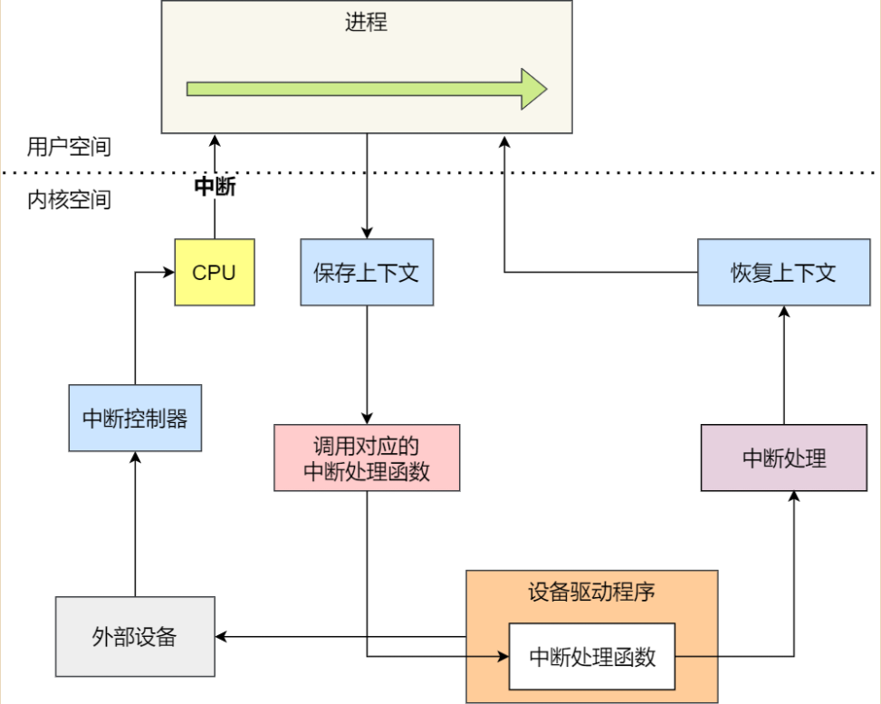

**我们来看看，中断处理程序的处理流程：**

1. 在 I/O 时，设备控制器如果已经准备好数据，则会通过中断控制器向 CPU 发送中断请求；
2. 保护被中断进程的 CPU 上下文；
3. 转入相应的设备中断处理函数；
4. 进行中断处理；
5. 恢复被中断进程的上下文；


### 通用块层

对于块设备，为了减少不同块设备的差异带来的影响，Linux 通过一个统一的**通用块层**，来管理不同的块设备。

通用块层是处于文件系统和磁盘驱动中间的一个块设备抽象层，它主要有两个功能：

- 第一个功能，向上为文件系统和应用程序，提供访问块设备的标准接口，向下把各种不同的磁盘设备抽象为统一的块设备，并在内核层面，提供一个框架来管理这些设备的驱动程序；
- 第二功能，通用层还会给文件系统和应用程序发来的 I/O 请求排队，接着会对队列重新排序、请求合并等方式，也就是 I/O 调度，主要目的是为了提高磁盘读写的效率。


**Linux 内存支持 5 种 I/O 调度算法，分别是**：

- **没有调度算法**
- **先入先出调度算法**
- **完全公平调度算法**
- **优先级调度**
- **最终期限调度算法**

第一种，没有调度算法，是的，你没听错，它不对文件系统和应用程序的 I/O 做任何处理，这种算法常用在虚拟机 I/O 中，此时磁盘 I/O 调度算法交由物理机系统负责。

第二种，先入先出调度算法，这是最简单的 I/O 调度算法，先进入 I/O 调度队列的 I/O 请求先发生。

第三种，完全公平调度算法，大部分系统都把这个算法作为默认的 I/O 调度器，它为每个进程维护了一个 I/O 调度队列，并按照时间片来均匀分布每个进程的 I/O 请求。

第四种，优先级调度算法，顾名思义，优先级高的 I/O 请求先发生， 它适用于运行大量进程的系统，像是桌面环境、多媒体应用等。

第五种，最终期限调度算法，分别为读、写请求创建了不同的 I/O 队列，这样可以提高机械磁盘的吞吐量，并确保达到最终期限的请求被优先处理，适用于在 I/O 压力比较大的场景，比如数据库等。


### 存储系统 I/O 软件分层

前面说到了不少东西，设备、设备控制器、驱动程序、通用块层，现在再结合文件系统原理，我们来看看 Linux 存储系统的 I/O 软件分层。

可以把 Linux 存储系统的 I/O 由上到下可以分为三个层次，分别是文件系统层、通用块层、设备层。他们整个的层次关系如下图：

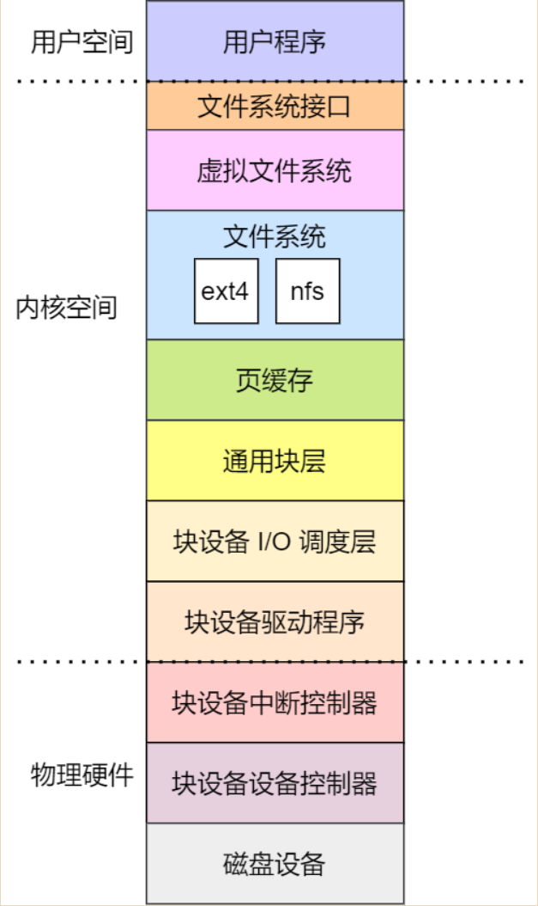

**这三个层次的作用是：**

- **文件系统层，包括虚拟文件系统和其他文件系统的具体实现，它向上为应用程序统一提供了标准的文件访问接口，向下会通过通用块层来存储和管理磁盘数据。**
- 通用块层，包括块设备的 I/O 队列和 I/O 调度器，它会对文件系统的 I/O 请求进行排队，再通过 I/O 调度器，选择一个 I/O 发给下一层的设备层。
- 设备层，包括硬件设备、设备控制器和驱动程序，负责最终物理设备的 I/O 操作。

有了文件系统接口之后，不但可以通过文件系统的命令行操作设备，也可以通过应用程序，调用 `read`、`write` 函数，就像读写文件一样操作设备，所以说设备在 Linux 下，也只是一个特殊的文件。

但是，**除了读写操作，还需要有检查特定于设备的功能和属性。于是，需要 `ioctl` 接口，它表示输入输出控制接口，是用于配置和修改特定设备属性的通用接口。**

另外，存储系统的 I/O 是整个系统最慢的一个环节，所以 Linux 提供了不少缓存机制来提高 I/O 的效率。

- 为了提高文件访问的效率，会使用**页缓存、索引节点缓存、目录项缓存**等多种缓存机制，目的是为了减少对块设备的直接调用。
- 为了提高块设备的访问效率， 会使用**缓冲区**，来缓存块设备的数据。


### 键盘敲入字母时，期间发生了什么？

看完前面的内容，相信你对输入输出设备的管理有了一定的认识，那接下来就从**操作系统的角度回答开头的问题「键盘敲入字母时，操作系统期间发生了什么？」**

我们先来看看 **CPU 的硬件架构图：**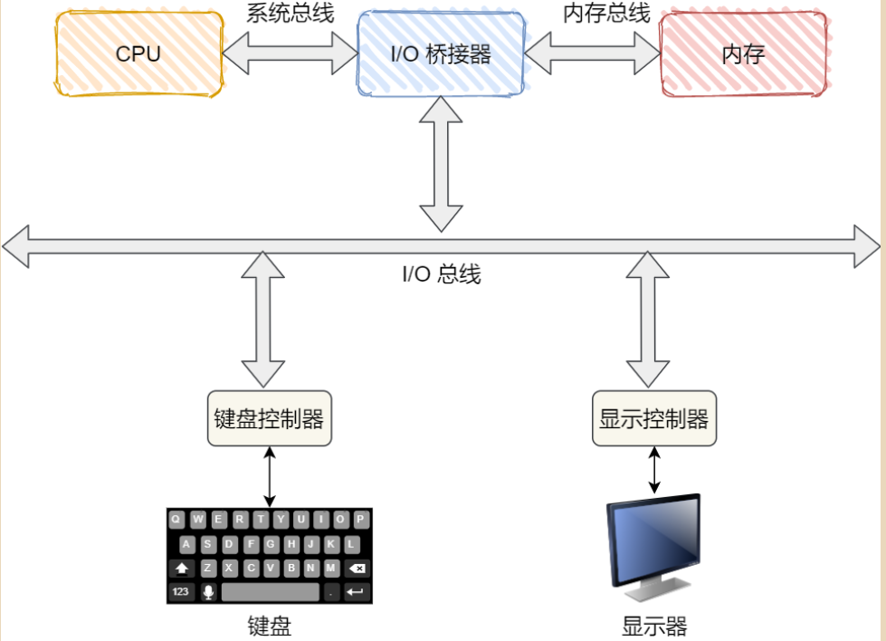

CPU 里面的内存接口，直接和系统总线通信，然后系统总线再接入一个 I/O 桥接器，这个 I/O 桥接器，另一边接入了内存总线，使得 CPU 和内存通信。再另一边，又接入了一个 I/O 总线，用来连接 I/O 设备，比如键盘、显示器等。

那当用户输入了键盘字符，**键盘控制器**就会产生扫描码数据，并将其缓冲在键盘控制器的寄存器中，紧接着键盘控制器通过总线给 CPU 发送**中断请求**。

CPU 收到中断请求后，操作系统会**保存被中断进程的 CPU 上下文**，然后调用键盘的**中断处理程序**。

键盘的中断处理程序是在**键盘驱动程序**初始化时注册的，那键盘**中断处理函数**的功能就是从键盘控制器的寄存器的缓冲区读取扫描码，再根据扫描码找到用户在键盘输入的字符，如果输入的字符是显示字符，那就会把扫描码翻译成对应显示字符的 ASCII 码，比如用户在键盘输入的是字母 A，是显示字符，于是就会把扫描码翻译成 A 字符的 ASCII 码。

得到了显示字符的 ASCII 码后，就会把 ASCII 码放到「读缓冲区队列」，接下来就是要把显示字符显示屏幕了，显示设备的驱动程序会定时从「读缓冲区队列」读取数据放到「写缓冲区队列」，最后把「写缓冲区队列」的数据一个一个写入到显示设备的控制器的寄存器中的数据缓冲区，最后将这些数据显示在屏幕里。

显示出结果后，**恢复被中断进程的上下文**。

# 【八】、网络系统

## 8.1Linux 系统是如何收发网络包的？

这次，就围绕一个问题来说。

**Linux 系统是如何收发网络包的？**

------

### 网络模型

为了使得多种设备能通过网络相互通信，和为了解决各种不同设备在网络互联中的兼容性问题，国际标标准化组织制定了开放式系统互联通信参考模型（*pen System Interconnection Reference Model*），也就是 OSI 网络模型，该模型主要有 7 层，分别是应用层、表示层、会话层、传输层、网络层、数据链路层以及物理层。

每一层负责的职能都不同，如下：

- 应用层，负责给应用程序提供统一的接口；
- 表示层，负责把数据转换成兼容另一个系统能识别的格式；
- 会话层，负责建立、管理和终止表示层实体之间的通信会话；
- 传输层，负责端到端的数据传输；
- 网络层，负责数据的路由、转发、分片；
- 数据链路层，负责数据的封帧和差错检测，以及 MAC 寻址；
- 物理层，负责在物理网络中传输数据帧；

**由于 OSI 模型实在太复杂，提出的也只是概念理论上的分层，并没有提供具体的实现方案。**事实上，**我们比较常见，也比较实用的是四层模型，即 TCP/IP 网络模型，Linux 系统正是按照这套网络模型来实现网络协议栈的。**

TCP/IP 网络模型共有 4 层，分别是应用层、传输层、网络层和网络接口层，每一层负责的职能如下：

- 应用层，负责向用户提供一组应用程序，比如 HTTP、DNS、FTP 等;
- 传输层，负责端到端的通信，比如 TCP、UDP 等；
- 网络层，负责网络包的封装、分片、路由、转发，比如 IP、ICMP 等；
- 网络接口层，负责网络包在物理网络中的传输，比如网络包的封帧、 MAC 寻址、差错检测，以及通过网卡传输网络帧等；

TCP/IP 网络模型相比 OSI 网络模型简化了不少，也更加易记，它们之间的关系如下图：

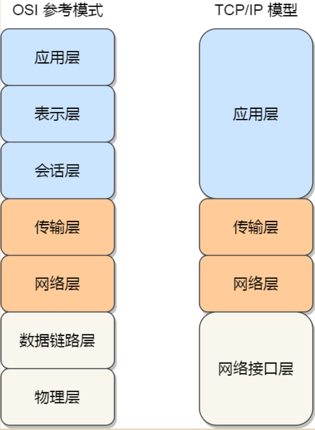

### Linux 网络协议栈

**把 TCP 协议通信的网络包发出去的时候，会把应用层的数据按照网络协议栈层层封装和处理。**

**你从下面这张图可以看到，应用层数据在每一层的封装格式。**（TCP/IP模型）

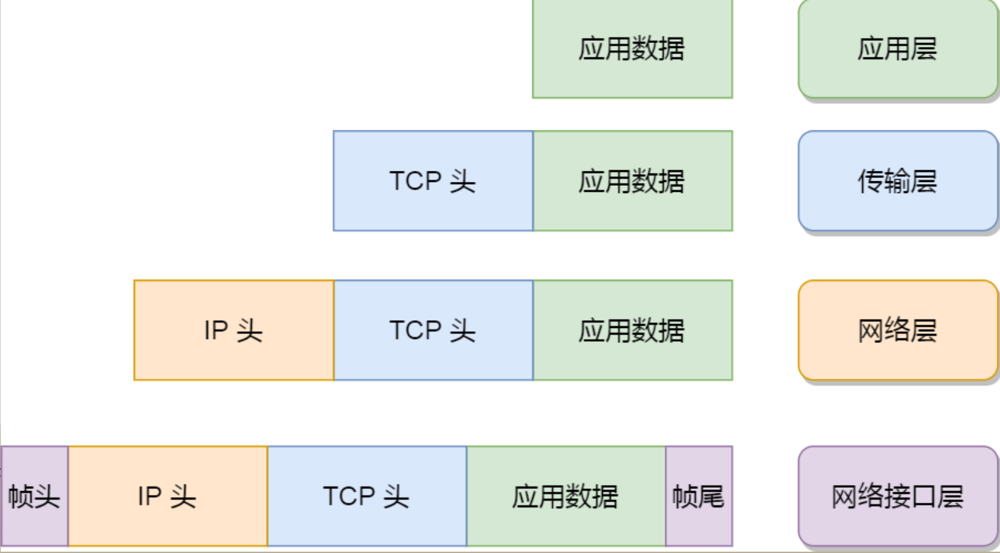

**我们可以把自己的身体比作应用层中的数据，打底衣服比作传输层中的 TCP 头，外套比作网络层中 IP 头，帽子和鞋子分别比作网络接口层的帧头和帧尾。**都意思是包装的应用数据

其中：

- **传输层，给应用数据前面增加了 TCP 头； 打底衣服**
- **网络层，给 TCP 数据包前面增加了 IP 头；外套+打底衣服**
- **网络接口层，给 IP 数据包前后分别增加了帧头和帧尾；帽子 外套 打底衣服 应用数据（身体） 鞋子**

**这些新增和头部和尾部，都有各自的作用，也都是按照特定的协议格式填充，这每一层都增加了各自的协议头，那自然网络包的大小就增大了，但物理链路并不能传输任意大小的数据包，所以在以太网中，规定了最大传输单元（MTU）是 `1500` 字节，也就是规定了单次传输的最大 IP 包大小。**

**当网络包超过 MTU 的大小，就会在网络层分片，以确保分片后的 IP 包不会超过 MTU 大小，如果 MTU 越小，需要的分包就越多，那么网络吞吐能力就越差，相反的，如果 MTU 越大，需要的分包就越小，那么网络吞吐能力就越好。**

知道了 TCP/IP 网络模型，以及网络包的封装原理后，那么 Linux 网络协议栈的样子，你想必猜到了大概，它其实就类似于 TCP/IP 的四层结构：

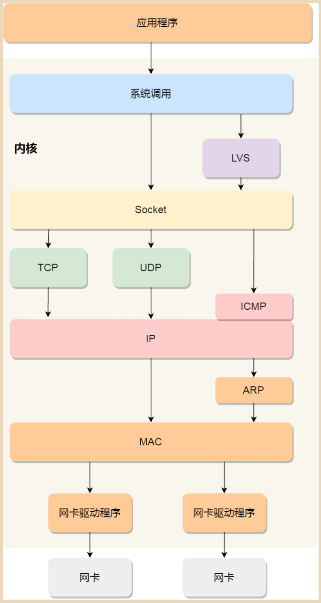

从上图的的网络协议栈，你可以看到：

- 应用程序需要通过系统调用，来跟 Socket 层进行数据交互；
- Socket 层的下面就是传输层、网络层和网络接口层；
- 最下面的一层，则是网卡驱动程序和硬件网卡设备；

**TCP/IP 和网络协议栈是计算机网络中密切相关的两个概念，但它们有不同的侧重点和定义。以下是它们的核心关系与区别的详细解析：**

---

### **一、关系：TCP/IP 是网络协议栈的理论模型**
1. **TCP/IP 模型**：  
   - 是一个 **四层参考模型**（**应用层、传输层、网络层、链路层**），定义了网络通信的分层架构和每层的核心功能。  
   - 提供理论指导，规定各层应实现的目标（如传输层负责端到端通信）。  

2. **网络协议栈**：  
   - 是 **具体实现**，指在操作系统或硬件中按照分层模型实现的协议集合。  
   - 例如：Linux 内核中的 TCP/IP 协议栈、Windows 的 Winsock 库。  

**关系总结**：  
- **TCP/IP 模型是蓝图**，**网络协议栈是按蓝图建造的房屋。**  
- 协议栈基于 TCP/IP 模型实现，但可能根据实际需求调整（如合并某些功能）。

---

### **二、区别：抽象模型 vs 具体实现**
| **对比维度** | **TCP/IP 模型**        | **网络协议栈**                       |
| ------------ | ---------------------- | ------------------------------------ |
| **本质**     | 理论分层模型           | 具体软件/硬件实现                    |
| **内容**     | 定义各层功能和交互逻辑 | 包含协议代码、数据结构、API接口      |
| **灵活性**   | 固定四层结构           | 可扩展（如添加新协议或优化现有协议） |
| **示例**     | 无具体代码，仅概念描述 | Linux 内核的 `net/ipv4` 模块         |

---

### **三、网络协议栈的组成与工作流程**
#### **1. 协议栈的典型分层（以发送 HTTP 请求为例）**
1. **应用层**：  
   - 生成 HTTP 请求（`GET /index.html`）。  
   - 协议：HTTP、DNS、FTP。  

2. **传输层**：  
   - 将数据分段，添加 TCP 头部（源端口、目标端口、序列号等）。  
   - 协议：TCP（可靠传输）、UDP（快速传输）。  

3. **网络层**：  
   - 添加 IP 头部（源 IP、目标 IP），处理路由和分片。  
   - 协议：IP、ICMP、ARP。  

4. **链路层**：  
   - 添加以太网头部（源 MAC、目标 MAC），通过物理介质传输。  
   - 协议：Ethernet、Wi-Fi、PPP。  

#### **2. 数据封装流程**
```plaintext
应用层数据 → 添加TCP头部 → 添加IP头部 → 添加以太网头部 → 物理信号传输
```

#### **3. 协议栈的实现示例（Linux 内核）**
- **套接字接口**：用户通过 `socket()`、`send()`、`recv()` 等系统调用与协议栈交互。  
- **内核模块**：  
  - 传输层：`net/ipv4/tcp.c`（TCP 实现）。  
  - 网络层：`net/ipv4/ip_output.c`（IP 数据包发送）。  
  - 链路层：`drivers/net/ethernet`（网卡驱动）。  

---

### **四、常见问题解析**
#### **1. 为什么说 TCP/IP 模型不严格符合 OSI 模型？**  
- **设计目标不同**：  
  - OSI 模型追求理论完备性（七层），TCP/IP 模型更注重实用性和简化（四层）。  
  - 例如：TCP/IP 的应用层合并了 OSI 的应用层、表示层、会话层。  

#### **2. 协议栈是否只能基于 TCP/IP 模型实现？**  
- **否**：  
  - 其他模型（如 OSI）也可实现协议栈，但 TCP/IP 是互联网的事实标准。  
  - 例如：蓝牙协议栈基于不同的分层模型（RFCOMM、L2CAP 等）。  

#### **3. 协议栈如何支持多协议共存？**  
- **协议分发机制**：  
  - 通过头部字段（如以太网帧的 `Type` 字段、IP 包的 `Protocol` 字段）决定下一层处理协议。  
  - 示例：  
    - `Type=0x0800` → 交给 IP 协议处理。  
    - `Protocol=6` → 交给 TCP 协议处理。  

---

### **五、现实比喻**
- **TCP/IP 模型**：像快递公司的服务规范（分拣中心→干线运输→本地配送→客户签收）。  
- **网络协议栈**：像快递公司的实际运作（分拣机器、货车、快递员按规范执行）。  

---

### **六、总结**
- **TCP/IP 模型**：是分层的理论框架，定义“应该做什么”。  
- **网络协议栈**：是具体的代码实现，解决“如何做到”。  
- **关键联系**：协议栈通过分层实现 TCP/IP 模型的功能，每一层调用下层服务并为上层提供服务。  

理解这一关系有助于深入学习网络编程（如 Socket API）和协议优化（如 QUIC 替代 TCP）。


**DMA（Direct Memory Access，直接内存访问）** 是一种允许外设（如硬盘、网卡）**直接与内存交换数据**而无需CPU介入的技术，从而显著提升系统效率。以下是其核心原理、工作流程及实际应用的详细解析：

---

### **一、DMA 的核心作用**
#### **1. 解决传统数据传输的瓶颈**
- **传统方式（PIO，Programmed I/O）**：  
  CPU 需逐字节处理数据（如从硬盘读取数据到内存），导致高负载和低效。  
  **问题**：CPU 被频繁中断，无法执行其他任务。

- **DMA 方式**：  
  DMA 控制器（DMAC）接管数据传输，CPU 仅需初始化传输参数，之后可并行处理其他任务。  
  **优势**：  
  - 减少 CPU 中断次数，提升系统吞吐量。  
  - 适合高速、大批量数据传输（如视频流、磁盘读写）。

---

### **二、DMA 的工作流程**
#### **1. 初始化阶段**
1. **CPU 配置 DMA 控制器**：  
   - 设置 **源地址**（如硬盘缓冲区地址）、**目标地址**（内存地址）、**传输长度**。  
   - 指定传输模式（单次/块传输、优先级）。  
2. **外设准备数据**：  
   - 外设（如硬盘）将数据存入自身缓冲区，并向 DMAC 发送传输请求（DREQ）。

#### **2. 数据传输阶段**
1. **DMAC 申请总线控制权**：  
   - 向 CPU 发送总线请求（HOLD），CPU 完成当前总线周期后释放总线（HLDA）。  
2. **DMAC 接管总线**：  
   - 直接读写内存，完成数据从外设到内存（或反向）的传输。  
3. **传输完成**：  
   - DMAC 释放总线，向 CPU 发送中断通知（IRQ）。  
   - CPU 处理后续任务（如数据校验）。

#### **3. 流程示意图**
```plaintext
+--------+       +------+       +---------+
| 外设   | →DREQ→| DMAC | ←HOLD→ | CPU     |
| (硬盘) | ←数据→|      | →数据→ | (内存)  |
+--------+       +------+       +---------+
```

---

### **三、DMA 的关键技术细节**
#### **1. DMA 传输模式**
| **模式**      | **描述**                         | **应用场景**           |
| ------------- | -------------------------------- | ---------------------- |
| **单次传输**  | 每次请求传输一个数据单元         | 低速设备（如键盘）     |
| **块传输**    | 连续传输多个数据单元后释放总线   | 高速设备（如SSD、GPU） |
| **请求传输**  | 外设持续请求时保持总线控制权     | 实时数据流（如摄像头） |
| **分散-聚集** | 单次传输中读写多个非连续内存区域 | 网络数据包处理         |

#### **2. DMA 控制器（DMAC）结构**
- **通道**：多个独立通道支持并发传输（如通道1处理硬盘，通道2处理网卡）。  
- **优先级**：固定优先级（通道0最高）或循环轮询。  
- **地址寄存器**：存储当前传输的源/目标地址，自动递增或递减。  

#### **3. 总线仲裁**
- **多主设备竞争**：CPU、DMAC、其他总线主设备（如GPU）需通过总线仲裁器协调访问权。  
- **性能影响**：频繁总线切换可能增加延迟（现代系统采用多层总线架构优化）。

---

### **四、DMA 的实际应用**
#### **1. 磁盘 I/O**
- **场景**：从 SSD 读取大文件到内存。  
- **优势**：CPU 仅需发起传输指令，后续由 DMAC 完成数据搬运，释放 CPU 资源。  

#### **2. 网络数据传输**
- **场景**：网卡接收数据包直接存入内存（零拷贝技术）。  
- **优化**：结合分散-聚集模式处理多缓冲区数据包。  

#### **3. 图形处理**
- **场景**：GPU 通过 DMA 快速读取纹理数据，减少渲染延迟。  

#### **4. 音频/视频流**
- **场景**：摄像头采集视频流直接传输到内存，避免CPU逐帧处理。  

---

### **五、DMA 的优缺点**
#### **优点**  
- **降低 CPU 负载**：CPU 仅需初始化传输，不参与数据搬运。  
- **提升传输速度**：DMAC 专为数据传输优化，速率接近总线极限。  
- **支持高并发**：多通道 DMAC 可同时处理多个外设请求。  

#### **缺点**  
- **总线竞争**：DMAC 占用总线时，CPU 和其他设备需等待。  
- **缓存一致性**：若 CPU 缓存与 DMA 内存区域重叠，需手动刷新缓存（如使用`DMA-coherent`内存）。  
- **配置复杂度**：需精确管理地址、传输长度，否则可能导致数据损坏。  

---

### **六、DMA 与零拷贝技术**
- **传统文件传输**：  
  ```plaintext
  硬盘 → 内核缓冲区 → 用户缓冲区 → Socket 缓冲区 → 网卡
  （4次拷贝，2次CPU参与）
  ```
- **DMA + 零拷贝**：  
  ```plaintext
  硬盘 → 内核缓冲区 → 网卡（通过 DMA 直接传输）
  （2次拷贝，0次CPU参与）
  ```
- **技术实现**：  
  - Linux 的 `sendfile()` 系统调用。  
  - 网卡支持 Scatter-Gather DMA。  

---

### **七、现代优化与扩展**
#### **1. RDMA（Remote Direct Memory Access）**
- **跨网络直接内存访问**：绕过操作系统，网卡直接读写远端内存（用于高性能计算、分布式存储）。  
- **协议**：InfiniBand、RoCE（RDMA over Converged Ethernet）。  

#### **2. IOMMU（Input-Output Memory Management Unit）**
- **地址翻译与隔离**：将外设的物理地址请求转换为虚拟地址，增强安全性和灵活性。  
- **应用**：虚拟机直接访问硬件（PCI Passthrough）。  

---

### **八、总结**
DMA 技术通过将数据传输任务卸载到专用控制器，大幅提升了计算机系统的效率，尤其在处理高速、高吞吐量 I/O 时表现突出。理解其工作原理和配置方法，是优化系统性能（如减少延迟、提高并发）的关键。


### Linux 接收网络包的流程

**小林：网卡是计算机里的一个硬件，专门负责接收和发送网络包，当网卡接收到一个网络包后，会通过 DMA 技术，将网络包放入到 Ring Buffer，这个是一个环形缓冲区。**

**用大白话解释就是：**

**网卡就像你家门口的快递收发室，DMA技术是快递员不用敲门问你就直接把包裹放进仓库，环形缓冲区（Ring Buffer）就是这个仓库里的一个旋转货架。**

**具体流程：**

1. **快递到了（网络包到达）**  
   网卡收到网络包，就像快递员拿到你的包裹。

**网络包**（Network Packet）就像是你通过快递寄送的一个个小包裹，里面装着你要传递的信息。它是网络通信中最基本的数据单元，负责在互联网上把信息从一台设备（比如你的电脑）传输到另一台设备（比如网站服务器）。

---

### **一、网络包的组成**
每个网络包都像是一个**信封**，包含两个核心部分：
1. **头部（Header）**：  
   - **发件人地址**：源IP地址（如 `192.168.1.100`）。  
   - **收件人地址**：目标IP地址（如 `93.184.216.34`）。  
   - **其他标签**：协议类型（TCP/UDP）、端口号（如 `80` 表示网页服务）、校验码（防数据损坏）。  
   - **快递单号**：序列号（保证包裹按顺序到达）。  

2. **载荷（Payload）**：  
   - **实际内容**：你要传输的数据（比如一段文字、一张图片的片段）。  

**示例**：  
```plaintext
[ 头部 | 载荷 ]
```

---

### **二、为什么要把数据分成“包”？**
1. **化整为零**：  
   - 大文件（如电影）会被拆成多个小包传输，避免网络拥堵（就像大件家具拆成小箱运输）。  
2. **灵活路由**：  
   - 不同包可以走不同路径，最终在目的地重组（类似快递分拣中心选择最快路线）。  
3. **容错恢复**：  
   - 如果某个包丢失或损坏，只需重传这个包，而不是整个文件（类似补发丢失的快递包裹）。  

---

### **三、网络包的一生**
以访问网站为例，网络包的旅程如下：
1. **打包**：  
   - 你的电脑把请求（如“打开百度首页”）拆成多个包，每个包加上头部信息。  
2. **运输**：  
   - 包经过路由器、交换机“快递站”，根据头部地址逐跳转发。  
3. **重组**：  
   - 目标服务器收到所有包后，按序列号重新拼成完整请求。  
4. **回信**：  
   - 服务器将网页内容拆包发回，你的电脑再重组显示网页。  

---

### 网络包的类型
| **类型**   | **特点**                   | **应用场景**              |
| ---------- | -------------------------- | ------------------------- |
| **TCP包**  | 可靠传输，保证顺序和完整性 | 网页浏览、文件下载        |
| **UDP包**  | 快速传输，可能丢包或乱序   | 视频通话、在线游戏        |
| **ICMP包** | 网络诊断和控制消息         | `ping` 命令测试网络连通性 |

---


1. **直接放仓库（DMA技术）**  
   快递员（网卡）不用叫醒你（CPU），直接用钥匙（DMA权限）打开仓库门（内存），把包裹（网络包）放到旋转货架（Ring Buffer）上。

2. **旋转货架（Ring Buffer）**  
   - 货架是环形的，放满后从头开始覆盖（类似老式唱片循环播放）。  
   - 每个格子存一个包裹，按顺序摆放，方便你（CPU）按顺序取货处理。

3. **通知你取货（中断或轮询）**  
   - **中断模式**：货架上有新包裹，快递员按门铃（发中断）叫你处理。  
   - **轮询模式**：你每隔几分钟去仓库看一眼有没有新包裹。

**为什么这么设计？**
- **省时间**：快递员不用等你，直接放货，你睡醒再处理。  
- **防丢件**：货架有多个格子，快递高峰期也能临时囤货，避免包裹堆门口（丢包）。  
- **高效率**：你一次可以批量处理多个包裹（批量处理网络包）。

**举个现实例子：**  
你网购了10个包裹，快递员趁你睡觉时全部放进仓库货架。第二天你一次性拆包，比每到一个包裹就被叫醒一次高效多了！

**如果货架满了怎么办？**  
新来的包裹没地方放，会被直接扔掉（网络丢包）。所以仓库货架越大（Ring Buffer越大），越不容易丢件，但占地方（内存）也越多。

- **（网络包（Network Packet）** 是一个**广义术语**，泛指在网络中传输的**任何数据单元**，涵盖不同网络层次（如数据链路层、网络层、传输层）。
- **IP数据包（IP Packet）** 是网络包的一种**具体类型**，特指在 **网络层（第三层）** 由 **IP协议** 封装的数据单元。)

**小林 ：那接收到网络包后，应该怎么告诉操作系统这个网络包已经到达了呢？**

**最简单的一种方式就是触发中断，也就是每当网卡收到一个网络包，就触发一个中断告诉操作系统。**

**但是，这存在一个问题，在高性能网络场景下，网络包的数量会非常多，那么就会触发非常多的中断，要知道当 CPU 收到了中断，就会停下手里的事情，而去处理这些网络包，处理完毕后，才会回去继续其他事情，那么频繁地触发中断，则会导致 CPU 一直没玩没了的处理中断，而导致其他任务可能无法继续前进，从而影响系统的整体效率。**

**小林**所以为了解决频繁中断带来的性能开销，Linux 内核在 2.6 版本中引入了 **NAPI 机制**，它是混合「中断和轮询」的方式来接收网络包，它的核心概念就是**不采用中断的方式读取数据**，而是**首先采用中断唤醒数据接收的服务程序，然后 `poll` 的方法来轮询数据。**

**Linux 内核的 NAPI 机制** 通过结合 **中断通知** 和 **轮询处理** 来优化网络数据包的接收效率，尤其在高流量场景下显著减少 CPU 中断开销。以下是其核心原理与工作流程的通俗解析：

---

### **一、传统中断模式的瓶颈**
- **问题**：  
  网卡每收到一个数据包就触发一次中断，CPU 需立即处理。当网络流量大时，频繁中断导致 CPU 忙于响应，无法高效执行其他任务（类似快递员每送一个包裹就敲门一次，户主频繁开门效率低下）。

---

### **二、NAPI 的混合策略**
#### **1. 中断唤醒，轮询处理**
- **第一步（中断触发）**：  
  当网卡收到 **第一个数据包** 时，触发硬件中断，通知 CPU 有数据待处理（类似快递员按一次门铃提醒有包裹到货）。
  
- **第二步（切换轮询）**：  
  CPU 响应中断后，**禁用网卡的中断**，改为主动轮询网卡的接收队列，批量处理多个数据包（户主开门后，快递员将所有包裹一次性搬入，无需反复敲门）。

- **第三步（处理完成恢复中断）**：  
  当轮询处理完所有数据包（或达到处理上限），重新启用网卡中断，等待下次数据到达（户主处理完包裹后，恢复等待下次门铃）。

#### **2. 核心优势**
- **减少中断次数**：高流量时，一次中断处理多个包，避免 CPU 被频繁打断。  
- **批量处理提升效率**：轮询期间集中处理数据，利用 CPU 缓存局部性，提高吞吐量。  
- **动态适应流量**：低流量时保留中断的实时性，高流量时自动切换为轮询。

---

### **三、NAPI 的工作流程**
1. **数据包到达**：  
   网卡接收数据包存入 **环形缓冲区（Ring Buffer）**。  
2. **首次中断**：  
   网卡触发中断，CPU 执行中断处理程序。  
3. **禁用中断 + 调度软中断**：  
   - 关闭网卡中断，防止后续包触发新中断。  
   - 调度 **NET_RX_SOFTIRQ** 软中断进行后续处理。  
4. **轮询处理（poll 函数）**：  
   - 软中断调用网卡驱动的 **poll 方法**，从缓冲区批量取出数据包。  
   - 数据包经协议栈处理（如 TCP/IP 解析）后传递给应用程序。  
5. **处理完成恢复中断**：  
   - 若轮询期间有新包到达，继续处理；否则，重新启用网卡中断。  

```plaintext
+---------------------+       +---------------------+
| 网卡接收数据包       | → 中断 → | CPU 禁用中断，启动轮询 |
+---------------------+       +---------------------+
                                ↓
+---------------------+       +---------------------+
| 轮询处理批量数据包    | ← poll ← | 软中断调度           |
+---------------------+       +---------------------+
                                ↓
+---------------------+       +---------------------+
| 处理完毕，恢复中断     | ← 空闲 ← | 等待新数据包到达      |
+---------------------+       +---------------------+
```

---

### **四、实际场景示例**
- **高流量场景（如视频直播）**：  
  - 网卡每秒接收数万个包，NAPI 将其合并为几次轮询处理，避免数万次中断拖垮 CPU。  
- **低流量场景（如网页浏览）**：  
  - 偶尔的数据包仍通过中断实时响应，保证低延迟。

---

### **五、性能优化关键点**
1. **Ring Buffer 大小调整**：  
   - 缓冲区过小易丢包，过大增加内存延迟。可通过 `ethtool` 工具调整。  
2. **多队列网卡（RSS）**：  
   - 配合多核 CPU，将数据包分流到不同队列，由多个 CPU 并行处理。  
3. **中断亲和性绑定**：  
   - 将网卡中断绑定到特定 CPU 核心，减少缓存切换开销。

---

### **六、总结**
- **NAPI 机制** 像一位聪明的快递管家：  
  - **首次敲门提醒**（中断），之后主动整理所有包裹（轮询），避免频繁打扰。  
- **适用场景**：  
  - 高吞吐量服务器、网络设备、实时流媒体等需高效处理海量数据包的场景。  

通过减少中断风暴，NAPI 显著提升了 Linux 系统的网络性能，成为现代网络栈优化的基石。


**小林**：比如，当有网络包到达时，网卡发起硬件中断，于是会执行网卡硬件中断处理函数，**中断处理函数处理完需要「暂时屏蔽中断」，然后唤醒「软中断」来轮询处理数据，直到没有新数据时才恢复中断，这样一次中断处理多个网络包**，于是就可以降低网卡中断带来的性能开销。

小林：那软中断是怎么处理网络包的呢？它会从 Ring Buffer 中拷贝数据到内核 struct sk_buff 缓冲区中，从而可以作为一个网络包交给网络协议栈进行逐层处理。

首先，会先进入到网络接口层，在这一层会检查报文的合法性，如果不合法则丢弃，合法则会找出该网络包的上层协议的类型，比如是 IPv4，还是 IPv6，接着再去掉帧头和帧尾，然后交给网络层。

到了网络层，则取出 IP 包，判断网络包下一步的走向，比如是交给上层处理还是转发出去。当确认这个网络包要发送给本机后，就会从 IP 头里看看上一层协议的类型是 TCP 还是 UDP，接着去掉 IP 头，然后交给传输层。

传输层取出 TCP 头或 UDP 头，根据四元组「源 IP、源端口、目的 IP、目的端口」 作为标识，找出对应的 Socket，并把数据拷贝到 Socket 的接收缓冲区。

最后，应用层程序调用 Socket 接口，从内核的 Socket 接收缓冲区读取新到来的数据到应用层。

至此，一个网络包的接收过程就已经结束了，你也可以从下图左边部分看到网络包接收的流程，右边部分刚好反过来，它是网络包发送的流程。

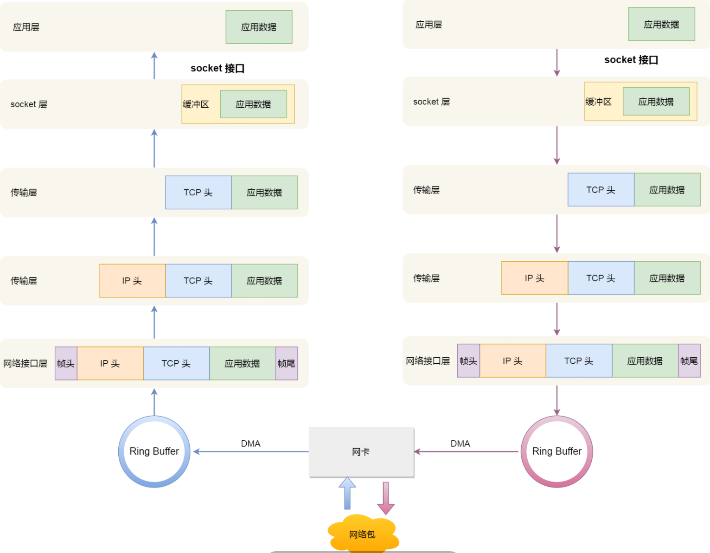

### Linux 发送网络包的流程

如上图的右半部分，**发送网络包的流程正好和接收流程相反。**

首先，**应用程序会调用 Socket 发送数据包的接口，由于这个是系统调用**，所以会从用户态陷入到内核态中的 Socket 层，Socket 层会将应用层数据拷贝到 Socket 发送缓冲区中。

（**Socket 接口** 是操作系统为应用程序提供的 **网络通信编程接口**，它允许不同主机或同一主机上的进程之间进行数据交换。你可以将 Socket 理解为“网络通信的插座”，应用程序通过它建立连接、发送和接收数据。

### **Socket 的核心作用**

1. **抽象网络细节**：
   隐藏底层协议（如 TCP/IP）的复杂性，开发者只需调用简单 API（如 `send()`、`recv()`）即可通信。

2. 支持多协议

   ：

   - **TCP（可靠流式传输）**：适合网页、文件传输。
   - **UDP（快速无连接传输）**：适合实时音视频、游戏。
   - **原始 Socket（直接操作网络层）**：用于网络嗅探、自定义协议。

3. **跨平台通信**：
   Windows、Linux、macOS 均提供标准 Socket API，确保代码可移植性。

）

接下来，**网络协议栈从 Socket 发送缓冲区中取出数据包，并按照 TCP/IP 协议栈从上到下逐层处理。**

**如果使用的是 TCP 传输协议发送数据，那么会在传输层增加 TCP 包头，然后交给网络层，网络层会给数据包增加 IP 包，然后通过查询路由表确认下一跳的 IP，并按照 MTU 大小进行分片。**

**分片后的网络包，就会被送到网络接口层，在这里会通过 ARP 协议获得下一跳的 MAC 地址，然后增加帧头和帧尾，放到发包队列中。**

这一些准备好后，会触发软中断告诉网卡驱动程序，这里有新的网络包需要发送，**最后驱动程序通过 DMA，从发包队列中读取网络包，将其放入到硬件网卡的队列中，随后物理网卡再将它发送出去。**

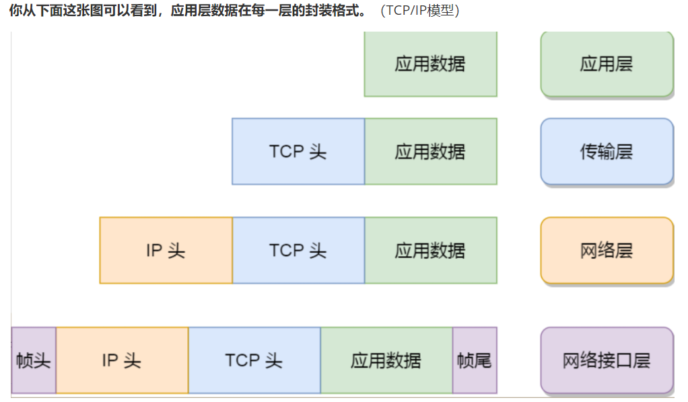

### 总结

电脑与电脑之间通常都是通话网卡、交换机、路由器等网络设备连接到一起，那由于网络设备的异构性，国际标准化组织定义了一个七层的 OSI 网络模型，但是这个模型由于比较复杂，实际应用中并没有采用，而是采用了更为简化的 TCP/IP 模型，Linux 网络协议栈就是按照了该模型来实现的。

TCP/IP 模型主要分为应用层、传输层、网络层、网络接口层四层，每一层负责的职责都不同，这也是 Linux 网络协议栈主要构成部分。

当应用程序通过 Socket 接口发送数据包，数据包会被网络协议栈从上到下进行逐层处理后，才会被送到网卡队列中，随后由网卡将网络包发送出去。

而在接收网络包时，同样也要先经过网络协议栈从下到上的逐层处理，最后才会被送到应用程序。
