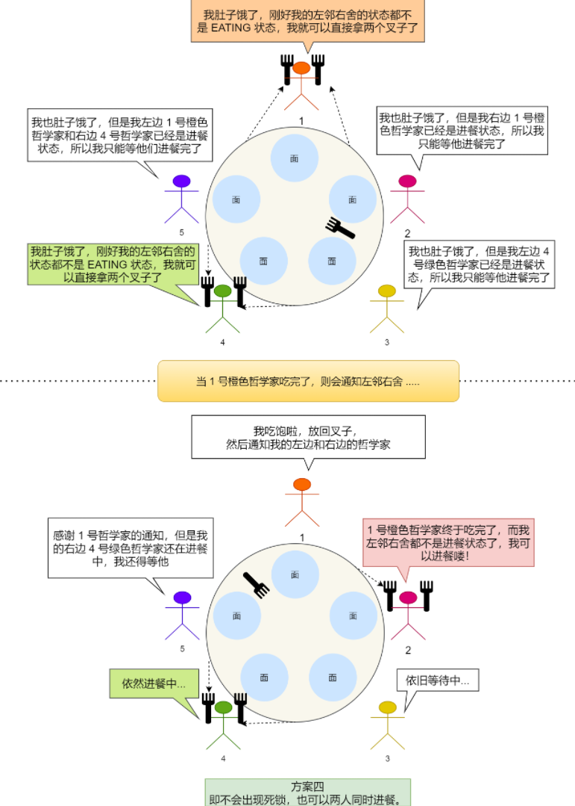

# 操作系统

[TOC]

##### 经典同步问题：

1. 哲学家就餐问题

   

2. 读者写者问题

   

3. 死锁 是指两个或多个进程在运行过程中，因争夺资源而陷入相互等待的状态，导致它们无法继续执行，系统无法正常推进。、

   示例：

   进程A持有资源1，请求资源2；
   进程B持有资源2，请求资源1；
   两者互不相让，形成僵局。

   ---------------------------------
   死锁的四个必要条件：
   互斥（Mutual Exclusion）

   资源一次只能被一个进程独占使用（如打印机）。

   

   占有且等待（Hold and Wait）

   进程已持有至少一个资源，同时等待其他进程释放额外资源。

   

   不可抢占（No Preemption）

   资源不能被强制从持有它的进程中剥夺，只能自愿释放。

   

   循环等待（Circular Wait）

   存在进程资源的环形等待链（如A→B→C→A）。

4. ##### 悲观锁与乐观锁的区别，就像“防贼”和“事后检查”两种生活态度：

   悲观锁（Pessimistic Lock）——出门必锁门
   核心思想：“总有人会改我的数据，先锁住再说！”
   工作方式：操作数据前先加锁（如行锁、表锁），确保独占访问。
   适用场景：
   写操作频繁，冲突概率高（如银行转账、库存扣减）。
   长事务或复杂业务逻辑（需长时间持有数据）。
   优点：保证强一致性，避免脏写。
   缺点：加锁时间长，降低并发性能（其他线程需等待）。

   乐观锁（Optimistic Lock）——回家再检查
   核心思想：“大家一般不会冲突，万一冲突了再处理！”
   工作方式：不加锁，提交时检查数据是否被修改（如版本号、时间戳）。
   适用场景：
   读多写少，冲突概率低（如文章点赞、配置更新）。

   ##### 高并发读场景（避免锁竞争拖慢系统）。

   1：电商秒杀
   悲观锁：用户点击秒杀时，直接锁库存 → 可能拖垮数据库。
   乐观锁：先放用户进入，提交订单时检查库存版本号 → 更适合高并发。
   场景2：文档协作编辑
   悲观锁：编辑前锁定文档 → 其他人无法同时修改，体验差。
   乐观锁：所有人自由编辑，保存时检查版本冲突 → 类似Google Docs。

   ##### 如何选择？

   选悲观锁：
   数据强一致性要求高（如金融系统）。
   写冲突频繁，重试成本高。
   选乐观锁：
   读多写少，冲突概率低。
   系统吞吐量要求高（如互联网应用）。

5. ##### 线程上下文切换是指：

   ##### 线程的上下文切换的是什么？当两个线程是属于同一个进程，因为虚拟内存是共享的，所以在切换时，虚拟内存这些资源就保持不动，只需要切换线程的私有数据、寄存器等不共享的数据。

6. ##### 自旋锁

   自旋锁是通过 CPU 提供的 CAS 函数（Compare And Swap），在「用户态」完成加锁和解锁操作，不会主动产生线程上下文切换，所以相比互斥锁来说，会快一些，开销也小一些。

   自旋锁开销少，在多核系统下一般不会主动产生线程切换，适合异步、协程等在用户态切换请求的编程方式，但如果被锁住的代码执行时间过长，自旋的线程会长时间占用 CPU 资源，所以自旋的时间和被锁住的代码执行的时间是成「正比」的关系。

   **自旋锁** 就像你在餐厅门口等位时，**一直盯着服务员问“有空位了吗？”**，而不是取个号去逛街。用大白话解释：

   ------

   ##### **自旋锁是啥？**

   - **核心逻辑**：线程在抢不到锁时，**死循环不停检查锁状态**，直到锁被释放。
   - 特点：
     - **不放弃CPU**：线程一直占着CPU，不睡觉（不进入阻塞状态）。
     - **适合短等待**：如果锁很快被释放，能立即抢到，响应快。

   ##### **自旋锁 vs 互斥锁（普通锁）**

   |   **场景**   |         **自旋锁**          |          **互斥锁**          |
   | :----------: | :-------------------------: | :--------------------------: |
   | **等锁方式** |   死循环问“锁释放了吗？”    | 取个号去睡觉，等锁释放被叫醒 |
   | **CPU占用**  |     高（一直占着CPU问）     |      低（睡觉不占CPU）       |
   | **适用场景** | 锁持有时间极短（如几纳秒）  | 锁持有时间长（如几毫秒以上） |
   | **典型应用** | 内核中断处理、多核CPU短任务 |     用户态程序、文件读写     |

   ------

   #####  举个栗子🌰——抢厕所

   - **自旋锁**：
     你急着上厕所，门锁着。你站在门口 **不停敲门**：“好了没？好了没？” → 里面的人一出来，你立刻冲进去。
     - **优点**：反应快，一开门就能抢到。
     - **缺点**：一直敲门累死自己（浪费体力/CPU）。
   - **互斥锁**：
     你发现厕所门锁着，**回工位刷手机**，等有人喊“厕所空了”再过去。
     - **优点**：省体力（不占CPU）。
     - **缺点**：可能错过第一时间（唤醒延迟）。

   ------

   ##### **自旋锁的适用场景**

   - **锁持有时间极短**：比如修改一个变量值、更新计数器。
   - **多核CPU环境**：一个核死循环等锁，其他核照常干活，不影响整体效率。
   - **不能睡眠的场景**：如操作系统内核的中断处理程序（中断时不能切换线程）。

   ------

   ##### **自旋锁的坑**

   - **单核CPU慎用**：如果锁一直被占用，自旋锁会 **100%占着CPU**，导致其他线程无法运行，永远拿不到锁（死锁）。
   - **长时间等待血亏**：自旋锁等1秒 → CPU空转1秒，不如让出CPU给其他任务。

7. ##### 加锁的目的就是保证共享资源在任意时间里，只有一个线程访问，这样就可以避免多线程导致共享数据错乱的问题。

   **锁** 就像现实生活中的 **“门锁”**，只不过它保护的不是房间，而是计算机中的 **共享资源（比如变量、文件、数据库记录）**，防止多个线程或进程同时修改导致数据混乱。

   - **本质**：一种同步工具，确保 **同一时间只有一个线程能访问共享资源**。
   - 类比：
     - 公共厕所只有一个坑位，进去的人锁门（加锁），出来解锁（释放锁），其他人才能用。
     - 多人编辑同一份文档，谁先打开就锁定文件，其他人只能等。

   ##### **避免结果不可预测**

   - 场景

     ：多人抢票系统，余票为1时，两个用户同时点击购买。

     - **不加锁**：可能两人都买到票，导致超卖。
     - **加锁**：第一个人锁定票数，第二个人需等待，确保余票正确扣减。

   ##### **锁的工作流程**

   1. 加锁：线程访问共享资源前，先申请锁。
      - 如果锁空闲 → 获得锁，进入临界区（需要保护的代码段）。
      - 如果锁被占用 → 等待（阻塞或自旋）。
   2. **操作资源**：在锁的保护下安全修改数据。
   3. **释放锁**：操作完成后释放锁，其他线程可竞争获取。

   ------

   ##### **锁的代价**

   - **性能开销**：加锁/解锁需要时间，高并发时可能成为瓶颈。
   - **死锁风险**：多个锁互相等待（如A等B，B等A）。
   - **设计复杂度**：锁粒度太粗（性能差）、太细（易出错）。

   ------

   ##### **常见锁的类型**

   |  **锁类型**  |     **特点**      |     **适用场景**     |
   | :----------: | :---------------: | :------------------: |
   |  **互斥锁**  | 阻塞等待，让出CPU |   大部分用户态程序   |
   |  **自旋锁**  | 忙等待，不释放CPU | 内核短操作、多核环境 |
   |  **读写锁**  |  读共享，写独占   |  读多写少（如缓存）  |
   | **条件变量** | 等待特定条件成立  |  生产者-消费者模型   |

   ------

   ##### **总结**

   - **锁是并发编程的“交通警察”**：确保共享资源有序访问。
   - 核心口诀：
     - 共享数据要保护，先加锁来后操作；

8. 开发过程中，最常见的就是互斥锁的了，互斥锁加锁失败时，会用「线程切换」来应对，当加锁失败的线程再次加锁成功后的这一过程，会有两次线程上下文切换的成本，性能损耗比较大。

   如果我们明确知道被锁住的代码的执行时间很短，那我们应该选择开销比较小的自旋锁，因为自旋锁加锁失败时，并不会主动产生线程切换，而是一直忙等待，直到获取到锁，那么如果被锁住的代码执行时间很短，那这个忙等待的时间相对应也很短。

   如果能区分读操作和写操作的场景，那读写锁就更合适了，它允许多个读线程可以同时持有读锁，提高了读的并发性。根据偏袒读方还是写方，可以分为读优先锁和写优先锁，读优先锁并发性很强，但是写线程会被饿死，而写优先锁会优先服务写线程，读线程也可能会被饿死，那为了避免饥饿的问题，于是就有了公平读写锁，它是用队列把请求锁的线程排队，并保证先入先出的原则来对线程加锁，这样便保证了某种线程不会被饿死，通用性也更好点。

   互斥锁和自旋锁都是最基本的锁，读写锁可以根据场景来选择这两种锁其中的一个进行实现。

   另外，互斥锁、自旋锁、读写锁都属于悲观锁，悲观锁认为并发访问共享资源时，冲突概率可能非常高，所以在访问共享资源前，都需要先加锁。

   相反的，如果并发访问共享资源时，冲突概率非常低的话，就可以使用乐观锁，它的工作方式是，在访问共享资源时，不用先加锁，修改完共享资源后，再验证这段时间内有没有发生冲突，如果没有其他线程在修改资源，那么操作完成，如果发现有其他线程已经修改过这个资源，就放弃本次操作。

   但是，一旦冲突概率上升，就不适合使用乐观锁了，因为它解决冲突的重试成本非常高。

   不管使用的哪种锁，我们的加锁的代码范围应该尽可能的小，也就是加锁的粒度要小，这样执行速度会比较快。再来，使用上了合适的锁，就会快上加快了。

   ------

   ## 五、调度算法

   ### 进程调度/页面置换/磁盘调度算法

   

   

   

