# 计算机网络：咸鱼 王道考研

[TOC]

##### 1.1.1计算机网络的概念

交换机可以构建一个内部网络，计算机网络用云朵来表示

**互联网（Internet）**和**互连网（Internetwork）**虽然听起来很像，但其实有点区别，用大白话来说：

1. **互连网（Internetwork）**：
   - 就是“多个网络连在一起”的意思。
   - 比如，公司里有一个局域网（LAN），学校有一个局域网（LAN），这两个局域网通过路由器连接起来，这就算是一个**互连网**。
   - 互连网只是个**通用概念**，指多个独立的网络相互连接，能互相通信。
2. **互联网（Internet）**：
   - 这是全球范围的、最大的一个互连网，也就是我们平时说的“上网”那个网。
   - 它是全球各个小网络互相连接，最终形成的一个庞大的“超级网”。
   - 互联网是**专有名词**，指的就是现在我们每天用的这个大网，比如访问网站、刷短视频、聊微信等都在互联网里。

**总结一句话：**
 👉 **互连网**是“网络和网络连起来”的概念，**互联网**是全球最大的那个互连网，就是我们日常用的那个网络。

##### 1.1.2计算机网络的组成、功能

交换服务：动态的选择数据在网络传送的路径

##### 1.1.3.1三种交换技术 电路交换 报文交换分组交换

 

差错控制 在传输过程中发现不了数据存在的错误 数据可能被误改。

**基于报文交换技术，提出了 分组交换技术**

对分组进行排序 0 1 2

**控制信息占比增加就是相对于报文交换，分组定长增加了很多首部，占比多了点**

**分组小帅的分成012 然后按照提前规划好的既定路线 逐一发送给小美，小美再去排序**   现代计算机还是分组交换 不用虚电路 虚电路会导致传输的交换机终端变慢

##### 1.1.3.2三种交换方式的性能对比

##### 1.1.4 计算机网络分类

##### 1.1.5.1计算机网络的性能指标

##### 1.1.5.2 计算机性能指标

##### 1.2.1计算机网络的分层结构（上）

##### 1.2.2计算机网络分层结构（下）

##### 1.2.3.1OSI参考模型

 

链路层保质保量   同一种功能会在不同层重复出现

##### 1.2.3.2 TCP IP 模型

 

网络层摆烂只把数据传过去，目的接收点他的传输层对网络层的烂摊子进行维护

传输层在osi模型中是不可以向应用层传输不可靠的服务的

##### 2.1.1通信基础的基本概念

##### 2.1.2信道的极限容量

##### 2.1.3.1编码与调制

##### 2.1.3.2编码和调制

##### 2.2传输介质

##### 2.3物理层设备

##### 3.1数据链路层的功能

##### 3.2组帧

帧定界

开始和结束部分都加上违规的曼彻斯特编码 物理层就可以识别到 非曼彻斯特编码 然后了解到哪里是开始 哪里是结束

##### 3.3.1.1检错编码（奇偶校验码）  差错控制

**这节来学习奇偶校验码**

**奇偶校验码**就像给数据加个“小哨兵”，帮你检查传输过程中有没有出错。举个生活化的例子：

假设你和朋友约定：每次发短信时，保证所有数字1的个数是偶数。比如你要发1011，里面原本有3个1（奇数），这时候你会自动在末尾加个1，变成1011**1**（总共有4个1，偶数）。如果传输时有个1被干扰成0，比如变成1001**1**，这时候接收方数1的个数发现是3个（奇数），就知道出错了！

**关键点：**

1. **加个校验位**：在原始数据后加一个0或1，让整个数据中1的总数保持奇数或偶数（根据约定）
2. **只能发现单数位错误**：如果同时有2个位出错（比如两个1变0），1的总数奇偶性不变，就检测不到了

异或运算（XOR）在差错控制中就像一个“智能开关”，既能**快速检查错误**，又能**悄悄隐藏规律**。用大白话解释：

------

### **1. 异或的规则：像找不同**

- 口诀

  ：相同得0，不同得1。

  - `1 XOR 1 = 0`
  - `1 XOR 0 = 1`
  - `0 XOR 0 = 0`
  - `0 XOR 1 = 1`

- **本质**：对比两个位是否一致，不一致就“报警”（结果为1）。

------

### **2. 在差错控制中的应用**

#### **场景1：奇偶校验码的底层计算**

假设你要发数据 `1011`，用奇校验（保证1的总数是奇数）：

- 原始数据有3个1（奇数），所以校验位是0 → 最终发 `10110`。
- **用异或计算校验位**：
  `1 XOR 0 XOR 1 XOR 1 = 1`（结果是1，但奇校验需要总1数是奇数，所以校验位补0？这里可能需要更准确的例子，比如偶校验。需要调整例子避免混淆。）
- **修正例子**（偶校验）：
  - 数据 `1011` 有3个1（奇数），校验位补1 → 总数变4（偶数）。
  - 异或运算：`1 XOR 0 XOR 1 XOR 1 = 1` → 校验位是1，和实际补1一致。
    **结论**：异或结果直接等于校验位（偶校验时，异或结果为1则补1，为0则补0）。

##### 3.3.1.2检错编码（循环冗余校验码）（CRC码）

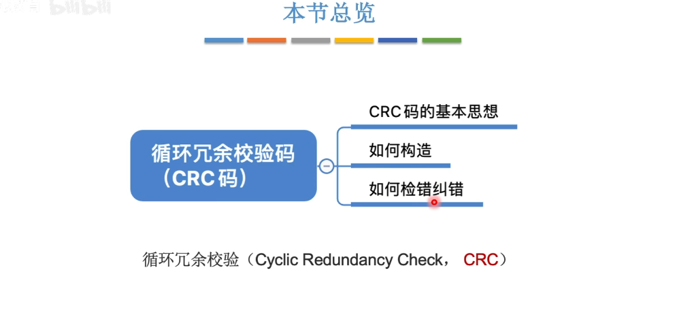

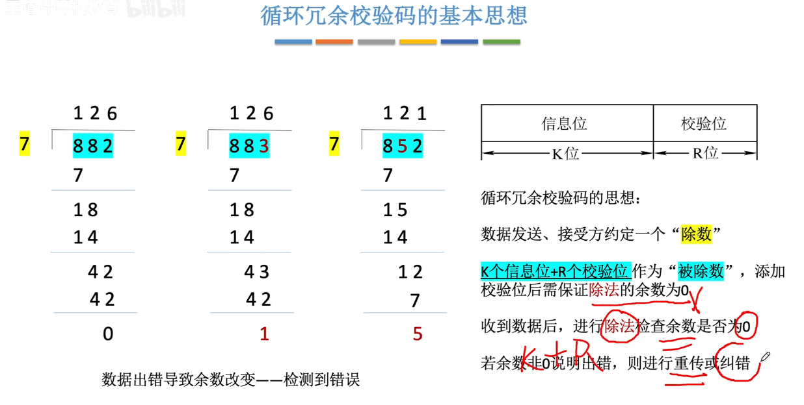

循环冗余校验码（CRC）可以理解为一种“数据指纹”，就像你寄快递时在包裹上贴个防拆封标签一样。它的作用是用最简单的方式帮你检查数据在传输或存储过程中有没有被“弄坏”。

**举个生活例子：**
假设你要给朋友发一串数字 "12345"，但怕传输过程中出错。你们事先约定好一个规则：把每个数字相加，比如1+2+3+4+5=15，然后把总和15附加在数据后面一起发送。朋友收到后也做同样计算，如果总和对不上就说明数据有错。

**CRC的升级版做法：**
1. **选个计算规则**：比如用"除以3看余数"（这相当于CRC中的生成多项式）
2. **发送方计算**：把数据12345和余数一起发出去。比如12345除以3余0，就发"123450"
3. **接收方验证**：收到数据后同样除以3，如果余数不是0就说明数据被篡改了

**真实CRC的特点：**
- 用的是二进制计算（0和1的世界）
- 规则更复杂（比如用x³+x+1这种多项式规则）
- 能检测出超过99%的错误（比如比特翻转、数据丢失等）
- 广泛应用在U盘、网络传输、二维码等场景

就像快递包裹的防拆标签虽然很小，但一旦被撕开就能明显发现异常一样，CRC用很小的校验码（比如32位）就能保护海量数据的安全。

**异或操作（XOR）** 是计算机中最有趣的二进制运算之一，用符号 **⊕** 表示。它的规则简单却非常实用，可以用一句话概括：**“相同得0，不同得1”**

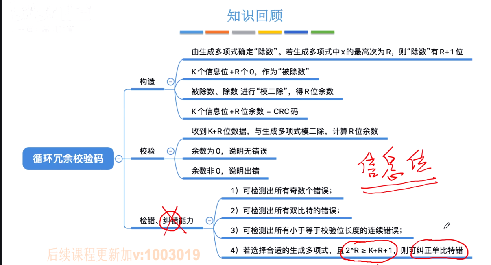

#### 3.3.2纠错编码 海明校验码

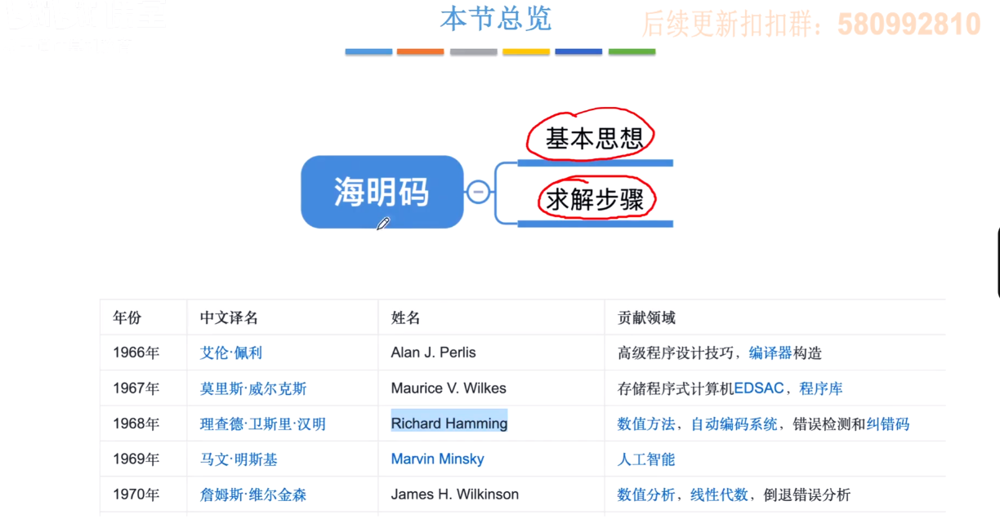

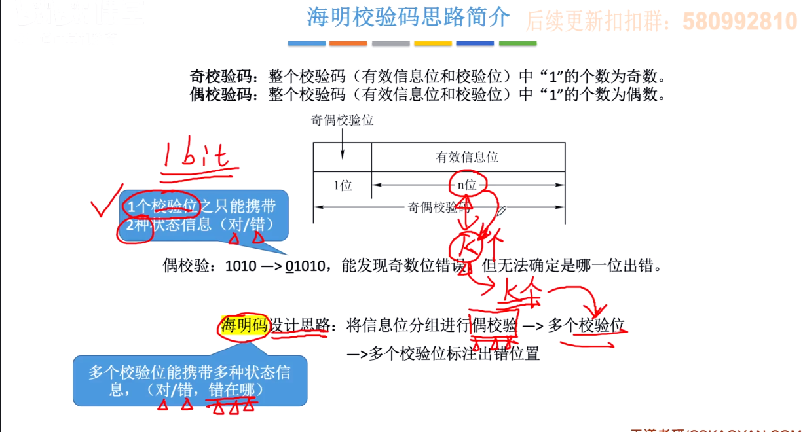

海明校验码（Hamming Code）就像给你的数据“加几把锁”，不仅能发现错误，还能告诉你具体哪里错了，甚至能自动修好！举个生活化的例子：

---

**想象你写了一串数字（比如1010），要传给朋友，但怕路上被人抄错了一个数字。怎么办？**

1. **加几把“检测锁”**  
   你在原来的数字中间插入几个“检测位”（像密码锁的位置），比如插在1号、2号、4号位置（这些位置是2的幂次方：1,2,4,8…）。  
   假设原数据是4位：D3 D2 D1 D0（比如1 0 1 0）  
   插入检测位后变成7位：P1 P2 D3 P4 D2 D1 D0  
   （实际位置：1 2 3 4 5 6 7，其中P是检测位，D是原数据）

2. **每把锁负责检查特定的位置**  
   - **P1（1号位）**：检查所有**位置号二进制第1位是1**的位（1,3,5,7…）  
   - **P2（2号位）**：检查所有**位置号二进制第2位是1**的位（2,3,6,7…）  
   - **P4（4号位）**：检查所有**位置号二进制第3位是1**的位（4,5,6,7…）  
   （类似“分组点名”，每个检测位管一组人）

3. **设置锁的密码（奇偶校验）**  
   每组被检查的位置（包括检测位自己）的1的个数必须是**偶数（偶校验）或奇数（奇校验）**。  
   例如用偶校验：  
   - P1管1,3,5,7号位，这些位置上的1的个数要是偶数  
   - P2管2,3,6,7号位，同理  
   - P4管4,5,6,7号位，同理  

4. **发现错误并定位**  
   如果传输中有一位错了（比如3号位从1变成0），接收方重新计算各检测位：  
   - P1组（1,3,5,7）的1的个数变成奇数 → 说明这组有问题  
   - P2组（2,3,6,7）的1的个数也变成奇数 → 这组也有问题  
   - P4组（4,5,6,7）没问题  
   把出问题的检测位号（P1和P2）相加：1+2=3 → **错误就在3号位！**  
   直接把这个位的数字取反（0变1或1变0），错误就修好了！

---

**一句话总结**：海明码通过插入几个“检测位”，用分组点名的方式锁定错误位置，既能发现错误，又能精准纠错，就像给数据装了个“自动修正GPS”！

#### 3.4.1流量控制 可靠传输 与滑动窗口机制

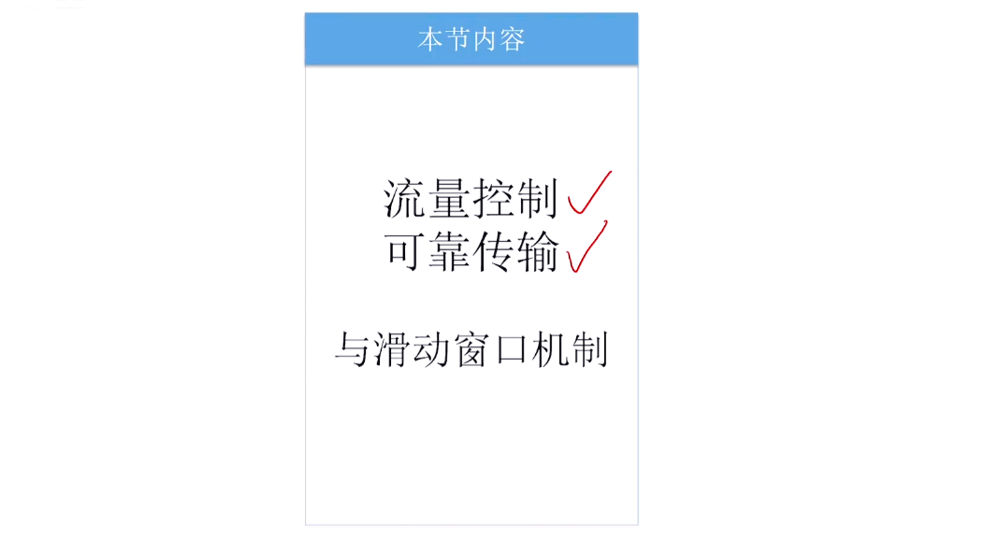

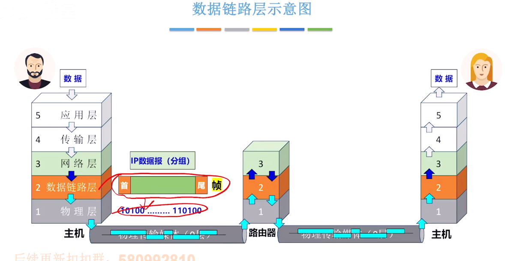

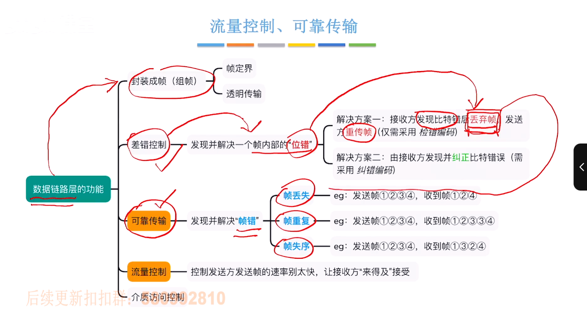

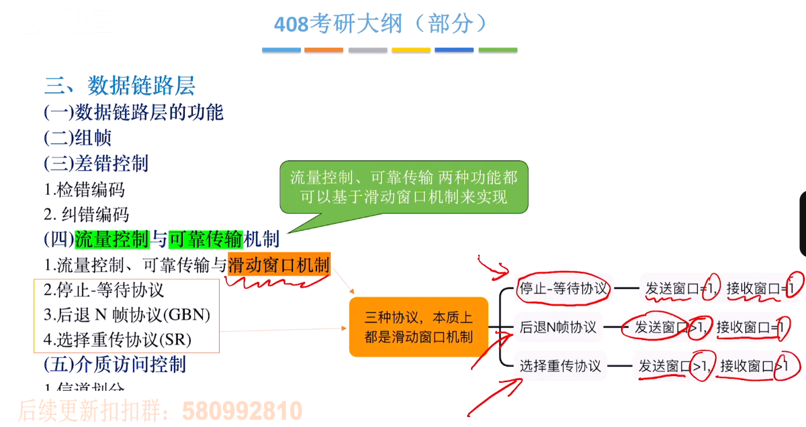

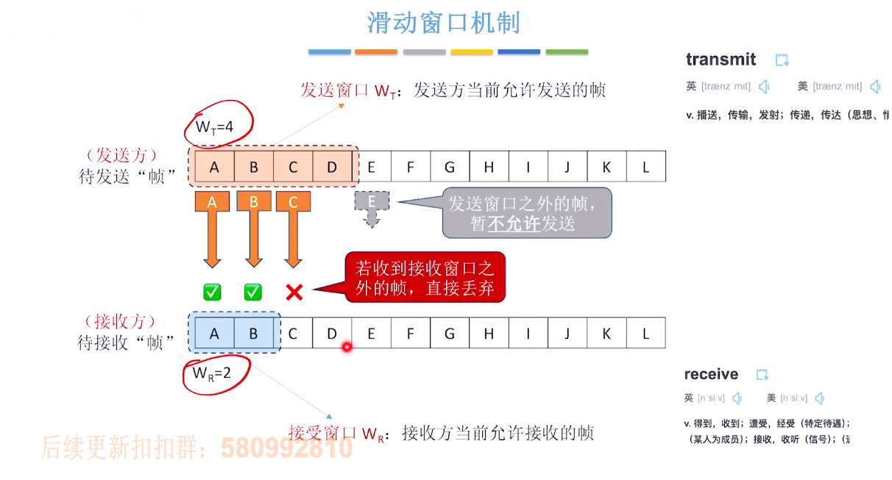

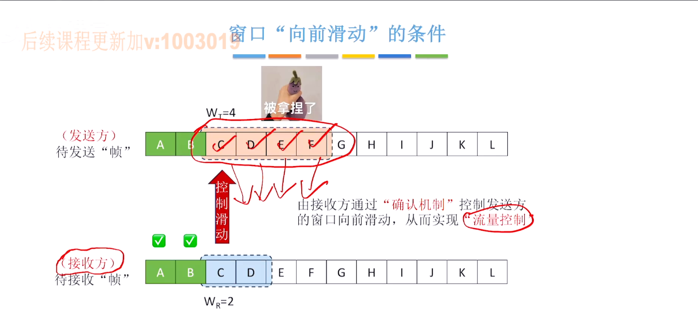

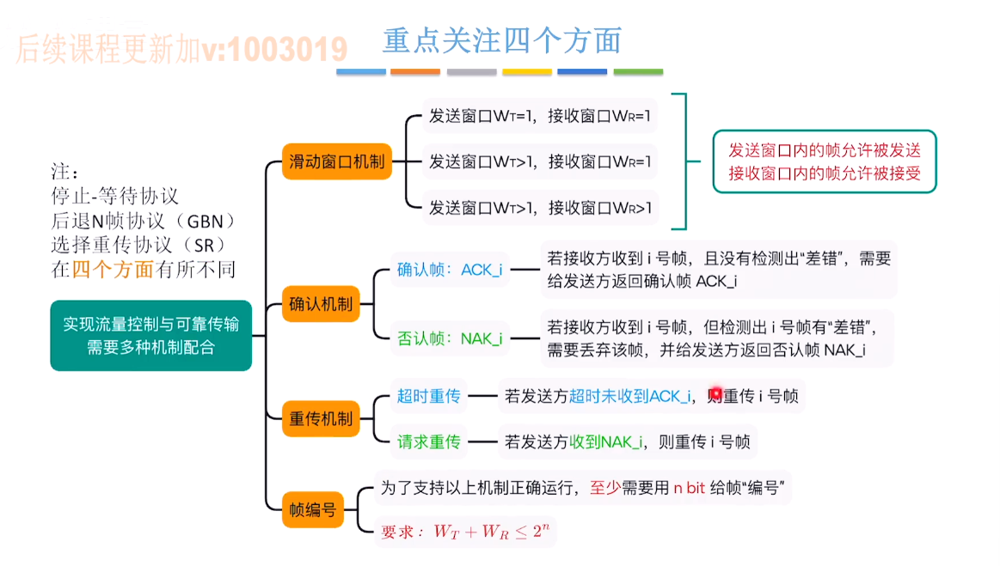

#### 3.4.2停止等待协议

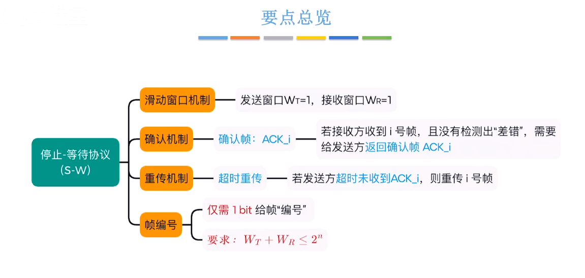

各位同学大家好。在这个视频中我们要探讨停止等待协议，英文缩写叫SWS指的是stop，w指的是weight。停止等待协议。我们需要关注这个协议的四个方面。首先是滑动窗口机制当中分为发送窗口和接收窗口，那停止等待协议的发送窗口和接收窗口的大小都等于一好。另外在确认机制方面，当数据的接收方收到某一个帧的时候，如果没有检测出帧内部的差错，会给发送方返回一个确认真。我们通常用ACKI来表示对I号真的确认。ACK是acknowledge的缩写，那我们知道acknowledge有确认的意思。
好，紧接着停止等待协议会引入超时重传机制。刚才我们说数据的接收方收到一个正确的真之后会返回一个确认。那如果发送方长时间没有收到这个确认的话，就会自动的重传，这个真好。最后为了支持上面这三种机制正确的运行，我们需要给帧进行编号。对于停止等待协议来说，我们只需要用一个比特给帧进行编号就可以。好，接下来我们会用具体的例子对停止等待协议的这几个方面展开探讨。
首先我们关注最核心的一个问题，滑动窗口机制。刚才说停止等待协议的发送窗口和接收窗口大小都等于一。我们知道在实际的网络当中，发送方可能会源源不断的给接收方发送数据帧。比如你的电脑可能会源源不断的给路由器这个节点发送很多很多数据。真那在这种情况下，如果我们使用N个比特给帧进行编号的话，这个N到底应该取多少呢？很难预估对吧？因为真的数量非常多，所以我们不可能做到说让每个帧都有一个独立的专属的编号。
那回到这个问题，到底要用多少个比特给帧进行编号呢？回到这个PPT，无论是停止等待协议，还是接下来要学习的后退N帧协议，以及选择重传协议。这三种协议对于用N比特给帧进行编号的限制。只要满足这个条件就可以，就是发送窗口和接收窗口的这个大小小于等于2的N次方，只要满足这个条件就可以。那这儿的N指的就是用N比特给帧进行编号。
好，那么回到停止等待协议。刚才说发送窗口和接收窗口的大小都等于一，所以如果要让WT加WR小于等于2的N次方，想要满足这个条件的话，很简单，我们只需要取N大于等于一就可以。也就是说在停止等待协议当中，我们最少只需要用一个比特给各个帧进行编号。那你可能会觉得奇怪，用一个比特给这些帧编号，那一个比特不就能表示零和一这两种数吗？怎么给这么多帧进行编号呢？好，我们可以这么做。第一个帧给它编号为零，第二个帧编号为一，第三个真又回到编号0，第四个真又回到编号一，也就是0101不断的循环。在接收方这边也是一样的，接收方首先想要接收零号帧，如果零号帧接收完毕，下一个帧它应该接收序号为一的那再往后一个它会想要接收序号为零的真如此交替往复一会儿的例子当中，你会感受到这种编号的作用。
好，现在我们确认了停止等待协议的发送窗口接收窗口大小，以及需要用多少个比特给帧编号这两个问题。接下来为了描述方便，我们引入几个概念。刚才我们说我们需要用一个比特给各个帧进行编号，那真的编号也可以称为帧序号。好，现在发送方会给接收方发送零号数据帧，在之后的讲解中，零号数据帧我们会剪辑为data 0。好，接收方收到这个帧之后会给发送方返回一个确认。真对零号真的确认我们用ACK0去表示。在图示当中我们会画成这种虚线的箭头。通常来说数据帧可能会很长，也可能会比较短，而确认帧通常来说都会非常短。
我们知道一个真的构成通常包含首部、尾部以及中间的数据部分。首部和尾部主要是一些控制类的信息，比如说我们之前学过的帧定界信息，还有用于差错控制的校验码信息。同时在首部和尾部当中也会标明真类型，比如数据帧和确认帧，它就是两种类型的真。

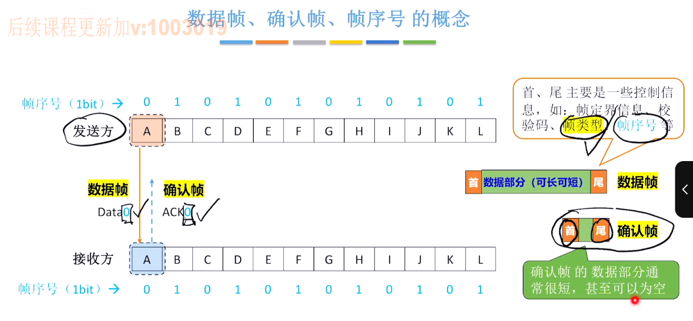

为什么要在首部和尾部当中标注一个真？它到底属于哪种类型呢？因为在实际的应用当中，两个节点之间有可能是双向的数据通信。在我们这个图示当中，为了讨论方便，我们把两个节点分为了发送方和接收方。但在实际应用当中，这个接收方有时候也会给发送方发送一些数据，真对吧？二者的通信通常是双向的。所以我们这儿标注的这个接收方，如果想要给发送方发送一个数据帧的话，那么它是不是就得在帧的首部或者尾部的位置去标记清楚我现在给你发的这个到底是一个数据帧，还是对你给我发的数据真的确认呢？我得给对方标注清楚这个事情，对吧？
好，所以在帧的首部或者尾部增加这种真类型的字段是必要的。好，另一方面在首部和尾部还需要增加帧序号字段，也就是刚才我们讨论的这个东西。在停止等待协议当中，我们只需要用一比特来表示帧序号。好，我们一会儿可以感受到这个帧序号的作用。
好，那么对于一个确认帧来说，我们只需要在首部和尾部标记清楚，它属于确认帧，同时标注清楚这个确认帧的帧号。如果确认帧携带的真号等于0，那么它表示的就是这是对零号数据帧的确认消息。除了首尾的控制信息之外，确认真的这个中间数据部分通常来说很短，甚至可以是空。

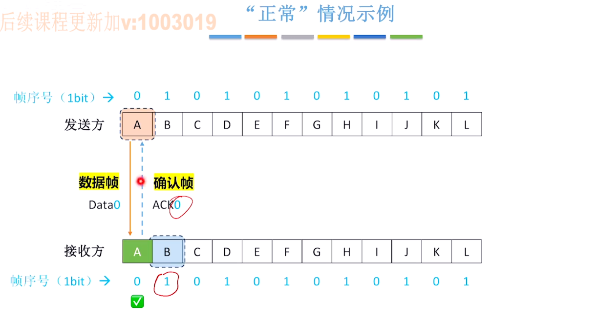

好，引入了这些概念之后，接下来我们看发送方和接收方之间是如何传输真的。我们先来看两个正常的情况。好，首先发送窗口和接收窗口都指向零号真，那么发送方会把零号数据帧传给接收方，接收方会对收到的这些数据帧进行检错。如果这个帧内部没有位错误，那么接收方就可以收下这个真的数据，并且把这个真的数据递交给网络层。好，与此同时接收方会给发送方返回零号确认真，同时接收方的滑动窗口可以向右移动，此时接收方已经准备好，接收一号臻。那发送方收到零号确认帧之后，就知道刚才发出去的零号帧已经被接收方正确的接收。那么此时发送方的发送窗口也可以往后移动，

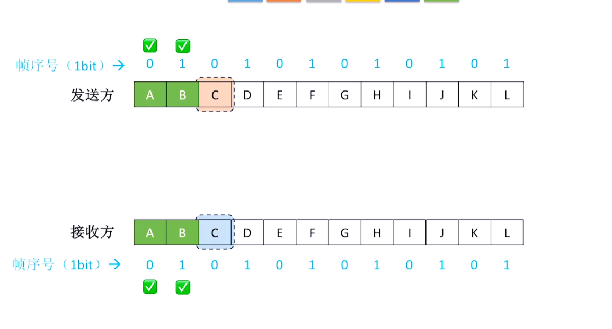

接下来发送一号数据帧，同样的接收方会对这个数据帧进行差错控制，如果没有检测出错误，那么就会收下这个真。同时接收方的数据链路层会把这个真的数据递交给网络层。与此同时接收方给发送方返回一号确认帧，同时接收窗口向右移动，表示接下来希望接收零号帧。那么发送方这边收到一号确认帧之后，就可以知道刚才发出去的一号臻已经被顺利的接收，此时发送方的发送窗口也可以向右移动。好，那么刚才传输这两个真的时候没有出现任何错误。

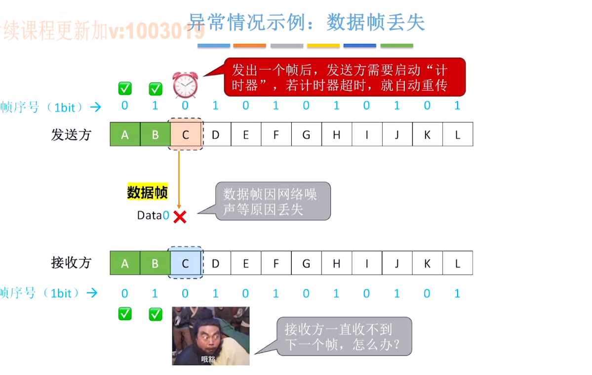

接下来我们看一个异常的情况。首先关注第一种数据帧丢失的情况如何处理。现在发送方要给接收方发零号帧，那么数据帧在传输的过程当中，有可能会因为网络噪声或者传输线路故障等等一系列的原因而导致这个数据帧丢失。接收方没有顺利的接收到这个数据帧，那这种情况怎么办呢？如果这个真一直不到达，那接收方的滑动窗口就永远不会向右滑动，对吧？

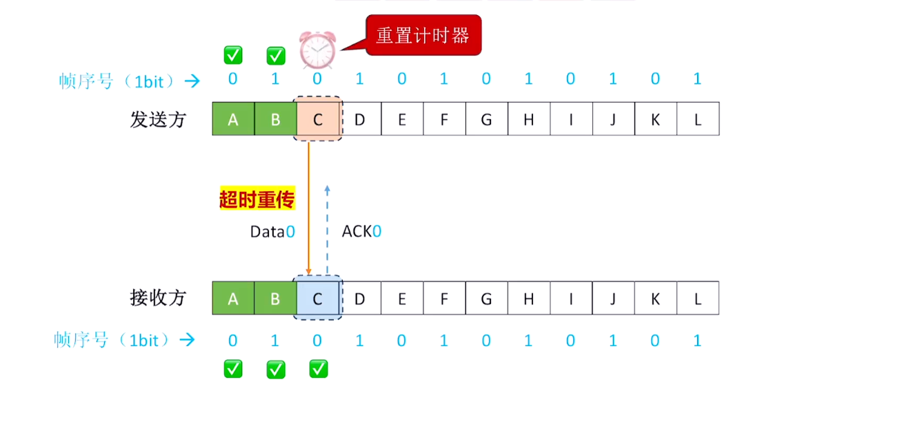

那解决的办法就是我们刚开始提到的，超时重传机制。如果发送方超时没有收到对i号真的确认，那么就要重传。爱好真好。所以当发送方发出这个数据帧的时候，与此同时也会设置一个计时器。如果计时器超时，那么发送方会尝试重新传输这个真，那重传这个真的时候也会在重置这个计时器。好，假设这次重传零号数据真没有发生这种数据帧丢失的情况，那接收方就可以正确的收到这个真，并且给发送方返回林浩真的确认信息。与此同时接收窗口向右滑动，那这一次在这个计时器超时之前，发送方就收到了对零号真的确认。因此发送方的这个窗口也可以向右滑动。

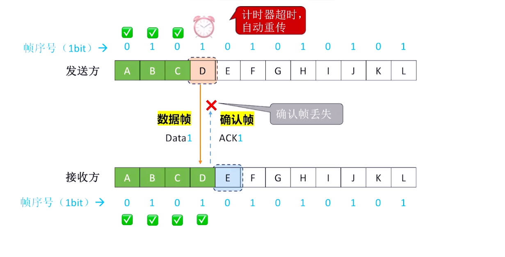

好，所以引入超时重传机制，我们就解决了数据真有可能会丢失的问题。好，接下来再看一种异常情况，假设接收方给发送方返回的确认帧丢失了怎么办？好，现在发送方给接收方发送一号数据帧，那与此同时会启动一号真的计时器，接收方收到这个帧之后会返回这个真的确认信息。假设因为各种原因这个确认真中途丢失了，那发送方就无法收到一号确认真。但是另一方面由于接收方已经收到这个一号臻，因此接收窗口会向右滑动。好，那接下来由于发送方一直没有收到一号确认真，那他的这个计时器肯定会超时，对吧？超时之后发送方会自动重传一号臻。那重传一号臻的同时，它会再次重置一号真的这个计时器。

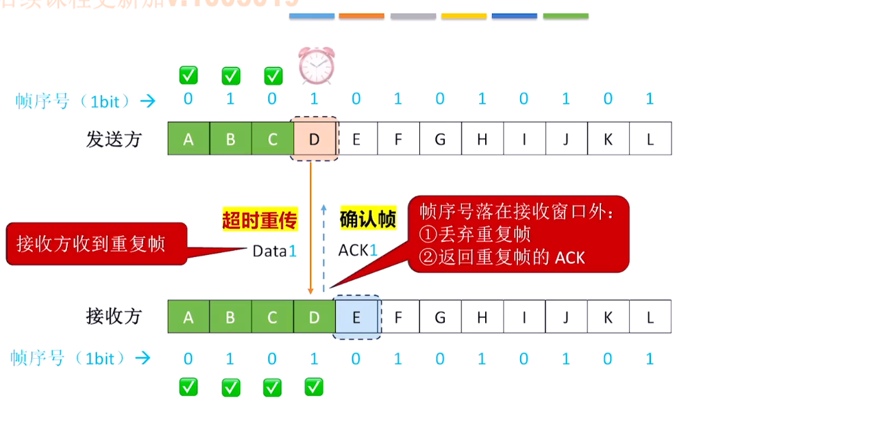

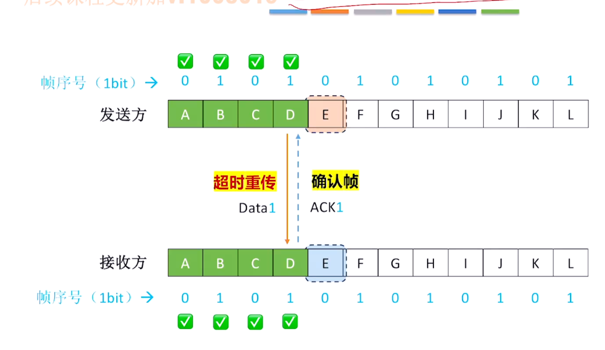

现在问题来到接收方这边，它的接收窗口现在瞄准的是零号帧，但此时收到的这个数据帧真号等于一并没有落在接收窗口之内，也就是接收方收到了重复的数据真。在这种情况下，接收方会做两件事。首先刚才收到的这个重复真会直接丢弃。好，第二步接收方会给发送方返回这个重复帧的ACK。好，那么这次发送方就可以在计时器超时之前收到一号确认真。那这样的话发送窗口就可以向右移动了。

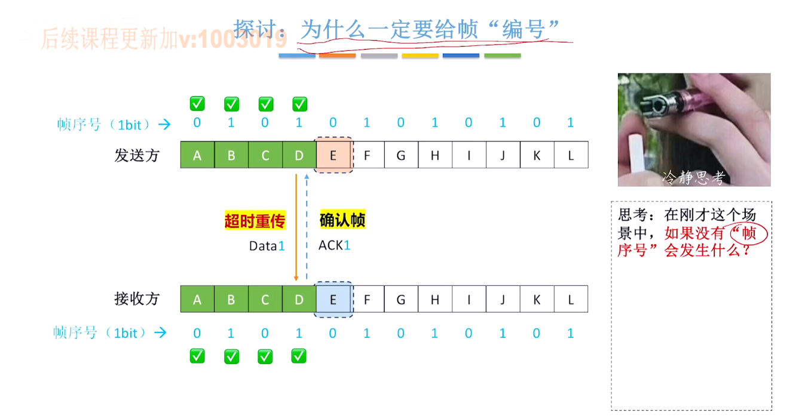

好，那么讲到这儿，我们可以探讨为什么要给帧编号的这个问题了。我们可以思考一下，在刚才这个场景当中，如果没有帧序号，那么会发生什么？

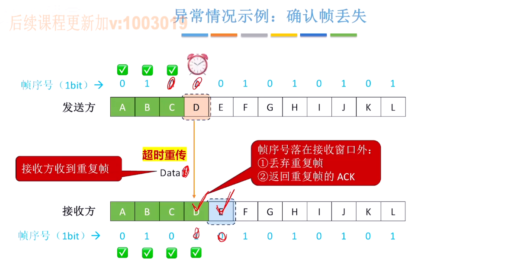

我们不妨回到之前这一步，假设我们没有给帧进行编号，当发送方迟迟没有收到对当前这个真的确认的时候，它会选择重新传送当前这个真，对吧？那么由于我们没有给帧进行编号，因此当接收方收到这个真的时候。他就没办法去判断现在收到的这个针到底是一个新的真还是重复的帧，对吧？因为如果没有帧序号的话，相邻的两个帧里边的数据一模一样，这是有可能的，对不对？好，所以如果没有给帧进行编号的话，那接收方没办法去判别它收到的帧到底是重复的还是不重复的。

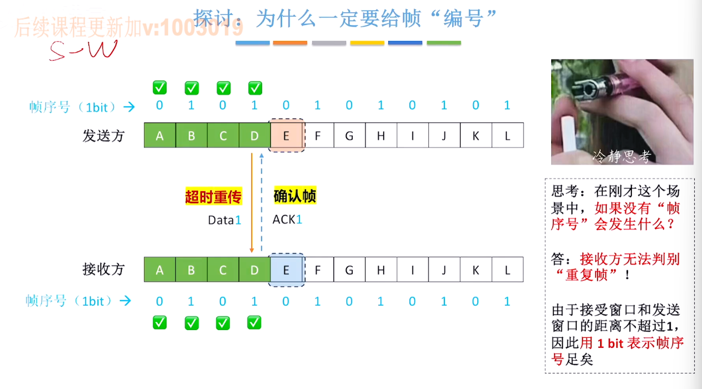

好，另一方面由于这个接收窗口和发送窗口的距离不会超过一，所以我们用一比特去表示各个帧的序号，就是0101。这么去表示就足以让发送方和接收方区分出现在我收到的这个数据帧和确认帧到底指的是谁了。好，到现在我们理解了停止等待协议为什么需要用一个比特给斟进行编号的这个原因。

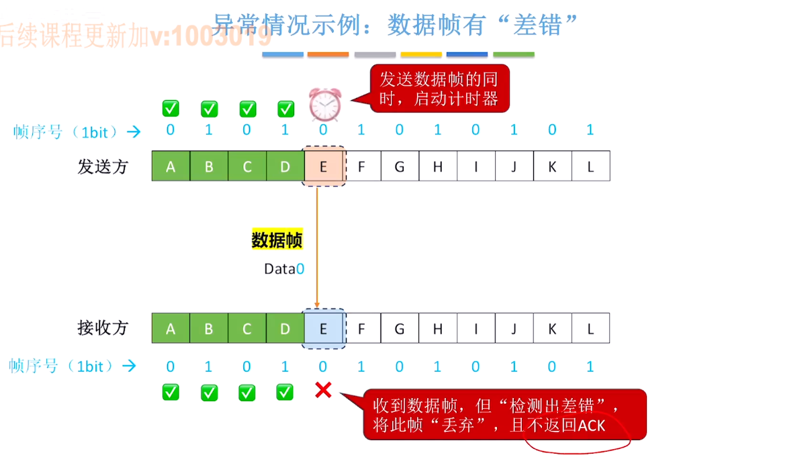

接下来我们继续探讨新的情况。假设发送方要给接收方发送数据帧0，与此同时发送方会给零号帧设置一个计时器。好，接下来的故事是这样的，假设接收方收到这个帧之后，在这个真的内部检测出差错。比如说用CRC循环冗余校验码检测出差错，那么此时接收方会直接把这个真给丢掉，并且不返回ACK。那只要它不返回ACK，发送方的这个计时器迟早会超时，对吧？

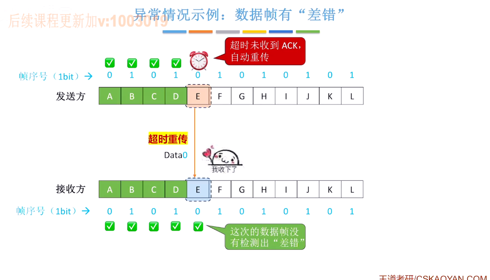

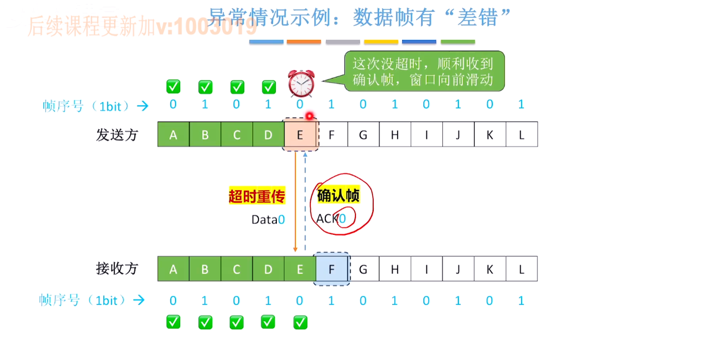

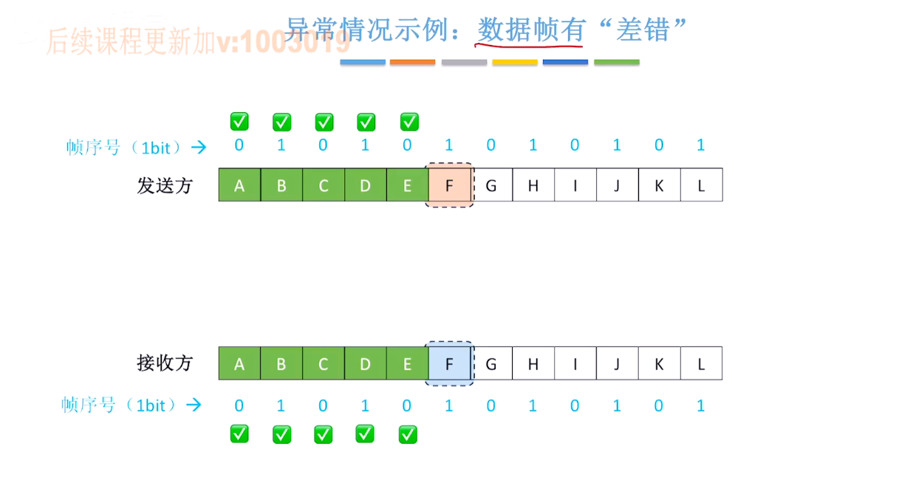

当计时器超时之后，发送方就会重新发送这个数据帧，好再次发送这个真再次重置计时器。这次重发的数据没有检测出任何差错，此时接收方可以收下这一帧，同时让接收窗口向后滑动。与此同时也会给发送方返回对应序号的这个确认。真这次这个零号真的计时器没有超时，那收到零号确认帧之后，发送窗口就可以继续向后滑动。好，这就是数据真有差错的时候，处理的一种方法。

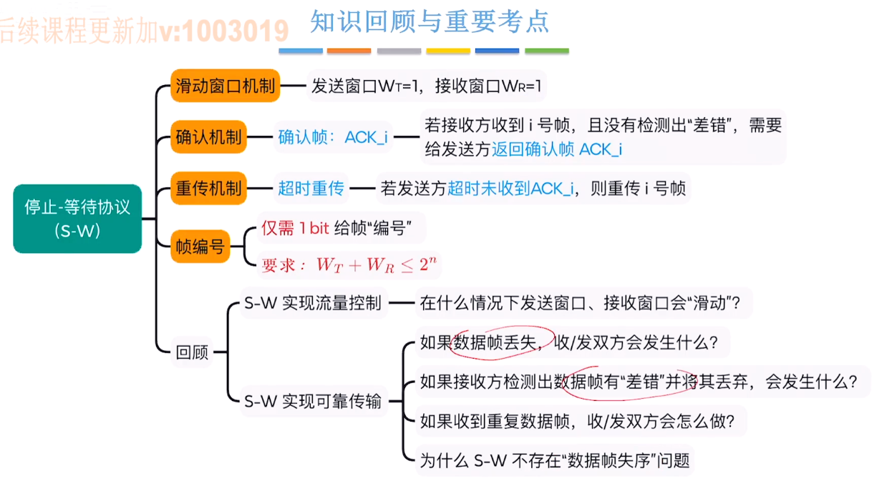

好的，这个视频中我们介绍了停止等待协议的一个运行规则。如果采用停止等待协议，那么发送窗口和接收窗口的大小都等于一。同时停止等待协议采用的确认机制是当接收方正确的收到I号贞之后，会给发送方返回I号真的确认真。那如果接收方迟迟没有收到确认，就会使用到重传机制，发送方发出一个真的，同时会给这个帧设置一个计时器。如果计时器超时还没有收到ACK，那么就会重传，这个真好。另外我们也强调停止等待协议需要给帧进行编号，最少只需要一个比特。
在停止等待协议当中，只有接收窗口向后滑动，同时给发送方返回确认帧之后，发送窗口才会跟着往后滑动。也就是说数据的接收方控制了发送窗口向后滑动的这个速度。那这样就实现了**数据的接收方对发送方进行流量控制的功能。**
好，另外停止等待协议用上面提到的这几种机制相互配合，就可以解决数据帧丢失、数据真有差错以及收到重复数据帧这些问题。另外由于接收窗口的大小等于一，因此接收方只会按顺序接收各个数据。真也就是说停止等待协议当中不存在数据帧失序的问题。那么解决了这几个方面的问题，就彻底的实现了可靠传输。大家可以结合这节课提到的例子，再回顾我们这儿提出的这几个问题。理解了这些问题基本上就理解了停止等待协议。好的，以上就是这视频的全部内容。

#### 3.4.3后退N帧协议

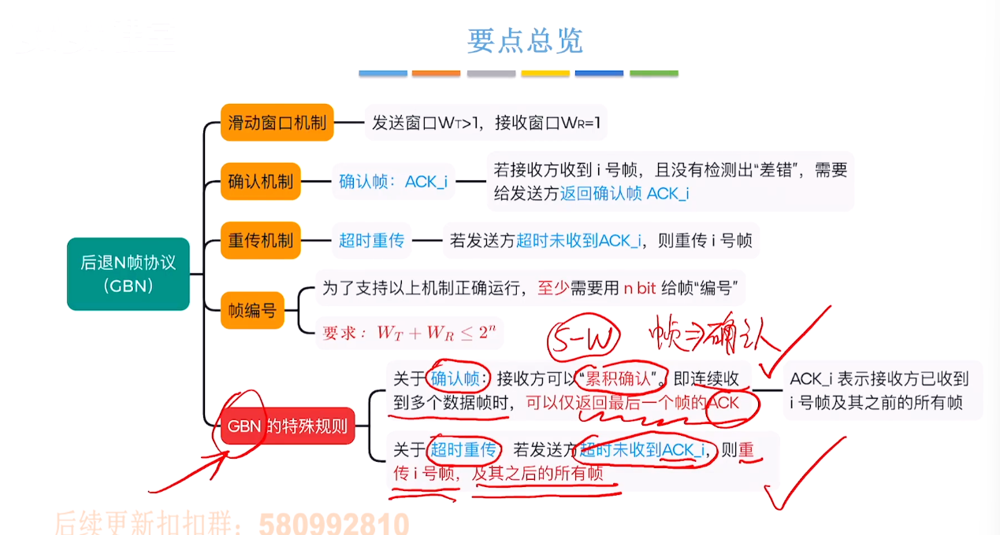

好的，接下来看第二个基于滑动窗口机制的协议，叫做后退N帧协议，英文缩写叫GBN。GBN分别取了go back n的首字母。那么相比于停止等待协议，后退N帧协议有这样的一些不同。首先在滑动窗口方面，后退N帧协议的发送窗口大小是大于一的，接收窗口的大小和停止等待协议一样都是等于一好。另外还有一个比较特殊的规则，就是关于确认真。在停止等待协议当中，每一个数据帧都需要一次确认。但是在后退N帧协议当中，接收方可以累积确认，也就是连续收到多个数据帧的时候，只返回最后一个真的ACK。一会儿我们会用一个例子带大家感受这个特点。
好，另一方面关于超时重传的规则也有一些不一样。如果说发送方超时没有收到I号真的ACK，那么在后退N帧协议当中会要求重新传输I昊祯以及I号真之后的所有真。同样的一会儿会用例子带大家感受，我们现在先建立起一个框架。

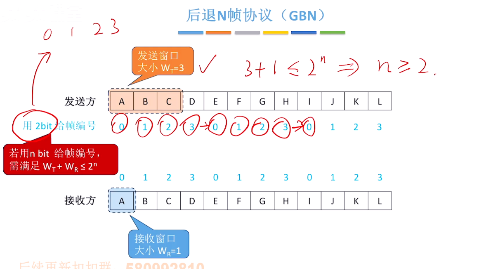

好，接下来我们先探讨滑动窗口和帧编号这两个问题。后退N帧协议规定发送窗口的大小要大于一。比如说我们可以取发送窗口的大小等于3，而接收窗口的大小等于一。那么如果我们要用N个比特给各个帧进行编号的话，我们必须满足发送窗口和接收窗口的大小小于等于2的N次方这个条件。对于这个例子来说就是3加1要小于等于2的N次方，所以可以推出N要大于等于2，也就是说我们至少要用两个比特给帧编号，那两个比特可以表示的编号就是0123这几个数。
我们会用这样的方式给各个帧进行编号。第一个真是零号帧，接下来一二三好，再往后一个真又回到0号123，接下来又回到零号0123。好。那么对于接收方来说，它的这些帧序号也是同样的规则。

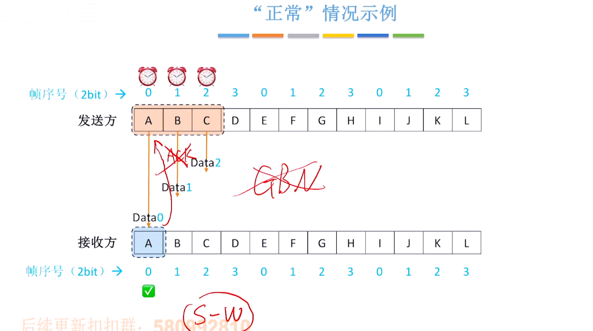

好，接下来基于这样的条件，我们来看后退N帧协议是如何工作的。现在发送窗口框住了012这几个真，所以发送方可以在信道上连续的传输这样的三个真好，接收方首先会收到零号帧。如果按照停止等待协议的规则，每当收到一个帧，接收方就需要返回这个帧的ACK对吧？但是对于后退N帧协议来说，我们不需要给每一个帧都返回一个ACK。

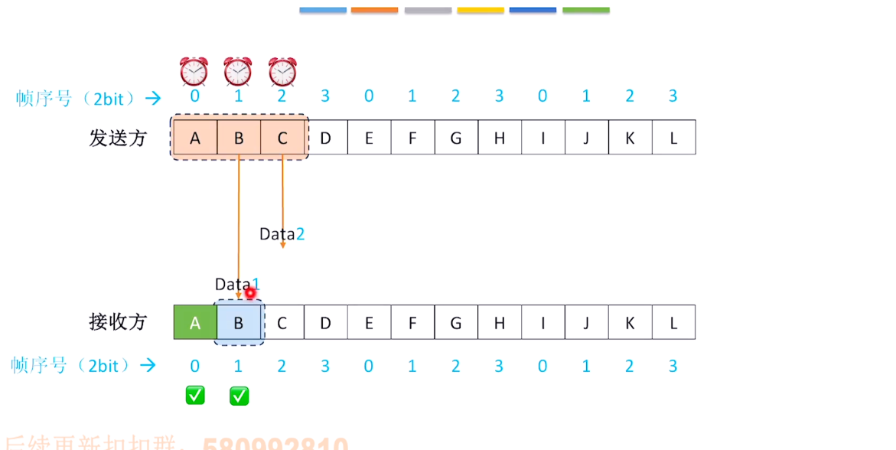

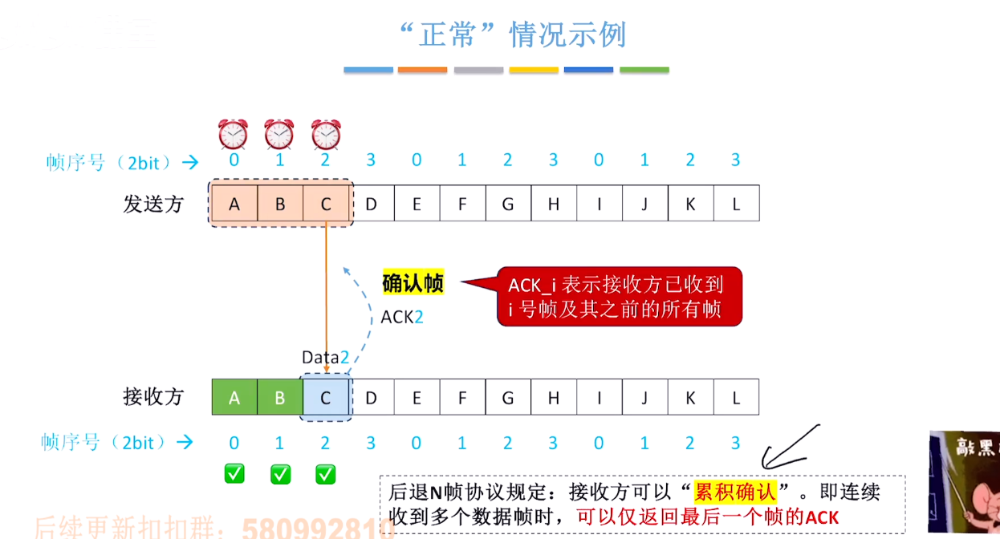

好，接下来可以这么做。收到零号帧之后，接收方的滑动窗口向右滑动，并且准备好接收一号真。现在一号臻也已经正确的接收，那滑动窗口继续往右移动，现在收到了二号真。那么在二号帧之后，信道上已经没有连续传输的数据了。此时接收方可以给发送方返回，最后收到的这个帧所对应的确认真，也就是ACK2。这就是所谓的累计确认机制。
当接收方给发送方返回ACKI的时候，表示他已经正确的接收到爱好真以及它之前的所有其他帧了。那对于刚才这个例子来说，返回ACK2意味着它已经收到二号贞以及二号真之前的所有帧了。

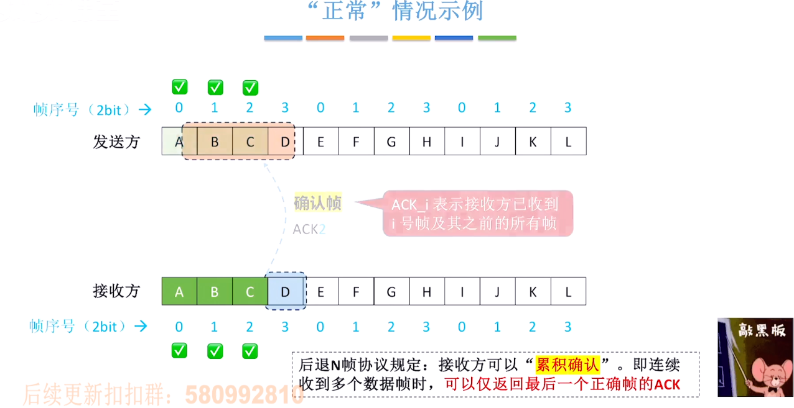

好，那么发送方收到这个确认帧之后，就可以确认零号、一号、二号已被正确地接收。接下来发送窗口就可以向后移动。
刚才我们举的这个例子是一种没有发生异常的情况。发送方连续发送了三个帧，并且三个帧都被顺利的接收。接下来我们看一种异常的情况，假设其中某一个数据帧丢失，我们应该如何处理好？

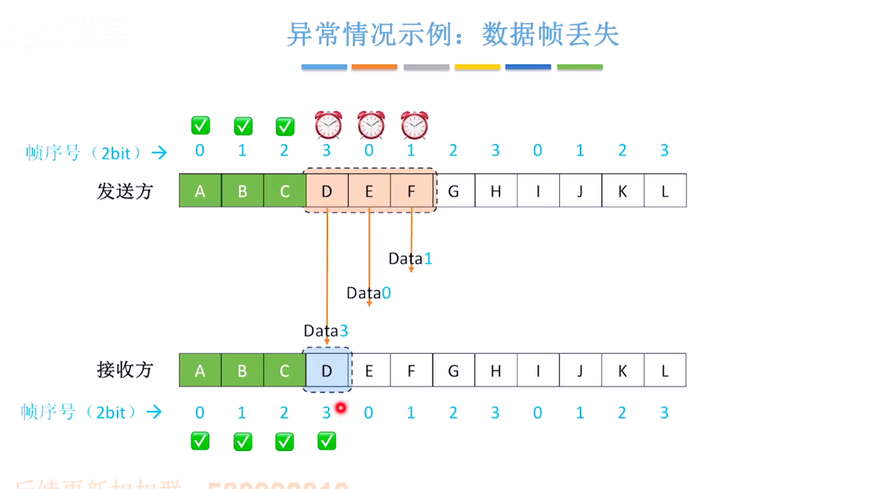

现在发送方的窗口框住了301这几个真，首先发送三号真，紧接着零号，最后是一号，这些帧的数据依次被发到新道上，那么第一个到达的帧肯定是三号真。我们假设三号真顺利到达，并且数据没有错误，可以被正确的接收。那此时接收方的滑动窗口会向右移动。

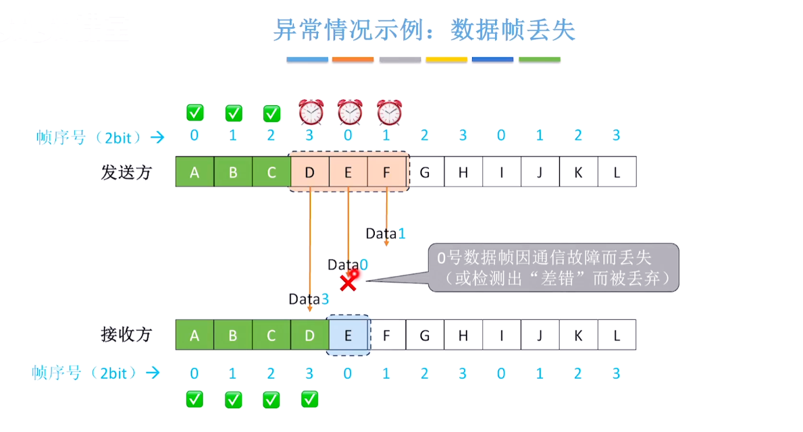

假设信道发生了一些故障，导致这个零号针在中途丢失。或者我们也可以假设我们可以顺利的收到零号帧，但是在零号帧当中检测出差错，因此零号帧被接收方主动丢弃。反正不管是因为线路的原因导致这个真丢失，还是说接收方主动的丢弃了这个真，接下来的处理都是类似的。

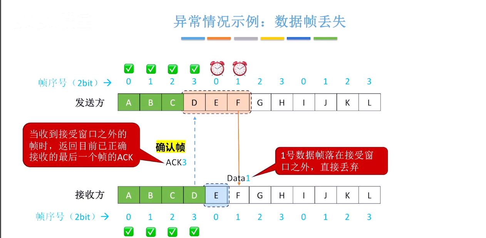

好，后面的故事是这样的，零号帧丢失之后，一号臻还可以顺利的传到接收方这边。但是接收方检查这个帧的序号并没有落在接收窗口之内。我现在期待接收到的是零号帧，但现在我收到的是一号真。那这种情况下我们肯定得拒绝接收一号臻，直接把它丢弃。与此同时接收方会给发送方返回最后收到的这个正确真的ACK那目前收到的最后一个正确真是三号真，所以应该给发送方返回ACK3让发送方知道这个三号真之前的所有帧我都已经顺利的接收了，对吧？

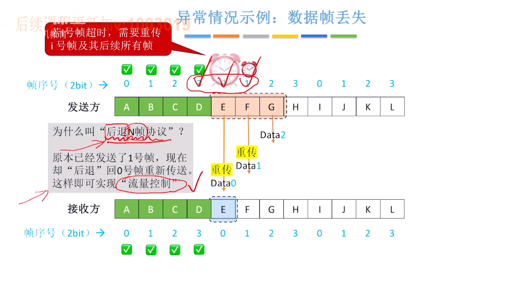

好，现在发送方收到ACK3之后，它就可以让发送窗口往右移动一格。与此同时，由于迟迟没有收到零号帧一号真的这个确认信息，所以零号真的计时器它会超时。而零号帧超时之后，发送方会把零号帧及其后面的所有帧都重新传一遍。虽然一号臻此时暂时还没有超时，但是既然接收方没有给我返回AK0，那么就意味着林浩真有可能没有被正确的接收，对吧？那在后退N帧协议当中，接收方只能顺序的接收各个真好。所以对于发送方而言，如果说零号帧超时了，那么就需要把零号帧及其后面的所有帧都统一的做重传的处理。零号帧和一号臻需要重传，而二号真是第一次进行传输。
好，讲到这儿我们就能理解为什么后退N帧协议要叫后退N帧了。之前发送方的这个发送窗口框住的是301这几个真，对吧？301这几个真原本都已经发给接收方了，但是现在由于零号帧超时，所以发送方不得不退回到林皓祯，从林皓祯再重新进行发送。因此由于需要退回到某一个帧重新进行发送，因此这个协议的名字叫做后退N帧协议。注意，这个后退并不是指滑动窗口往后退，而是原本已经发送出去的这些真需要退回来重新发一次。这样的特性也实现了流量控制。
我们可以想象一下，如果发送方给接收方发送真的数据太快，而导致接收方来不及接收，所有的帧已经发出。但是来不及接收的那些真肯定迟早会超时，对吧？那超时之后，发送方又会把超时的帧以及后面的所有帧再重新发一遍。也就是说发送方给接收方发送数据的速率是被接收方所控制的那这就是后退N帧协议实现流量控制的一个原理。

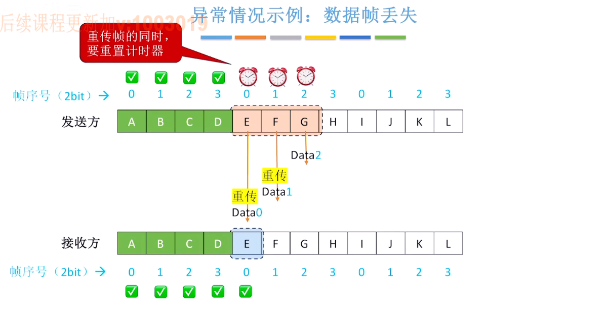

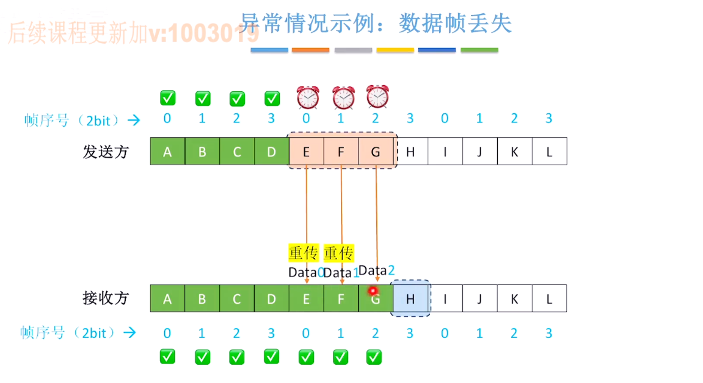

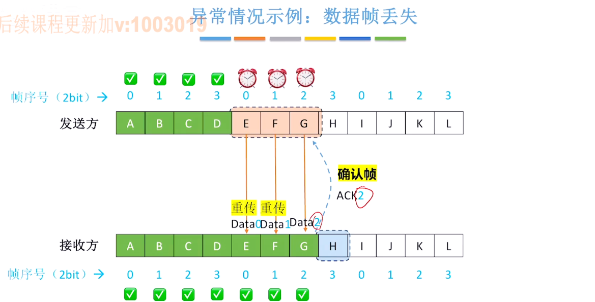

好，接下来我们让故事继续。发送方重传了零号帧和一号真，那么被重传的这些真需要重置计时器，同时新发送的这个二号真也需要给它设置一个计时器。首先到达的是零号数据帧，收到这个帧之后接收窗口可以向右滑动。与此同时一号臻二号真也顺利的到达，并且顺利的被接收，那接收窗口就可以到达三这个位置。在连续收到几个帧之后，接收方会把最后这个真的ACK返回给发送方。最后这个真的真号是2，所以返回的就是ACK2。对于发送方而言，他说到ACK2就知道二号贞以及它前面的所有帧都已经被顺利的接收，因此发送方的窗口也可以继续往右滑动。

好，刚才这个例子当中我们看到了在GBN协议当中，如果数据帧丢失，发送方和接收方会如何处理。

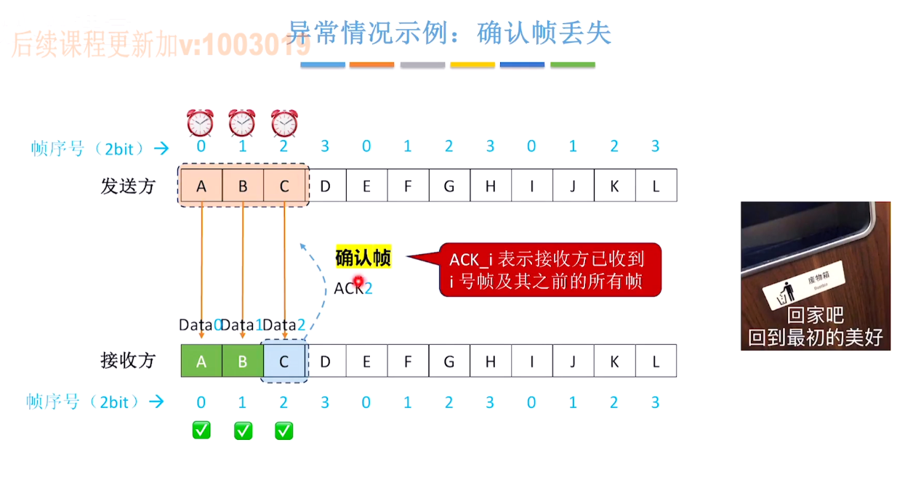

接下来我们看另一种异常的情况，我们看确认帧丢失的情况，我们把传输的过程退回到这一步。假设现在发送方已经给接收方发了两个数据帧，并且这两个真已经被顺利的接收。紧接着发送方又发送了二号数据帧，同时这个真也被顺利的接收。好，那么连续收到3个帧之后，接收方的窗口会向右滑动，与此同时会给发送方返回最后收到的这个正确真它的确认信息，也就是ACK2。

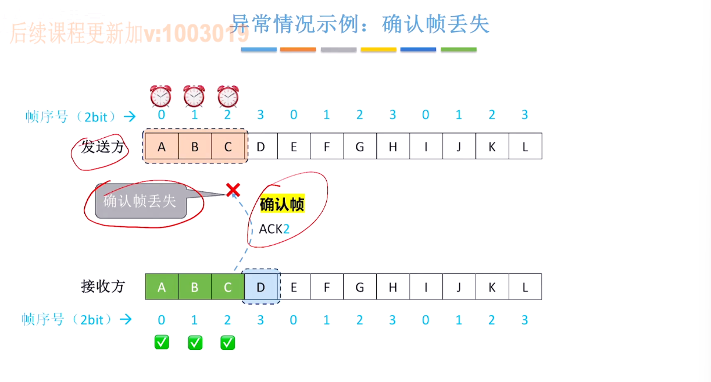

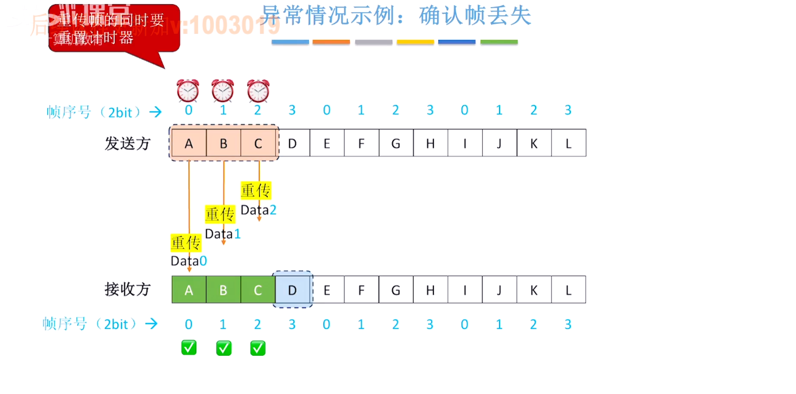

接下来出现了一点小状况，假设这个确认帧在传输的过程中丢失了，那这样的话发送方就一直收不到ACK2，对吧？不过好在发送方在每一个帧被发出的时候都会设置计时器，那零号真是最先被发出的，所以它的计时器会第一个超时。那么零号帧超时之后，零号帧及其之后的所有帧都需要重新发送。所以接下来发送方会把零号帧一号臻二号贞全部进行重传。

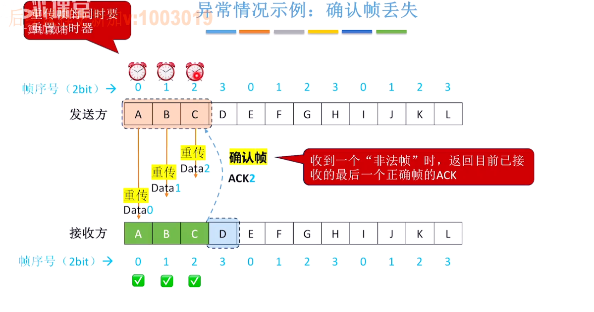

好，现在问题来到了接收方这边，接下来它会陆续的收到零号、一号、二号这几个真，但是这几个真落在了接收窗口失败。好，那么当接收方收到这种非法的真的时候，会给发送方返回目前已经收到的最后一个正确真的ACK那现在已经收到的最后一个正确真应该是二号真对吧？所以接收方会给发送方返回ACK2，那接收方会把这些重复收到的帧直接丢弃，之前已经收到过了对吧？不用重新再接收。好，那么这一次返回的确认真，ACK2中途没有丢失，被发送方顺利的收到。那发送方就可以知道在二号贞及其之前的所有这些帧已经被正确的接收。因此它可以把滑动窗口滑到三开始的这个位置。

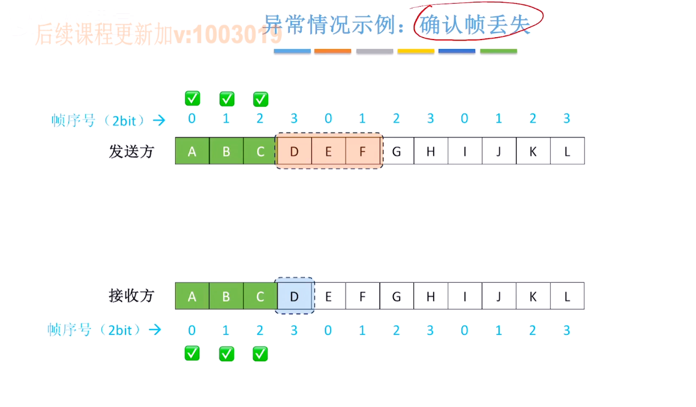

好，刚才这个例子中我们探讨了确认帧丢失的时候，发送方和接收方会怎么处理。

好，接下来我们探讨下一个关键的问题。我们强调过无论是停止等待协议，还是后退N帧协议，还是之后将要学习的这个选择重传协议，这三种协议都必须满足发送窗口和接收窗口小于等于2N这个条件。其中N指的是给甄进行编号的比特数。

 

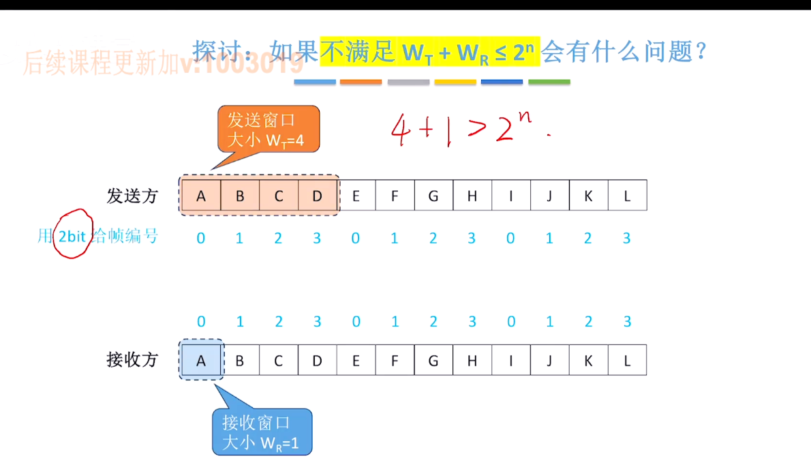

好，现在我们探讨一下后退N帧协议，如果不满足这个条件。那么会有什么问题？我们假设使用两个比特给这些帧进行编号，但是发送窗口的大小我们调到4，那么发送窗口和接收窗口的大小已经大于2的N次方了，对吧？也就是不满足这个条件。

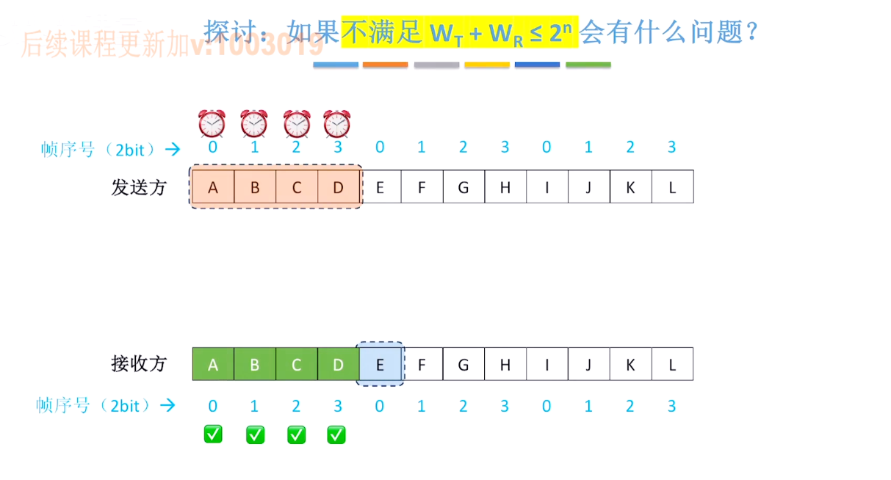

好在这种情况下我们看会有什么问题。现在假设发送方给接收方连续发送了零号、一号、二号、三号，真因为这几个真都落在了发送窗口之内，对吧？所以按照滑动窗口机制的规则，这几个真都是可以发给接收方的。好，现在假设接收方这边也没有出现任何的问题，它顺利的接收了0123这几个真。同时接收方的这个接收窗口也滑动到了后一个帧，也就是零号这个位置。

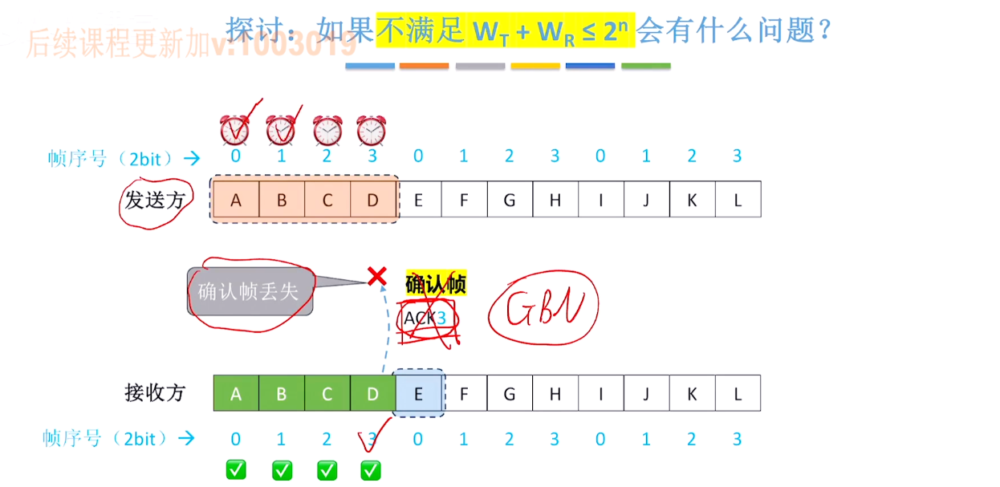

好，接下来问题发生了，接收方最后接收到的真是三号，对吧？因此按照后退N帧协议的规则，接收方会给发送方返回最后这个真的ACK。但是这个ACK3在传输的过程当中丢失了，那么对于发送方而言，它就永远收不到这个ACK3。发送方给每个帧都设置了计时器，由于零号真是最先被发出的，所以零号真的计时器会首先超时。零号帧超时之后，发送方会把0123这些真全部再重新传输给接收方。


首先进行重传的是零号帧。现在问题发生了，接收方的接收窗口它落在了零号这个位置。与此同时发送方给过来的这个真它的编号也等于0，刚好可以落在接收窗口之内，对吧？所以接收方会把这个真的数据完整的接收下来。但是通过上帝视角我们可以看到，发送方这次传过来的零号帧，并不是他真正想接收的这个零号真，而是对前面这个零号真的重传好。所以如果发送窗口和接收窗口的大小小于等于2N这个条件不满足的话，在传输的过程中这个帧序号可能会错乱，导致发送方接收方无法判别每一个帧序号真正对应的到底是哪一个。真好，所以必须满足这样的条件，这个条件也十分重要。在历年真题当中很多题目就是以这个条件作为解题的切入点。


好的，那么这个小节当中我们探讨了后退N帧协议，英文缩写叫GBN。后退N帧协议的发送窗口大于一，接收窗口等于一，那发送窗口和接收窗口的大小相加要小于等于2N这里的N指的是给帧进行编号的比特数。在后退N帧协议当中，确认机制有一些特殊的地方。我们不需要给每个帧都返回一个ACK，我们可以采用累计确认的这种方式。当接收方收到连续的多个帧的时候，可以只返回最后一个真的ACK。所以对于发送方而言，当他收到ACKI的时候，表示爱好真和爱好之前的所有帧都已经被顺利的接收了。
好，那么除了确认机制之外，重传机制，后退N帧协议也会有一些特殊的地方。如果I号真超时，那么发送方除了重传I昊祯之外，还需要重传I号帧之后的所有真。这是后退N帧协议比较特别的两个地方。
好，最后我们再总结一些后退N帧协议的要点。首先当接收方收到一个非法针的时候，接收方会把这个针给丢弃。那非法真是我的说法官方并没有这样的术语。所谓的非法针指的就是落在了接收窗口之外的真，或者落在窗口之内但是被检测出差错的，这些真反正就是有问题的帧，我们把它称为非法真。接收方会丢弃这种非法征，并且给发送方返回目前已经接收的最后一个正确真的ACK。那么对于发送方而言，他收到ACKI之后就意味着爱好真以及爱好之前的所有帧已经被正确的接收。
如果爱好真的后一个真出现超时的情况，那么数据的发送方就需要后退回I加一号真，把这个帧以及后面的所有帧都重新发送。但严格来说我们不应该把它称为I加一号真更准确的说法应该是I加一再对2的N次方取一。因为我们知道用N比特给帧编号，那么帧的编号就会呈现出0123，一直到2的N次方减1，然后再回到0123，这是真编号的一个规律对吧？所以I号真的后面一个真，它的编号应该是I加1，然后对二的N次方取余。当然这个地方大家能够理解，I加一号臻指的就是I昊祯后面一个帧就可以了。
好，这样的特性也使得后退N帧协议有一个明显的缺点。如果接收方接收帧的速度很慢，也就是说发送方给你连续发送了多个真，但是接收方可能只来得及接收第一个帧，后面这些帧都来不及接收。那么对于发送方而言，后面这些帧它迟早会超时，对吧？而只要其中一个帧超时，那发送方就需要把这个真及其后面的所有帧都重新发一遍。那当接收方收帧的速度很慢的时候，发送方的这个发送进度是不是就很有可能需要频繁的往后退？我需要重复的传送很多真，那这样就会导致传输效率低下。
另一方面，如果说信道的误码率很高的话，也会导致传输效率低下。同样的道理，发送方可以给接收方连续的发送多个帧，但是由于信道误码率很高，所以接收方收到的第一个真很有可能就会有差错，对吧？而只要第一个真有差错，后面这些帧都不可能被顺利的接收。因此发送方又需要退回到第一个真，逐一的再重新发一遍。所以在信道误码率很高的情况下，也会导致后退N帧协议的这种传输效率非常低。好，这是后退N帧协议明显的一个缺点。在之后我们还会学习选择重传协议，在选择重传协议中我们会尝试着解决这种需要频繁后退的问题。好的，大家可以再结合这一页的总结，再回顾一下后拖延症协议。以上就是这视频的全部内容。

#### 3.4.4选择重传协议


各位同学大家好。在这个视频中我们要探讨选择重传协议。选择重传协议和停止等待协议以及后退N帧协议有很多相似的方面。选择重传协议的英文缩写叫SR selective repeat，它的滑动窗口大小有这样的特点。首先发送窗口和接收窗口都要大于一，其次它在滑动窗口上有一个特殊的要求，就是接收窗口不能比发送窗口大。一会儿我们再解释为什么要这么规定。好，另一方面和停止等待协议后退N帧协议类似，如果我们用N个比特给臻进行编号，那么必须满足WT加WR小于等于2的N次方，要满足这样的一个条件。
好，另外在确认机制方面，首先由于选择重传协议，它的发送窗口的大小是大于一的，所以发送方可以连续的给接收方发送多个真。在后退N帧协议当中，接收方如果连续接收到多个正确真，那么可以采用累计确认的这种方式，也就是只返回最大的正确帧的帧号就可以，这是后退N帧协议。而对于选择重传协议来说，它并不支持这种累计确认的方式。必须每收到一个正确真就返回一个ACK好。这一点是选择重传协议和后拖延真协议不同的地方。
另一方面在选择重传协议当中，如果数据的接收方收到的这个真检测出差错，那么接收方会丢弃这个帧，并且给发送方返回否认真。用否认帧NAK主动的去请求发送方重新发送。好真。那这一点也是选择重传协议和之前的两个协议不同的地方。之前学习的两个协议，在重传机制方面只有超时重传这种规则。也就是发送方超时没有收到ACKI的时候，再重传爱好真而选择重传协议当中，这个重传机制除了支持超时重传这种规则之外，还支持请求重传，就是会有数据的接收方主动的用NAK这种否认帧请求发送方去重传爱好真。这样的话，发送方就不用非得等到这个超时再进行重传，可以让重传的效率进一步的得到提升。

好，这是选择重传协议的一些要点。接下来我们会结合一些例子带大家感受这些要点。首先我们来探讨选择重传协议的这个窗口大小的限制条件。假设我们用三个比特给这些帧进行编号，所以这些帧的编号就是先从零再到7，然后再回到01234567用这样的方式给这些帧编号。那接收方这边也是一样的，给每个帧用0到7再回到零这样的方式进行编号。


好，刚才我们说在选择重传协议当中，窗口大小的限制有这样的两个条件必须满足。首先第一个条件，如果用N个比特给帧编号，那么发送窗口和接收窗口的这个总大小要小于等于2的N次方。第二条件，接收窗口的大小要小于等于发送窗口的大小。那么对于刚才给的这个例子，如果我们用三个比特给帧编号的话，我们可以取发送窗口，大小等于4，接收窗口的大小等于32的3次方等于8。满足第一个条件，发送窗口和接收窗口的大小之和小于等于8。同时也满足第二个条件，接收窗口要小于发送窗口。所以如果这么设计，那么就符合选择重传的这个窗口大小的两个限制条件。


好，接下来假设我们把接收窗口的大小改为四，那么此时同样满足条件一和条件2，那这种设计也是合法的。


好，再接下来如果我们把发送窗口的大小改为三，那么此时不满足条件2，我们说接收窗口必须小于或者等于发送窗口的大小。那由于不满足第二个条件，所以这样的设计是不被允许的。


好，我们简单解释一下为什么要规定接收窗口一定要小于或等于发送窗口。回到前面这个例子，接收窗口等于3，发送窗口等于4。那在这种情况下，发送方显然可以连续的发送四个真，对吧？连续的发送四个真，那么接收方在接收到第一个帧的时候，它的这个接收窗口是不是就可以往右开始往右滑动了，对吧？只要往右滑动一格，接下来后面的这三个真陆续到达也可以被顺利的接收。这是接收窗口小于发送窗口的情况。我们可以充分的利用发送窗口和接收窗口的这个容量。


好，再回到这个例子，在这个例子当中接收窗口要比发送窗口更大。那在这种情况下，发送方最多只能给他先发三个真，对吧？那么接收方连续接收到这三个帧之后，他又会给发送方依次返回这三个真的ACK确认的信息。那么只有发送方接收到这些确认信息之后，发送方的窗口才可以向右滑动。只有窗口向右滑动，它才可以继续发送后一个也就是三号真。所以在刚才这个例子中，我们可以感受到，如果接收方的窗口大于发送方的窗口，那么接收方更大的这些小格子它就会长期保持为空，利用率不高。所以如果接收窗口大于发送窗口的话，那么这两个窗口的性能就没办法得到完全的发挥。好，所以在选择重传协议当中，我们必须满足第一个条件和第二个条件。


好，那么在实际应用当中，选择重传协议的发送窗口和接收窗口通常会取相等的这种情况。比如说用3比特给帧编号，那么我们可以取发送窗口和接收窗口的大小都等于4。在这种情况下两个窗口相互配合效率会更高。


好，接下来我们用几个事例来感受选择重传协议的工作过程。发送窗口和接收窗口的大小都等于4。此时发送方可以给接收方连续的发送零号、一号、二号和三号，这几个真好。接收方会陆续的收到这几个帧，并且要给发送方返回这几个真的ACK。同时接收窗口可以向右滑动，可以看到接收方每收到一个正确帧，都要给发送方返回这个正确帧所对应的ACK。


相比之下，在后退N帧协议当中，接收方可以累积确认。如果是后退N帧协议，像刚才这种情况，连续收到0123这几个真的话，那么后退N帧协议可以只返回ACK3对吧？好，这一点大家需要注意，两种协议的确认机制是有一些区别的。


好，我们让故事继续。发送方接下来会陆续的收到ACK0123。确认了这几个真都已经被正确的接收之后，发送方的发送窗口就可以向右滑动。那接下来发送方就可以发4567这几个真。下面我们看一种异常情况的处理。假设在接下来这个发送过程当中产生了数据真的丢失，那么情况就是这样的。


假设接下来发送了4567这几个帧，每发送一个帧也会给这个帧设置计时器，也就是一个倒计时。假设其中的五号真因为通信线路的故障而丢失了，那这样的话接收方就只能接收到四六七这几个真。那么收到这几个帧之后，接收方的这个接收窗口可以向右滑动一格。


与此同时把四六七这几个真的ACK返回给发送方。那么发送方接下来会收到467的ACK，在这种情况下，发送窗口只能往右滑动一格。因为五号真此时还没有被正确的接收好。此时由于零号帧已经在发送窗口之内，所以可以发送零号帧，并且设置零号真的计时器。


那随着时间的推移，五号真迟迟没有收到ACK，所以五号真的计时器会超时。在这种情况下，发送方会重传五号帧，并且重置五号真的计时器。


好，接下来接收方就可以收到零号帧和5号帧，并且顺利的把这两个帧接收好。现在接收窗口可以向右滑动，与此同时接收方给发送方返回ack 0和K5。那这一次ACK0和ACK5都可以在超时之前被发送方收到。那确认这两个真被接收之后，发送窗口就可以继续向右滑动。
好，刚才这个例子当中展示了数据帧丢失的时候，选择重传协议会如何处理。主要就是依靠超时重传机制。每个帧被发出的时候都会设置一个计时器，如果计时器超时还没有收到对应的ACK，那么就重传这个真好，这是数据帧丢失的处理。

接下来看另一种情况，我们退回到前面这一步。接下来我们假设接收方可以收到数据帧，但是由于检测出数据帧的错误而把数据帧主动的丢弃。那在这种异常情况下选择重传协议又是如何处理的呢？


在这个图示当中，现在发送方可以连续的传输4567这几个帧，并且每个帧被发出的都会设置一个计时器。那现在假设所有的帧都可以被接收方收到，


但是五号真因为检测出差错而被接收方丢弃，那此时接收窗口只可以往右移动一格。那与此同时接收方会给发送方返回四号、六号、七号真的ACK以及五号真的NAK。NAK指的是否认真，就是告诉发送方说，五号真出问题了，你给我重新传一个，就是这样的一个作用。NAK是negative acknowledge的缩写，acknowledge是确认的意思，negative是否定负面的意思。英文缩写取了NAK这几个字母。


好，接下来发送方会陆续的收到四号真的确认、五号真的否认和6号7号真的确认。当收到四号真的确认之后，发送窗口就可以向右滑动一格。


与此同时，由于收到五号真的否认，所以发送方会在这个计时器超时之前，主动的把这个五号帧重传一遍。那重传五号真的同时也会重置五号真的这个计时器。好，与此同时由于发送窗口刚才已经向右滑动了一格，所以零号帧此时也落入了这个发送窗口之内，因此零号帧也可以紧接着被发出。发出零号帧的同时也要设置零号真的计时器，接下来接收方可以顺利的收到五号真和零号真。


这一次重新收到5号帧之后，我们假设并没有检测出差错，那么五号真就可以被正确的接收。好在这种情况下接收窗口就可以向右滑动四格。


由于是先收到五号真，所以会先返回五号真的ACK，紧接着收到零号帧，再返回零号真的ACK发送方收到ACK5之后，滑动窗口可以向右移动。


在收到ACK0之后，滑动窗口可以继续往后移动。


好，刚才这个例子当中我们展示了，如果数据帧因为出现差错而被主动丢弃的时候会进行的处理。在选择重传协议当中，除了超时重传机制之外，还引入了请求重传机制。如果接收方发现一个有差错的真，那么除了丢弃这个真之外，还会主动的给发送方返回这个帧的NAK，主动的去请求发送方重传这个哀号真。那这样的话发送方就不必等到计时器超时再重传，而是收到否认帧就立即重传。这样的话就可以提升选择重创协议的效率。


接下来我们再看第三种异常的情况如何处理。我们假设在接下来的例子当中确认真有可能会丢失。好，回到最初的起点，现在发送方可以连续发送零号、一号、二号、三号帧，接收方也可以顺利的陆续收到这几个真。


根据收到这些帧的顺序，接收方会给发送方陆续的返回ACK0、ACK1、ACK2和ACK3。


那现在情况发生了，假设ACK1和ACK3因为通信故障而半路丢失了，发送方就只能收到ACK0和ACK2。那在这种情况下，发送方的发送窗口只能往右滑动一格。


好，往右滑动之后，现在四号真又落入了这个发送窗口之内，所以可以发送四号真好。


与此同时，如果一号臻和三号真的这个计时器超时了，那么发送方就会重传一号臻和三号真，重传的同时也会重置这两个计时器。好，那么回到接收方这边，


首先接收方收到了这个四号真，那四号真刚好也落在这个接收窗口之内，所以四号真可以被正确的接收，并且会给发送方返回ACK4。与此同时这个接收窗口可以再向右滑动一格。好，紧接着接收方还会收到一号和三号数据真。


由于这两个数据帧落在了接收窗口之外，所以接收方会认为这两个数据帧肯定是重复的那收到这种重复帧的时候，接收方会给发送方返回这两个重复帧的ACK


好，这一次确认真并没有在中途丢失，所以发送方可以顺利的收到ACK4、ACK1和ACK3。


那此时发送窗口就可以往右滑动。好，那刚才我们探讨了确认帧丢失的时候，选择重传协议是如何处理的。首先确认帧丢失会引起发送方超时重传，超时重传之后又会导致接收方收到重复真。


那接收方判别重复帧的这个方法就是看这个真是否落在了接收窗口之外。如果在接收窗口之外，那么就说明它肯定是一个重复真。每收到一个重复帧，接收方就会给发送方再一次返回这个重复帧的ACK。那用这样的方式就可以解决确认帧丢失的问题。


好，接下来我们要探讨这个窗口的大小，如果不满足这个条件会有什么问题。假设帧序号是三个比特，现在我们故意违反这个规定，我们让发送窗口等于5，接收窗口等于4，二者之和大于8，也就是不满足这个条件。好在这种情况下我们看会发生什么。首先发送方可以给接收方发送01234这几个真。那接收方首先会收到零号帧，只要零号帧被正确的接收，那接收窗口就可以向右滑动一格，与此同时给发送方返回ACK0。好，那么接下来1234这几个真也会陆续的到达，那接收方也会陆续的接收到这几个真与此同时接收窗口向右滑动，滑到五这个位置。


好，那么接下来意外发生了，假设因为通信故障，ACK0到4全部都丢失了。那么发送方这边01234这几个真的计时器会陆续的超时，超时之后它又会重传零号、一号、二号、三号、四号。真此时零号真的重传就出现了问题。


按照刚才这个例子，我们接收窗口往右滑动之后，零号是在接收窗口之内的。所以当接收方收到零号帧的时候，他会认为这个零号帧是合法的，并不是重复真。那此时接收方就会错误的接收零号帧。那对于1234这几个真，它们是落在了这个接收窗口之外，所以接收方会认为这几个真是重复真好。


回到刚才这个问题，如果不满足这个条件，就会导致发送方和接收方无法正确的判别哪些是重复真好。这就是必须要满足这些条件的原因。


好的，在这个小节中我们介绍了选择重传协议，它和停止等待协议、后退N帧协议有很多相似的地方。比较特别的点，我用这种红色的这种框框给它框起来了。
选择重传协议的确认机制比较特别，当接收方收到正确真的时候，会返回这个帧的ACK。而当接收方收到一个错误的有差错的真的时候，会返回NAK否认真。用NAK否认帧来主动的请求发送方重传对应的这个I号真好。另外在选择重传协议当中要注意这个条件，接收窗口不能大于发送窗口的大小。
那选择授权协议最需要注意的要点就是，首先是刚才说的NAK否认帧，用NAK来主动的请求重传。另外我们强调选择重传协议不支持累计确认，必须一帧一确认，这点是和后退N帧协议不一样的。好的，这就是选择重传协议。
